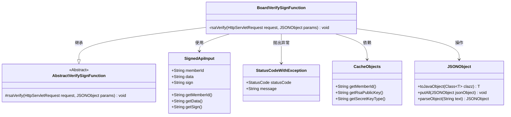
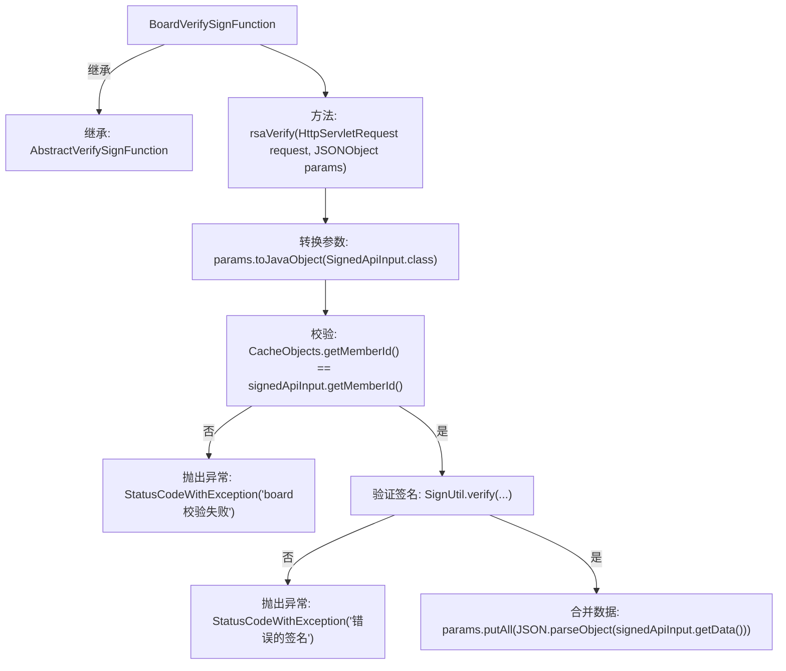

# 基础信息

|      |      |
|------|------|
| 名称 | BoardVerifySignFunction |
| 编码语言 | .java |
| 代码路径 | WeFe/serving/serving-service/src/main/java/com/welab/wefe/serving/service/utils/sign/BoardVerifySignFunction.java |
| 包名 | com.welab.wefe.serving.service.utils.sign |
| 依赖项 | ['com.alibaba.fastjson.JSONObject', 'com.welab.wefe.common.StatusCode', 'com.welab.wefe.common.exception.StatusCodeWithException', 'com.welab.wefe.common.util.RSAUtil', 'com.welab.wefe.common.web.dto.SignedApiInput', 'com.welab.wefe.serving.service.service.CacheObjects', 'javax.servlet.http.HttpServletRequest'] |
| 概述说明 | BoardVerifySignFunction类继承AbstractVerifySignFunction，通过RSA验证请求签名，检查memberId匹配，验证失败抛出异常，成功则解析数据到params。 |

# 说明

BoardVerifySignFunction类继承AbstractVerifySignFunction，用于验证请求签名。首先将输入参数转换为SignedApiInput对象，检查memberId是否匹配缓存值，不匹配则抛出异常。然后使用SignUtil.verify方法验证数据签名，若验证失败抛出异常。最后将解析后的数据合并到参数中。整个过程涉及成员ID校验和RSA签名验证。

# 类列表 Class Summary

| 名称   | 类型  | 说明 |
|-------|------|-------------|
| BoardVerifySignFunction | class | BoardVerifySignFunction类继承AbstractVerifySignFunction，通过RSA验证请求签名，检查memberId匹配性，验证失败抛出异常，成功则将数据加入参数。 |

## 类 BoardVerifySignFunction

|      |      |
|------|------|
| 访问范围 | public |
| 类型 | class |
| 名称 | BoardVerifySignFunction |
| 说明 | BoardVerifySignFunction类继承AbstractVerifySignFunction，通过RSA验证请求签名，检查memberId匹配性，验证失败抛出异常，成功则将数据加入参数。 |

### UML类图

该代码展示了一个签名验证功能类BoardVerifySignFunction，继承自抽象类AbstractVerifySignFunction。主要完成RSA签名验证流程：首先将输入参数转换为SignedApiInput对象，校验memberId是否匹配缓存值，然后调用签名工具验证数据签名有效性。验证失败时抛出StatusCodeWithException异常，成功后将数据解析到参数对象中。涉及与CacheObjects、JSONObject等工具类的交互，体现了完整的参数校验和异常处理机制。

### 内部方法调用关系图

这段代码是用于验证签名的功能类，主要流程包括：将输入参数转换为特定对象，校验成员ID是否匹配，使用RSA公钥验证数据签名，若验证失败则抛出异常，验证通过则将数据合并到原始参数中。整个过程严格遵循签名验证的安全流程，确保数据传输的完整性和身份真实性。

### 字段列表 Field List

| 名称  | 类型  | 说明 |
|-------|-------|------|

### 方法列表

| 名称  | 类型  | 说明 |
|-------|-------|------|
| rsaVerify | void | 方法rsaVerify验证请求签名：检查memberId匹配，使用RSA公钥验证数据签名，失败抛出异常，成功则解析数据到params。 |

