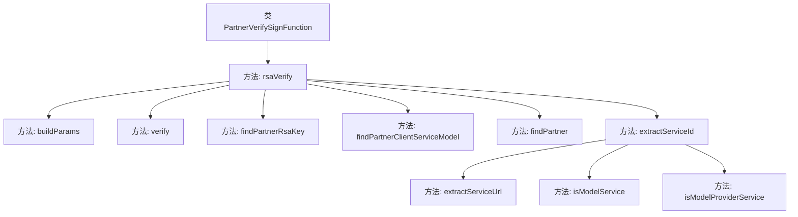
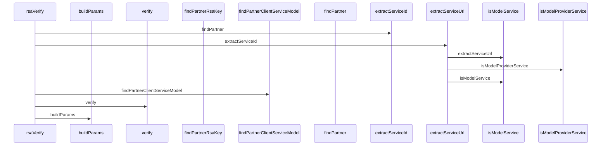

# 基础信息

|      |      |
|------|------|
| 名称 | PartnerVerifySignFunction |
| 编码语言 | .java |
| 代码路径 | WeFe/serving/serving-service/src/main/java/com/welab/wefe/serving/service/utils/sign/PartnerVerifySignFunction.java |
| 包名 | com.welab.wefe.serving.service.utils.sign |
| 依赖项 | ['javax.servlet.http.HttpServletRequest', 'org.slf4j.Logger', 'org.slf4j.LoggerFactory', 'com.alibaba.fastjson.JSONObject', 'com.alibaba.fastjson.parser.Feature', 'com.welab.wefe.common.StatusCode', 'com.welab.wefe.common.constant.SecretKeyType', 'com.welab.wefe.common.exception.StatusCodeWithException', 'com.welab.wefe.common.util.RSAUtil', 'com.welab.wefe.common.util.StringUtil', 'com.welab.wefe.common.web.Launcher', 'com.welab.wefe.common.web.dto.SignedApiInput', 'com.welab.wefe.serving.service.database.entity.ClientServiceMysqlModel', 'com.welab.wefe.serving.service.database.entity.PartnerMysqlModel', 'com.welab.wefe.serving.service.database.entity.TableModelMySqlModel', 'com.welab.wefe.serving.service.database.entity.TableServiceMySqlModel', 'com.welab.wefe.serving.service.database.repository.TableModelRepository', 'com.welab.wefe.serving.service.database.repository.TableServiceRepository', 'com.welab.wefe.serving.service.service.CacheObjects', 'com.welab.wefe.serving.service.service.ClientServiceService', 'com.welab.wefe.serving.service.service.PartnerService'] |
| 概述说明 | PartnerVerifySignFunction类实现RSA签名验证，处理合作方请求参数，提取服务ID并校验签名有效性，最后构建返回参数。 |

# 说明

PartnerVerifySignFunction类继承自AbstractVerifySignFunction，主要用于验证合作伙伴的签名。核心功能包括解析请求参数，提取服务ID，查找合作伙伴信息，验证签名有效性，并构建返回参数。通过RSA或自定义签名工具进行签名验证，处理异常情况如无效签名或未找到合作方记录。支持模型服务和普通服务的区分处理，记录执行耗时。

# 类列表 Class Summary

| 名称   | 类型  | 说明 |
|-------|------|-------------|
| PartnerVerifySignFunction | class | PartnerVerifySignFunction类实现RSA签名验证，处理请求参数，验证合作方身份及服务有效性，记录执行时间。 |

## 类 PartnerVerifySignFunction

|      |      |
|------|------|
| 访问范围 | public |
| 类型 | class |
| 名称 | PartnerVerifySignFunction |
| 说明 | PartnerVerifySignFunction类实现RSA签名验证，处理请求参数，验证合作方身份及服务有效性，记录执行时间。 |

### UML类图

```mermaid
classDiagram
    class AbstractVerifySignFunction {
        <<Abstract>>
        +AbstractVerifySignFunction()
        #void rsaVerify(HttpServletRequest request, JSONObject params) throws Exception
    }

    class PartnerVerifySignFunction {
        -Logger LOG
        +PartnerVerifySignFunction()
        #void rsaVerify(HttpServletRequest request, JSONObject params) throws Exception
        -void buildParams(HttpServletRequest request, JSONObject params, SignedApiInput signedApiInput, String serviceId)
        -void verify(SignedApiInput signedApiInput, String partnerRsaKey, SecretKeyType secretKeyType) throws Exception
        -String findPartnerRsaKey(String partnerId, String serviceId) throws StatusCodeWithException
        -ClientServiceMysqlModel findPartnerClientServiceModel(String partnerId, String serviceId) throws StatusCodeWithException
        -String findPartner(String customerId) throws StatusCodeWithException
        -String extractServiceId(HttpServletRequest request, JSONObject params) throws StatusCodeWithException
        -String extractServiceUrl(HttpServletRequest request)
        -boolean isModelService(HttpServletRequest request)
        -boolean isModelProviderService(HttpServletRequest request)
    }

    class SignedApiInput {
        +String memberId
        +String customerId
        +String partnerCode
        +String data
        +String sign
        +String getMemberId()
        +String getCustomerId()
        +String getPartnerCode()
        +String getData()
        +String getSign()
        +void setPartnerCode(String partnerCode)
    }

    class ClientServiceMysqlModel {
        +String publicKey
        +SecretKeyType secretKeyType
        +String getPublicKey()
        +SecretKeyType getSecretKeyType()
    }

    class StatusCodeWithException {
        +StatusCode statusCode
        +String message
        +StatusCodeWithException(StatusCode statusCode, String message)
    }

    class ClientServiceService {
        <<Interface>>
        +ClientServiceMysqlModel queryByIdAndServiceId(String partnerId, String serviceId)
    }

    class PartnerService {
        <<Interface>>
        +PartnerMysqlModel queryByCode(String customerId)
    }

    class TableModelRepository {
        <<Interface>>
        +TableModelMySqlModel findOne(String field, String value, Class~TableModelMySqlModel~ clazz)
    }

    class TableServiceRepository {
        <<Interface>>
        +TableServiceMySqlModel findOne(String field, String value, Class~TableServiceMySqlModel~ clazz)
    }

    AbstractVerifySignFunction <|-- PartnerVerifySignFunction
    PartnerVerifySignFunction --> SignedApiInput : 使用
    PartnerVerifySignFunction --> ClientServiceMysqlModel : 使用
    PartnerVerifySignFunction --> StatusCodeWithException : 抛出
    PartnerVerifySignFunction ..> ClientServiceService : 依赖
    PartnerVerifySignFunction ..> PartnerService : 依赖
    PartnerVerifySignFunction ..> TableModelRepository : 依赖
    PartnerVerifySignFunction ..> TableServiceRepository : 依赖
```

这段代码展示了一个合作伙伴签名验证功能的实现类`PartnerVerifySignFunction`，它继承自抽象类`AbstractVerifySignFunction`。主要功能包括RSA签名验证、合作伙伴信息查询、服务ID提取等操作。类图中清晰地展示了继承关系、依赖接口以及主要的数据模型类，包括`SignedApiInput`输入参数类、`ClientServiceMysqlModel`服务模型类等。该实现通过多种辅助方法完成签名验证流程，并处理各种异常情况。

### 内部方法调用关系图

这段代码是PartnerVerifySignFunction类的实现，主要用于处理RSA签名验证流程。流程图展示了类中各个方法的调用关系，时序图则详细描述了rsaVerify方法执行时各子方法的调用顺序。代码首先通过findPartner和extractServiceId获取合作方和服务信息，然后调用verify进行签名验证，最后通过buildParams构建返回参数。整个过程包含异常处理和日志记录，确保签名验证的安全性和可靠性。

### 字段列表 Field List

| 名称  | 类型  | 说明 |
|-------|-------|------|
| LOG = LoggerFactory.getLogger(this.getClass()) | Logger | 声明一个受保护的最终日志对象，用于当前类的日志记录。 |

### 方法列表

| 名称  | 类型  | 说明 |
|-------|-------|------|
| buildParams | void | 该方法将请求参数构建到JSON对象中，包括输入数据、客户ID、合作伙伴代码、服务ID及模型服务标识。 |
| findPartner | String | 该方法通过客户ID查询合作方信息，若不存在则抛出异常，存在则返回合作方ID。 |
| findPartnerClientServiceModel | ClientServiceMysqlModel | 该方法通过合作方ID和服务ID查询合作方开通记录，若未找到则抛出异常。返回查询结果。 |
| findPartnerRsaKey | String | 该方法通过合作方ID和服务ID查询RSA公钥，若未找到记录则抛出异常，成功则返回公钥。 |
| rsaVerify | void | 方法rsaVerify验证请求签名，处理会员ID和客户ID，提取服务ID，查找合作方，验证签名并构建参数，记录耗时。 |
| verify | void | 验证签名方法，使用RSA公钥和签名类型检查输入数据签名，失败则抛出异常。 |
| extractServiceId | String | 该方法从HTTP请求和JSON参数中提取服务ID。若为模型提供者服务，直接从参数获取；若为模型服务，通过URL查询模型表获取；否则查询服务表获取。未找到则抛出异常。 |
| extractServiceUrl | String | 提取HTTP请求URI中"api/"后的部分作为服务URL。 |
| isModelService | boolean | 检查HTTP请求URI是否包含"api/"后接"predict"，判断是否为模型服务请求。 |
| isModelProviderService | boolean | 检查请求URI是否包含"model/provider/status/check"，判断是否为模型提供者服务。 |

