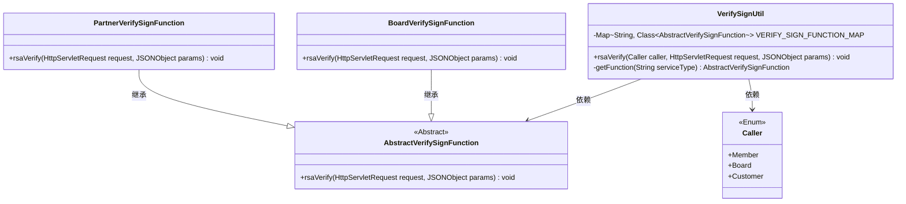
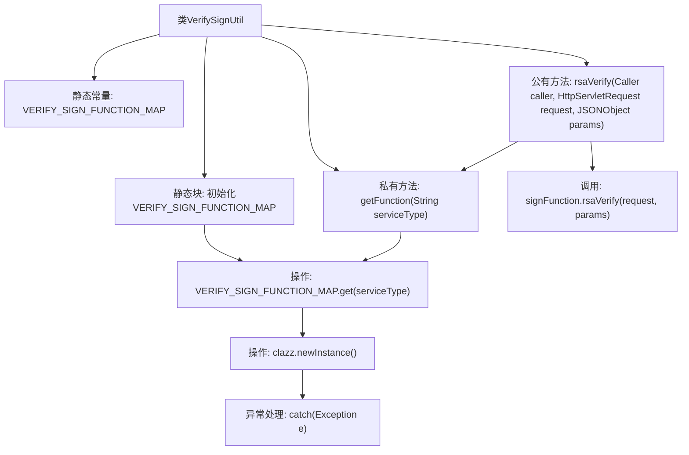

# 基础信息

|      |      |
|------|------|
| 名称 | VerifySignUtil |
| 编码语言 | .java |
| 代码路径 | WeFe/serving/serving-service/src/main/java/com/welab/wefe/serving/service/utils/sign/VerifySignUtil.java |
| 包名 | com.welab.wefe.serving.service.utils.sign |
| 依赖项 | ['com.alibaba.fastjson.JSONObject', 'com.welab.wefe.common.web.api.base.Caller', 'javax.servlet.http.HttpServletRequest', 'java.util.HashMap', 'java.util.Map'] |
| 概述说明 | VerifySignUtil类通过静态映射存储不同调用者的验证函数类，动态实例化并执行RSA签名验证。 |

# 说明

VerifySignUtil是一个用于验证签名的工具类，包含静态映射VERIFY_SIGN_FUNCTION_MAP，存储不同调用者类型对应的验证签名函数类。静态初始化块为Member、Board、Customer三种调用者分别指定BoardVerifySignFunction和PartnerVerifySignFunction实现类。getFunction方法根据服务类型获取对应的验证签名函数实例。rsaVerify方法通过调用者类型获取对应函数实例并执行RSA签名验证。异常处理捕获实例化异常并打印堆栈跟踪。

# 类列表 Class Summary

| 名称   | 类型  | 说明 |
|-------|------|-------------|
| VerifySignUtil | class | VerifySignUtil类通过静态映射表管理不同调用方的签名验证函数，提供rsaVerify方法根据调用方类型执行对应验证逻辑。 |

## 类 VerifySignUtil

|      |      |
|------|------|
| 访问范围 | public |
| 类型 | class |
| 名称 | VerifySignUtil |
| 说明 | VerifySignUtil类通过静态映射表管理不同调用方的签名验证函数，提供rsaVerify方法根据调用方类型执行对应验证逻辑。 |

### UML类图

这段代码展示了一个签名验证工具类VerifySignUtil，它通过静态Map维护不同调用方(Caller枚举)与具体验证类(BoardVerifySignFunction/PartnerVerifySignFunction)的映射关系。核心功能是通过rsaVerify方法根据调用方类型动态选择对应的验证实现类，调用其rsaVerify方法完成验证。采用抽象工厂模式，AbstractVerifySignFunction作为抽象基类定义验证接口，具体实现类处理不同业务场景的签名验证逻辑。

### 内部方法调用关系图

这段代码展示了一个签名验证工具类，通过静态映射表VERIFY_SIGN_FUNCTION_MAP存储不同调用者类型对应的验证函数类，静态初始化块预加载了三种调用者类型的映射关系。核心逻辑是通过getFunction方法动态实例化对应的验证类，最终由rsaVerify方法调用具体实现的签名验证功能。流程图清晰呈现了类结构、初始化过程和方法调用链，特别突出了异常处理和数据流转路径。

### 字段列表 Field List

| 名称  | 类型  | 说明 |
|-------|-------|------|
| VERIFY_SIGN_FUNCTION_MAP = new HashMap<>() | Map<String, Class<? extends AbstractVerifySignFunction>> | 定义了一个静态不可变的映射，键为字符串，值为抽象验证签名函数的子类。 |

### 方法列表

| 名称  | 类型  | 说明 |
|-------|-------|------|
| getFunction | AbstractVerifySignFunction | 根据服务类型获取对应的签名验证函数实例，失败返回null。 |
| rsaVerify | void | 静态方法rsaVerify验证调用者请求的RSA签名，需传入调用者、请求对象和参数，调用对应签名函数完成验证。 |

