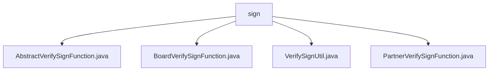

# 基础信息

|      |      |
|------|------|
| 名称 | sign |
| 编码语言 | .java |
| 代码路径 | WeFe/serving/serving-service/src/main/java/com/welab/wefe/serving/service/utils/sign |
| 包名 | docs.serving.serving-service.src.main.java.com.welab.wefe.serving.service.utils.sign |
| 概述说明 | AbstractVerifySignFunction是签名验证抽象类，含rsaVerify方法需子类实现。BoardVerifySignFunction继承它，校验成员ID和签名。VerifySignUtil是工具类，管理不同调用者的验证函数。PartnerVerifySignFunction用于验证合作伙伴签名，支持多种服务类型。 |

# 说明

## 概述  
该模块核心职责是提供可扩展的签名验证框架，通过抽象类定义统一接口，子类实现不同调用方的具体验证逻辑。接口规范要求所有验证函数必须实现`rsaVerify`方法，接收`HttpServletRequest`和`JSONObject`参数，类似网关的鉴权拦截器设计。关键数据结构包括`SignedApiInput`（封装签名参数）和`VERIFY_SIGN_FUNCTION_MAP`（存储验证策略映射）。依赖项涉及HttpServlet请求处理和JSON解析。例如`BoardVerifySignFunction`会校验memberId与缓存一致性。

## 主要业务场景  
典型流程为：根据调用方类型（Member/Board/Customer）选择对应验证策略，例如合作伙伴调用触发`PartnerVerifySignFunction`的RSA验签。交互模式采用策略模式，通过`VerifySignUtil`统一路由到具体实现。功能覆盖成员身份核验、签名时效性检查等，例如`PartnerVerifySignFunction`会区分模型服务与普通服务。API集成时需传入服务类型标识，异常处理会捕获签名无效或实例化失败等情况。

### 包内部结构视图

该流程图展示了WeFe项目中签名验证工具类的层级结构。sign目录下包含四个核心文件：AbstractVerifySignFunction作为抽象基类，BoardVerifySignFunction和PartnerVerifySignFunction分别实现不同场景的签名验证逻辑，VerifySignUtil提供通用验证方法。这种结构体现了策略模式的设计思想，便于扩展新的验证方式。

# 文件列表

| 名称   | 类型  | 说明 |
|-------|------|-------------|
| [AbstractVerifySignFunction.java](AbstractVerifySignFunction.md) | file | 抽象类AbstractVerifySignFunction定义受保护的rsaVerify方法，用于验证RSA签名，接收请求和JSON参数，可能抛出异常。 |
| [BoardVerifySignFunction.java](BoardVerifySignFunction.md) | file | BoardVerifySignFunction类继承AbstractVerifySignFunction，通过RSA验证请求签名，检查memberId匹配，验证失败抛出异常，成功则解析数据到params。 |
| [VerifySignUtil.java](VerifySignUtil.md) | file | VerifySignUtil类通过静态映射存储不同调用者的验证函数类，动态实例化并执行RSA签名验证。 |
| [PartnerVerifySignFunction.java](PartnerVerifySignFunction.md) | file | PartnerVerifySignFunction类实现RSA签名验证，处理合作方请求参数，提取服务ID并校验签名有效性，最后构建返回参数。 |

