# 基础信息

|      |      |
|------|------|
| 名称 | welab |
| 编码语言 | .java |
| 代码路径 | WeFe/union/blockchain-data-sync/src/main/java/com/welab |
| 包名 | docs.union.blockchain-data-sync.src.main.java.com.welab |
| 概述说明 | 区块链数据同步系统核心组件，包含解析器、工具类、服务层及配置管理。解析器将合约事件转为MongoDB操作，工具类提供辅助功能，服务层处理数据持久化，配置管理初始化环境。支持多线程同步，确保数据一致性。 |

# 说明

## 概述  
该模块是区块链数据同步系统的核心组件，采用分层架构设计，负责链上合约事件的解析、转换与持久化。核心职责包括：通过抽象工厂模式实现事件解析（如MemberContractEventParser）、线程安全的数据同步管理（如SyncConstant）以及工具集支持（如AbiUtil）。关键数据结构涵盖EventBO业务对象、BlockInfoBO区块信息及ContractABIDefinition等元数据。外部依赖包括MongoDB、区块链节点SDK（BcosBlock）、Java标准库及微信通知API。例如通过BlockSyncHeightService实现区块高度幂等更新，ClassPathScanHandler动态加载解析器类。

## 主要业务场景  
模块支持多线程环境下的区块链数据全生命周期管理，类似ETL管道与事件总线混合模式。典型流程为：InitListener初始化环境→DataSyncTask同步区块→DataProcessor路由事件→子类Parser处理业务→MongoDB持久化。主要处理三类场景：实体状态变更（如成员公钥更新）、元数据维护（如ABI解析）和资源权限管理（如数据集标签控制）。交互模式统一通过parseContractEvent等静态方法驱动，例如UnionNodeContractEventParser处理节点状态变更，BloomFilterContractEventParser维护布隆过滤器参数。API类型包含工厂方法、扫描接口和数据处理三类，集成案例展示线程安全的高度更新与合约解析器自动发现。

### 包内部结构视图

```mermaid
graph TD
    wefe --> BlockchainDataSyncApp.java
    wefe --> parser
    wefe --> enums
    wefe --> constant
    wefe --> util
    wefe --> exception
    wefe --> bo
    wefe --> service
    wefe --> event
    wefe --> tool
    wefe --> task
    wefe --> listener
    wefe --> config
    parser --> MemberContractEventParser.java
    parser --> RealnameAuthAgreementTemplateContractEventParser.java
    parser --> DataSetContractEventParser.java
    parser --> AbstractParser.java
    parser --> TableDataSetContractEventParser.java
    parser --> BlockInfoParser.java
    parser --> MemberFileInfoContractEventParser.java
    parser --> UnionNodeContractEventParser.java
    parser --> TrustCertsContractEventParser.java
    parser --> MemberAuthTypeContractEventParser.java
    parser --> DataResourceContractEventParser.java
    parser --> BloomFilterContractEventParser.java
    parser --> DataSetMemberPermissionContractEventParser.java
    parser --> MemberServiceContractEventParser.java
    parser --> DataSetDefaultTagContractEventParser.java
    parser --> DataResourceDefaultTagContractEventParser.java
    parser --> ImageDataSetContractEventParser.java
    enums --> JavaTypeEnum.java
    constant --> SyncConstant.java
    constant --> ContractConstants.java
    constant --> BinConstant.java
    constant --> BlockConstant.java
    constant --> EventConstant.java
    util --> WechatUtil.java
    util --> AbiUtil.java
    util --> BlockUtil.java
    util --> SolJavaTypeMappingUtil.java
    util --> TransactionUtil.java
    util --> ContractParserUtil.java
    util --> PropertiesUtil.java
    exception --> BusinessException.java
    bo --> contract
    bo --> data
    contract --> ContractInfo.java
    contract --> EventMetaInfo.java
    contract --> ContractContextInfo.java
    contract --> FieldInfo.java
    contract --> MethodMetaInfo.java
    data --> CommonBO.java
    data --> BlockInfoBO.java
    data --> TransactionResponseBO.java
    data --> EventBO.java
    service --> BlockSyncContractHeightService.java
    service --> BlockSyncHeightService.java
    service --> TransactionResponseService.java
    service --> BlockSyncDetailInfoService.java
    service --> BaseService.java
    event --> NewBlockEventCallback.java
    tool --> DataSyncContext.java
    tool --> ClassPathScanHandler.java
    tool --> DataProcessor.java
    task --> DataSyncTask.java
    listener --> InitListener.java
    config --> BlockchainConfig.java
```

该流程图展示了区块链数据同步项目的完整目录结构，从根目录wefe开始，向下展开为14个主要模块，包括核心解析器(parser)、工具类(util)、业务对象(bo)和服务层(service)等。每个模块包含其具体的实现类，如parser模块下有21种不同合约事件解析器，constant模块包含5种常量定义类。整体结构层次清晰，展现了典型Java项目的分包逻辑和功能划分。

# 文件列表

| 名称   | 类型  | 说明 |
|-------|------|-------------|
| [wefe](wefe/_module.md) | package | 区块链数据同步系统核心组件，包含解析器、工具类、服务层及配置管理。解析器将合约事件转为MongoDB操作，工具类提供辅助功能，服务层处理数据持久化，配置管理初始化环境。支持多线程同步，确保数据一致性。 |

