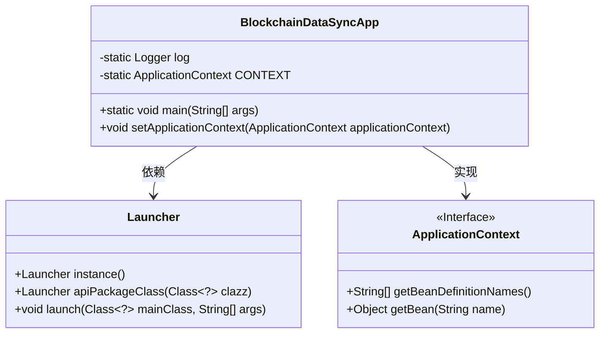
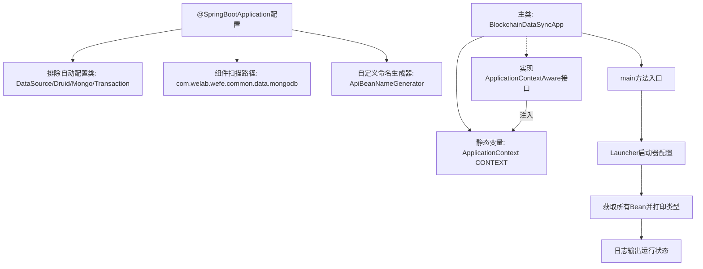

# 基础信息

|      |      |
|------|------|
| 名称 | BlockchainDataSyncApp |
| 编码语言 | .java |
| 代码路径 | WeFe/union/blockchain-data-sync/src/main/java/com/welab/wefe/BlockchainDataSyncApp.java |
| 包名 | com.welab.wefe |
| 依赖项 | ['com.alibaba.druid.spring.boot.autoconfigure.DruidDataSourceAutoConfigure', 'com.welab.wefe.common.web.Launcher', 'com.welab.wefe.common.web.config.ApiBeanNameGenerator', 'org.slf4j.Logger', 'org.slf4j.LoggerFactory', 'org.springframework.beans.BeansException', 'org.springframework.boot.autoconfigure.SpringBootApplication', 'org.springframework.boot.autoconfigure.data.mongo.MongoDataAutoConfiguration', 'org.springframework.boot.autoconfigure.jdbc.DataSourceAutoConfiguration', 'org.springframework.boot.autoconfigure.mongo.MongoAutoConfiguration', 'org.springframework.boot.autoconfigure.transaction.TransactionAutoConfiguration', 'org.springframework.context.ApplicationContext', 'org.springframework.context.ApplicationContextAware', 'org.springframework.context.annotation.ComponentScan', 'org.springframework.scheduling.annotation.EnableScheduling', 'java.util.Arrays'] |
| 概述说明 | SpringBoot应用排除数据源配置，启用定时任务，自定义组件扫描路径，实现应用上下文注入，启动时输出所有Bean信息。 |

# 说明

这是一个基于Spring Boot的区块链数据同步应用启动类。通过@SpringBootApplication注解排除了数据源、MongoDB和事务的自动配置。使用@ComponentScan指定了基础扫描包路径和自定义的Bean命名生成器。主类实现了ApplicationContextAware接口以获取应用上下文，并在main方法中启动应用，打印所有Bean信息后记录成功日志。

# 类列表 Class Summary

| 名称   | 类型  | 说明 |
|-------|------|-------------|
| BlockchainDataSyncApp | class | SpringBoot应用排除数据源配置，启用定时任务，自定义组件扫描路径，包含Launcher和BlockchainDataSyncApp类，启动时打印所有Bean信息。 |

## 类 BlockchainDataSyncApp

|      |      |
|------|------|
| 访问范围 | @EnableScheduling;@SpringBootApplication(exclude = {;        DataSourceAutoConfiguration.class,;        DruidDataSourceAutoConfigure.class,;        MongoAutoConfiguration.class,;        MongoDataAutoConfiguration.class,;        TransactionAutoConfiguration.class;});@ComponentScan(;        basePackages = {"com.welab.wefe.common.data.mongodb"},;        nameGenerator = ApiBeanNameGenerator.class,;        basePackageClasses = {;                Launcher.class,;                BlockchainDataSyncApp.class;        };);;/**; * @author yuxin.zhang; */;public |
| 类型 | class |
| 名称 | BlockchainDataSyncApp |
| 说明 | SpringBoot应用排除数据源配置，启用定时任务，自定义组件扫描路径，包含Launcher和BlockchainDataSyncApp类，启动时打印所有Bean信息。 |

### UML类图

类图描述：该图展示了BlockchainDataSyncApp类与Launcher和ApplicationContext接口的关系。BlockchainDataSyncApp是Spring Boot应用入口，通过Launcher启动并管理应用上下文，实现了ApplicationContextAware接口以获取Spring容器上下文。Launcher类提供实例化和启动方法，ApplicationContext接口定义获取Bean的核心方法。

### 内部方法调用关系图

该流程图展示了Spring Boot应用的启动过程：通过@SpringBootApplication排除特定自动配置，指定组件扫描路径和命名规则。主类BlockchainDataSyncApp通过Launcher启动，获取应用上下文并打印所有Bean信息，最后记录启动成功日志。类实现了ApplicationContextAware接口以获取上下文实例，整个过程体现了Spring的依赖注入和容器初始化机制。

### 字段列表 Field List

| 名称  | 类型  | 说明 |
|-------|-------|------|
| log = LoggerFactory.getLogger(BlockchainDataSyncApp.class) | Logger | 定义静态不可变日志对象，用于BlockchainDataSyncApp类的日志记录。 |
| CONTEXT = null | ApplicationContext | 静态公共变量CONTEXT，类型为ApplicationContext，初始值为null。 |

### 方法列表

| 名称  | 类型  | 说明 |
|-------|-------|------|
| main | void | Java主方法启动应用，扫描并排序打印所有Bean类型信息，最后记录运行成功日志。 |
| setApplicationContext | void | 重写setApplicationContext方法，将传入的ApplicationContext赋值给静态变量CONTEXT。 |

