# 基础信息

|      |      |
|------|------|
| 名称 | wefe |
| 编码语言 | .java |
| 代码路径 | WeFe/union/blockchain-data-sync/src/main/java/com/welab/wefe |
| 包名 | docs.union.blockchain-data-sync.src.main.java.com.welab.wefe |
| 概述说明 | 区块链数据同步系统核心组件，包含解析器、工具类、服务层及配置管理。解析器将合约事件转为MongoDB操作，工具类提供辅助功能，服务层处理数据持久化，配置管理初始化环境。支持多线程同步，确保数据一致性。 |

# 说明

## 概述  
该模块是区块链数据同步系统的核心组件，采用分层架构设计，负责链上合约事件的解析、转换与持久化。核心职责包括：通过抽象工厂模式实现事件解析（如MemberContractEventParser）、线程安全的数据同步管理（如SyncConstant）以及工具集支持（如AbiUtil）。关键数据结构涵盖EventBO业务对象、BlockInfoBO区块信息及ContractABIDefinition等元数据。外部依赖包括MongoDB、区块链节点SDK（BcosBlock）、Java标准库及微信通知API。例如通过BlockSyncHeightService实现区块高度幂等更新，ClassPathScanHandler动态加载解析器类。

## 主要业务场景  
模块支持多线程环境下的区块链数据全生命周期管理，类似ETL管道与事件总线混合模式。典型流程为：InitListener初始化环境→DataSyncTask同步区块→DataProcessor路由事件→子类Parser处理业务→MongoDB持久化。主要处理三类场景：实体状态变更（如成员公钥更新）、元数据维护（如ABI解析）和资源权限管理（如数据集标签控制）。交互模式统一通过parseContractEvent等静态方法驱动，例如UnionNodeContractEventParser处理节点状态变更，BloomFilterContractEventParser维护布隆过滤器参数。API类型包含工厂方法、扫描接口和数据处理三类，集成案例展示线程安全的高度更新与合约解析器自动发现。

### 包内部结构视图

```mermaid
graph TD
    wefe --> BlockchainDataSyncApp.java
    wefe --> parser
    wefe --> enums
    wefe --> constant
    wefe --> util
    wefe --> exception
    wefe --> bo
    wefe --> service
    wefe --> event
    wefe --> tool
    wefe --> task
    wefe --> listener
    wefe --> config
    parser --> MemberContractEventParser.java
    parser --> RealnameAuthAgreementTemplateContractEventParser.java
    parser --> DataSetContractEventParser.java
    parser --> AbstractParser.java
    parser --> TableDataSetContractEventParser.java
    parser --> BlockInfoParser.java
    parser --> MemberFileInfoContractEventParser.java
    parser --> UnionNodeContractEventParser.java
    parser --> TrustCertsContractEventParser.java
    parser --> MemberAuthTypeContractEventParser.java
    parser --> DataResourceContractEventParser.java
    parser --> BloomFilterContractEventParser.java
    parser --> DataSetMemberPermissionContractEventParser.java
    parser --> MemberServiceContractEventParser.java
    parser --> DataSetDefaultTagContractEventParser.java
    parser --> DataResourceDefaultTagContractEventParser.java
    parser --> ImageDataSetContractEventParser.java
    enums --> JavaTypeEnum.java
    constant --> SyncConstant.java
    constant --> ContractConstants.java
    constant --> BinConstant.java
    constant --> BlockConstant.java
    constant --> EventConstant.java
    util --> WechatUtil.java
    util --> AbiUtil.java
    util --> BlockUtil.java
    util --> SolJavaTypeMappingUtil.java
    util --> TransactionUtil.java
    util --> ContractParserUtil.java
    util --> PropertiesUtil.java
    exception --> BusinessException.java
    bo --> contract
    bo --> data
    contract --> ContractInfo.java
    contract --> EventMetaInfo.java
    contract --> ContractContextInfo.java
    contract --> FieldInfo.java
    contract --> MethodMetaInfo.java
    data --> CommonBO.java
    data --> BlockInfoBO.java
    data --> TransactionResponseBO.java
    data --> EventBO.java
    service --> BlockSyncContractHeightService.java
    service --> BlockSyncHeightService.java
    service --> TransactionResponseService.java
    service --> BlockSyncDetailInfoService.java
    service --> BaseService.java
    event --> NewBlockEventCallback.java
    tool --> DataSyncContext.java
    tool --> ClassPathScanHandler.java
    tool --> DataProcessor.java
    task --> DataSyncTask.java
    listener --> InitListener.java
    config --> BlockchainConfig.java
```

该流程图展示了区块链数据同步项目的完整目录结构，从根目录wefe开始，向下展开为13个主要模块，包括parser解析器、constant常量、util工具类等。每个模块下又包含具体的实现类文件，如parser模块包含20个不同合约事件解析器，constant模块包含5个常量定义文件。整体结构清晰展现了项目的功能划分和层级关系。

# 文件列表

| 名称   | 类型  | 说明 |
|-------|------|-------------|
| [exception](exception/_module.md) | package | 自定义业务异常类，继承Exception，含带消息参数的构造方法。 |
| [BlockchainDataSyncApp.java](BlockchainDataSyncApp.md) | file | SpringBoot应用排除数据源配置，启用定时任务，自定义组件扫描路径，实现应用上下文注入，启动时输出所有Bean信息。 |
| [config](config/_module.md) | package | 区块链配置类，包含证书路径、群组列表、线程池参数、IP和端口配置，提供连接状态监控和SDK初始化功能。 |
| [listener](listener/_module.md) | package | InitListener监听应用启动事件，初始化合约信息并注册新区块事件回调，启动数据同步任务。依赖BcosSDK和合约路径配置。 |
| [task](task/_module.md) | package | DataSyncTask类用于同步区块链数据，包含组ID配置、微信通知URL，通过多线程按组同步区块数据，处理异常并记录同步状态。 |
| [tool](tool/_module.md) | package | DataSyncContext管理区块链交互配置，含客户端、CNS、解码器和群组ID。ClassPathScanHandler扫描类路径，支持文件和JAR扫描及过滤。DataProcessor处理区块数据，动态创建解析器并处理事件。 |
| [event](event/_module.md) | package | NewBlockEventCallback类实现BlockNumberNotifyCallback接口，处理新区块事件。通过onReceiveBlockNumberInfo方法获取组ID和区块号，更新组的最新区块高度信息。 |
| [service](service/_module.md) | package | BlockSyncContractHeightService记录同步区块高度合约信息，与MongoDB交互，保存区块信息并处理合约名称。BlockSyncHeightService记录同步区块高度，支持保存和查询。TransactionResponseService处理交易响应数据，动态生成集合名并创建索引。BlockSyncDetailInfoService保存区块同步详情，转换并存储数据。BaseService提供基础功能，包括错误消息发送。 |
| [bo](bo/_module.md) | package | 模块1管理区块链合约元数据，包括合约信息、方法签名和事件参数，采用Getter/Setter模式访问，依赖CnsService验证地址。模块2封装区块链同步数据实体，采用Java Bean风格，支撑区块解析和交易追踪，依赖Java标准库。 |
| [util](util/_module.md) | package | WechatUtil发送微信消息；AbiUtil获取ABI事件定义；BlockUtil处理区块数据和事件元信息；SolJavaTypeMappingUtil转换类型；TransactionUtil获取合约信息；ContractParserUtil解析合约；PropertiesUtil读取合约文件。 |
| [constant](constant/_module.md) | package | SyncConstant类管理线程本地数据同步上下文。ContractConstants类定义空地址常量。BinConstant类定义元数据哈希长度常量。BlockConstant类维护线程安全的区块高度映射。EventConstant类定义多种事件类型常量。 |
| [enums](enums/_module.md) | package | Java枚举类定义数据类型映射，包含Java类型、实体类型、SQL类型及转换方法，提供解析方法parse。 |
| [parser](parser/_module.md) | package | 多个解析器类继承AbstractParser，处理区块链合约事件并操作MongoDB。包括成员、数据集、节点、证书等各类事件解析，实现增删改查及扩展JSON更新功能，确保数据同步与一致性。 |

