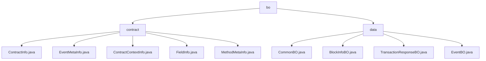

# 基础信息

|      |      |
|------|------|
| 名称 | bo |
| 编码语言 | .java |
| 代码路径 | WeFe/union/blockchain-data-sync/src/main/java/com/welab/wefe/bo |
| 包名 | docs.union.blockchain-data-sync.src.main.java.com.welab.wefe.bo |
| 概述说明 | 模块1管理区块链合约元数据，包括合约信息、方法签名和事件参数，采用Getter/Setter模式访问，依赖CnsService验证地址。模块2封装区块链同步数据实体，采用Java Bean风格，支撑区块解析和交易追踪，依赖Java标准库。 |

# 说明

## 概述  
该模块核心职责是管理区块链数据实体与合约元数据，采用分层设计模式。接口规范统一采用Getter/Setter模式，例如ContractInfo提供ABI访问，CommonBO封装基础属性。关键数据结构包括合约上下文(ContractContextInfo)、跨链字段定义(FieldInfo)及区块信息(BlockInfoBO)。外部依赖仅涉及CnsService验证和Java标准库。实现案例包含合约二进制映射查询(ContractContextInfo.getContractInfoByCode)和交易列表初始化(TransactionResponseBO)。

## 主要业务场景  
模块支持区块链数据全生命周期管理，类似配置中心与数据中台混合模式。典型流程包括：通过合约地址查询元数据、解析事件结构(EventMetaInfo)及组装区块视图(BlockInfoBO链式聚合)。交互模式基于静态Map缓存和POJO链式调用，例如CONTRACT_BINARY_MAP加速检索。功能完整性体现在跨链类型适配(FieldInfo)和核心要素覆盖(EventBO继承体系)，典型应用如智能合约监听和交易追踪。API类型包含元数据查询、结构转换及数据载体三类。

### 包内部结构视图

该流程图展示了区块链数据同步项目中Java代码的目录结构。顶层目录"bo"下包含两个子目录"contract"和"data"，其中"contract"目录下包含5个合约相关的Java文件，主要处理合约信息、事件元数据等；"data"目录下包含4个数据相关的Java文件，处理区块信息、交易响应等业务对象。整个结构清晰地反映了项目的数据处理层次。

# 文件列表

| 名称   | 类型  | 说明 |
|-------|------|-------------|
| [data](data/_module.md) | package | CommonBO封装合同名和实体数据。BlockInfoBO存储组ID、区块号、事件和交易列表。TransactionResponseBO包含交易相关属性。EventBO继承CommonBO，记录事件名、区块号和地址信息。 |
| [contract](contract/_module.md) | package | ContractInfo类存储合约信息，含名称、二进制、ABI等字段。EventMetaInfo类存事件元信息，含名称、合约名和参数列表。ContractContextInfo类管理合约信息映射，提供查询方法。FieldInfo类存字段在不同环境中的名称和类型。MethodMetaInfo类存方法元信息，含输入输出参数列表。 |

