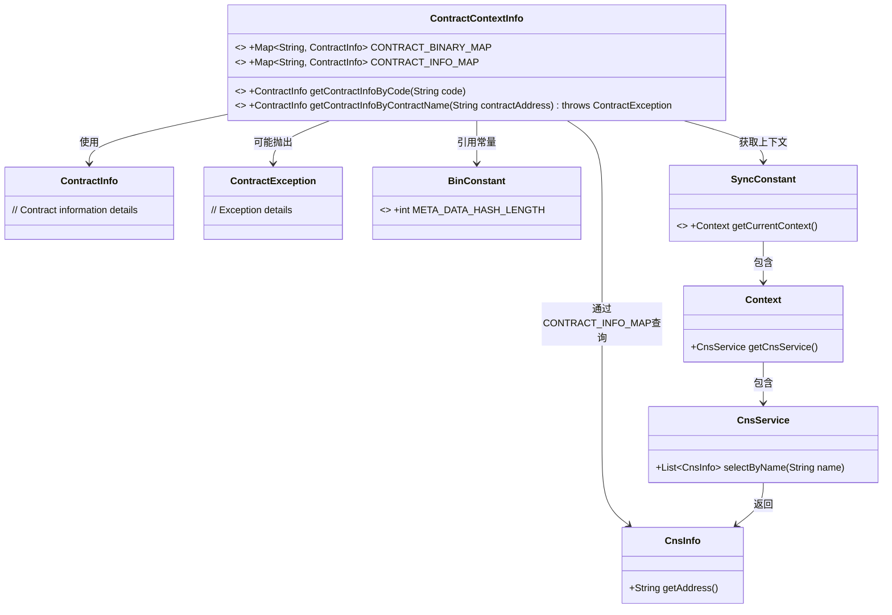
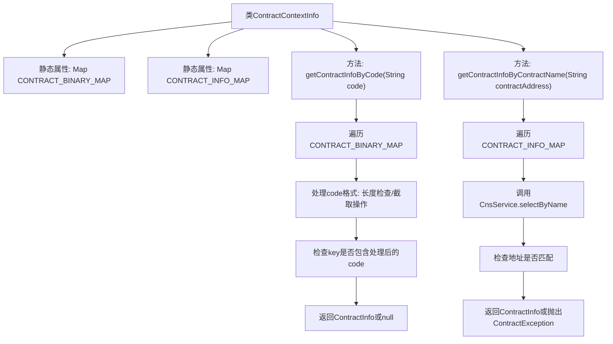

# 基础信息

|      |      |
|------|------|
| 名称 | ContractContextInfo |
| 编码语言 | .java |
| 代码路径 | WeFe/union/blockchain-data-sync/src/main/java/com/welab/wefe/bo/contract/ContractContextInfo.java |
| 包名 | com.welab.wefe.bo.contract |
| 依赖项 | ['com.welab.wefe.constant.BinConstant', 'com.welab.wefe.constant.SyncConstant', 'org.apache.commons.lang3.StringUtils', 'org.fisco.bcos.sdk.contract.precompiled.cns.CnsInfo', 'org.fisco.bcos.sdk.transaction.model.exception.ContractException', 'java.util.HashMap', 'java.util.List', 'java.util.Map', 'java.util.stream.Collectors'] |
| 概述说明 | ContractContextInfo类包含两个静态Map存储合约信息，提供通过合约地址码或名称查询合约信息的方法。地址码查询处理特殊格式，名称查询匹配地址后返回对应信息。 |

# 说明

ContractContextInfo类管理合约信息，包含两个静态Map：CONTRACT_BINARY_MAP存储合约二进制与信息映射，CONTRACT_INFO_MAP存储合约名称与信息映射。提供两个查询方法：getContractInfoByCode通过合约地址码查询，处理不同长度和格式的码值进行匹配；getContractInfoByContractName通过合约名称查询，利用CnsService验证地址有效性后返回对应信息。未找到时均返回null。

# 类列表 Class Summary

| 名称   | 类型  | 说明 |
|-------|------|-------------|
| ContractContextInfo | class | ContractContextInfo类包含两个静态Map存储合约信息，提供通过合约地址码或合约名称查询合约信息的方法。 |

## 类 ContractContextInfo

|      |      |
|------|------|
| 访问范围 | public |
| 类型 | class |
| 名称 | ContractContextInfo |
| 说明 | ContractContextInfo类包含两个静态Map存储合约信息，提供通过合约地址码或合约名称查询合约信息的方法。 |

### UML类图

这段代码展示了一个合约上下文信息管理类，通过两个静态Map维护合约二进制和名称的映射关系。核心功能是通过合约地址代码或名称查询合约信息，涉及哈希长度校验、地址格式处理等逻辑。类图清晰地展示了与CNS服务、上下文对象和常量类的协作关系，体现了合约信息查询的完整链路。异常处理和字符串操作体现了对边缘情况的考虑。

### 内部方法调用关系图

这段代码流程图展示了ContractContextInfo类的结构和主要方法逻辑。该类维护两个静态合约信息映射表，提供两种查询方式：通过合约地址码查询时会对输入进行格式处理后再匹配；通过合约名称查询时会调用CNS服务验证地址有效性。两种方法都采用遍历查找策略，最终返回匹配的合约信息或空值/异常。

### 字段列表 Field List

| 名称  | 类型  | 说明 |
|-------|-------|------|
| CONTRACT_INFO_MAP = new HashMap<>(16) | Map<String, ContractInfo> | 静态哈希映射存储合约信息，初始容量16。 |
| CONTRACT_BINARY_MAP = new HashMap<>(16) | Map<String, ContractInfo> | 静态哈希映射，键为字符串，值为合同信息，初始容量16。 |

### 方法列表

| 名称  | 类型  | 说明 |
|-------|-------|------|
| getContractInfoByCode | ContractInfo | 该方法通过遍历合约映射，根据输入代码长度和特定字符串匹配规则调整代码格式，最终返回匹配的合约信息。若未匹配则返回null。 |
| getContractInfoByContractName | ContractInfo | 静态方法getContractInfoByContractName通过合约地址查询合约信息。遍历CONTRACT_INFO_MAP，检查CnsService中是否存在匹配地址，存在则返回对应合约信息，否则返回null。 |

