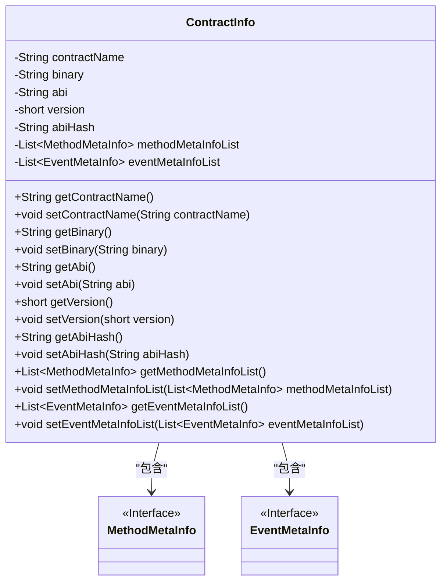

# 基础信息

|      |      |
|------|------|
| 名称 | ContractInfo |
| 编码语言 | .java |
| 代码路径 | WeFe/union/blockchain-data-sync/src/main/java/com/welab/wefe/bo/contract/ContractInfo.java |
| 包名 | com.welab.wefe.bo.contract |
| 依赖项 | ['java.util.List'] |
| 概述说明 | ContractInfo类包含合约名称、二进制代码、ABI、版本号、ABI哈希值、方法元信息列表和事件元信息列表，提供各字段的getter和setter方法。 |

# 说明

ContractInfo类是一个包含合约相关信息的Java类，主要字段包括合约名称、二进制数据、ABI、版本号、ABI哈希值、方法元信息列表和事件元信息列表。每个字段都有对应的getter和setter方法，用于获取和设置属性值。方法元信息列表和事件元信息列表分别存储MethodMetaInfo和EventMetaInfo类型的对象。

# 类列表 Class Summary

| 名称   | 类型  | 说明 |
|-------|------|-------------|
| ContractInfo | class | ContractInfo类包含合约名称、二进制代码、ABI、版本号、ABI哈希值、方法元信息列表和事件元信息列表，提供各字段的getter和setter方法。 |

## 类 ContractInfo

|      |      |
|------|------|
| 访问范围 | public |
| 类型 | class |
| 名称 | ContractInfo |
| 说明 | ContractInfo类包含合约名称、二进制代码、ABI、版本号、ABI哈希值、方法元信息列表和事件元信息列表，提供各字段的getter和setter方法。 |

### UML类图

这段代码定义了一个`ContractInfo`类，用于存储智能合约的相关信息，包括合约名称、二进制代码、ABI接口、版本号、ABI哈希值以及方法和事件的元信息列表。该类通过私有字段封装数据，并提供了完整的getter和setter方法。类图中展示了`ContractInfo`与`MethodMetaInfo`和`EventMetaInfo`两个接口的依赖关系，表明合约信息中包含方法和事件的元数据列表。整体设计符合JavaBean规范，便于数据封装和访问控制。

### 内部方法调用关系图

```mermaid
graph TD
    A["类ContractInfo"]
    B["属性: String contractName"]
    C["属性: String binary"]
    D["属性: String abi"]
    E["属性: short version"]
    F["属性: String abiHash"]
    G["属性: List<MethodMetaInfo> methodMetaInfoList"]
    H["属性: List<EventMetaInfo> eventMetaInfoList"]
    I["方法: getContractName()"]
    J["方法: setContractName(String)"]
    K["方法: getBinary()"]
    L["方法: setBinary(String)"]
    M["方法: getAbi()"]
    N["方法: setAbi(String)"]
    O["方法: getVersion()"]
    P["方法: setVersion(short)"]
    Q["方法: getAbiHash()"]
    R["方法: setAbiHash(String)"]
    S["方法: getMethodMetaInfoList()"]
    T["方法: setMethodMetaInfoList(List<MethodMetaInfo>)"]
    U["方法: getEventMetaInfoList()"]
    V["方法: setEventMetaInfoList(List<EventMetaInfo>)"]

    A --> B
    A --> C
    A --> D
    A --> E
    A --> F
    A --> G
    A --> H
    A --> I
    A --> J
    A --> K
    A --> L
    A --> M
    A --> N
    A --> O
    A --> P
    A --> Q
    A --> R
    A --> S
    A --> T
    A --> U
    A --> V
```

该流程图展示了ContractInfo类的完整结构，包含8个私有属性和14个公共方法。属性包括合约名称、二进制数据、ABI、版本号、ABI哈希值以及方法和事件的元信息列表。每个属性都配有对应的getter和setter方法，用于封装访问和修改这些属性的值。类设计符合JavaBean规范，通过方法暴露属性操作，保持数据封装性。

### 字段列表 Field List

| 名称  | 类型  | 说明 |
|-------|-------|------|
| version | short | 私有短整型变量version，用于存储版本号。 |
| eventMetaInfoList | List<EventMetaInfo> | 事件元信息列表，存储EventMetaInfo对象的私有集合。 |
| binary | String | 声明一个私有字符串变量binary。 |
| abi | String | 定义私有字符串变量abi。 |
| contractName | String | 私有字符串变量contractName |
| abiHash | String | 私有字符串变量abiHash，用于存储ABI哈希值。 |
| methodMetaInfoList | List<MethodMetaInfo> | 类私有成员变量，存储方法元信息列表。 |

### 方法列表

| 名称  | 类型  | 说明 |
|-------|-------|------|
| getBinary | String | 获取二进制字符串的方法。 |
| setContractName | void | 设置合同名称的方法，将输入参数赋值给类的成员变量contractName。 |
| setEventMetaInfoList | void | 设置事件元信息列表的方法，将输入列表赋值给类的成员变量。 |
| setAbiHash | void | 设置ABI哈希值的方法，将输入参数abiHash赋值给类成员变量abiHash。 |
| setVersion | void | 设置版本号的公共方法，参数为short类型，赋值给类成员变量version。 |
| getAbiHash | String | 获取abiHash值的公共方法。 |
| getContractName | String | 获取合约名称的方法，返回字符串类型变量contractName。 |
| setBinary | void | 设置二进制字符串的方法，将输入值赋给类的binary变量。 |
| getAbi | String | 获取abi字符串的方法。 |
| setMethodMetaInfoList | void | 设置方法元信息列表，将输入列表赋值给类的成员变量methodMetaInfoList。 |
| getEventMetaInfoList | List<EventMetaInfo> | 获取事件元信息列表的方法，返回存储的事件元信息集合。 |
| setAbi | void | 定义了一个公共方法setAbi，用于设置类的abi属性值为传入的字符串参数。 |
| getMethodMetaInfoList | List<MethodMetaInfo> | 获取方法元信息列表的方法，返回存储方法元信息的列表。 |
| getVersion | short | 获取当前版本号的短整型方法。 |

