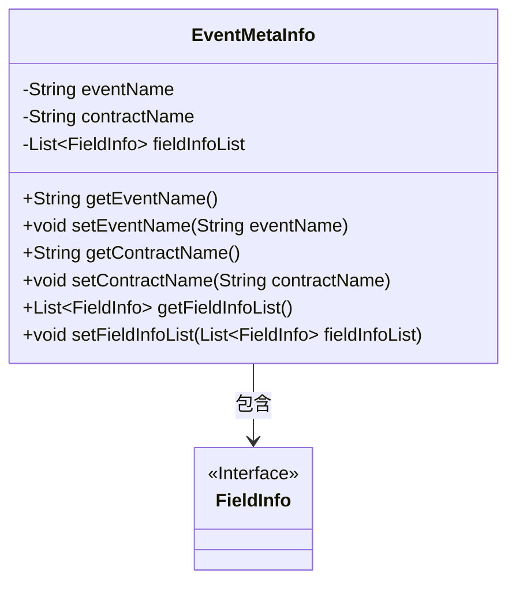
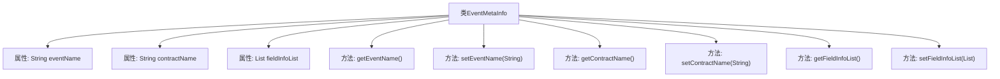

# 基础信息

|      |      |
|------|------|
| 名称 | EventMetaInfo |
| 编码语言 | .java |
| 代码路径 | WeFe/union/blockchain-data-sync/src/main/java/com/welab/wefe/bo/contract/EventMetaInfo.java |
| 包名 | com.welab.wefe.bo.contract |
| 依赖项 | ['java.util.List'] |
| 概述说明 | EventMetaInfo类包含事件名、合约名和事件参数列表，提供对应的getter和setter方法。 |

# 说明

EventMetaInfo类用于存储事件元信息，包含三个主要属性：eventName表示事件名称，contractName表示合约名称，fieldInfoList是FieldInfo类型的列表，存储事件参数。类提供了这三个属性的getter和setter方法，用于获取和设置对应的值。

# 类列表 Class Summary

| 名称   | 类型  | 说明 |
|-------|------|-------------|
| EventMetaInfo | class | EventMetaInfo类包含事件名称、合约名称和事件参数列表，提供对应的getter和setter方法。 |

## 类 EventMetaInfo

|      |      |
|------|------|
| 访问范围 | public |
| 类型 | class |
| 名称 | EventMetaInfo |
| 说明 | EventMetaInfo类包含事件名称、合约名称和事件参数列表，提供对应的getter和setter方法。 |

### UML类图

这段代码定义了一个`EventMetaInfo`类，用于存储事件的元信息，包括事件名称、合约名称和字段信息列表。该类提供了对私有字段的getter和setter方法，并通过泛型`List<FieldInfo>`管理字段信息集合。类图中显示了`EventMetaInfo`与`FieldInfo`接口之间的依赖关系，表明事件元信息包含多个字段信息对象。这是一个典型的数据封装类，用于结构化存储和传递事件相关数据。

### 内部方法调用关系图

这段代码定义了一个名为EventMetaInfo的类，用于存储事件元信息。类包含三个私有属性：eventName表示事件名称，contractName表示合约名称，fieldInfoList存储事件参数的字段信息列表。提供了六个公共方法，包括各属性的getter和setter方法，用于获取和设置这些属性的值。该类主要用于封装和管理与事件相关的元数据信息，便于其他代码模块进行访问和修改。

### 字段列表 Field List

| 名称  | 类型  | 说明 |
|-------|-------|------|
| fieldInfoList | List<FieldInfo> | 字段信息列表，存储FieldInfo对象集合。 |
| eventName | String | 私有字符串变量eventName，用于存储事件名称。 |
| contractName | String | 私有字符串变量contractName |

### 方法列表

| 名称  | 类型  | 说明 |
|-------|-------|------|
| setEventName | void | 这是一个Java方法，用于设置事件名称。方法接收一个字符串参数eventName，并将其赋值给类的成员变量eventName。 |
| setFieldInfoList | void | 设置字段信息列表的方法，将传入的字段信息列表赋值给当前对象的成员变量。 |
| getContractName | String | 这是一个Java方法，返回字符串类型的contractName变量值。 |
| getEventName | String | 获取事件名称的方法，返回字符串类型的事件名称。 |
| getFieldInfoList | List<FieldInfo> | 该方法返回一个FieldInfo类型的列表fieldInfoList。 |
| setContractName | void | 这是一个Java方法，用于设置合约名称。方法接收一个字符串参数contractName，并将其赋值给类的成员变量contractName。 |

