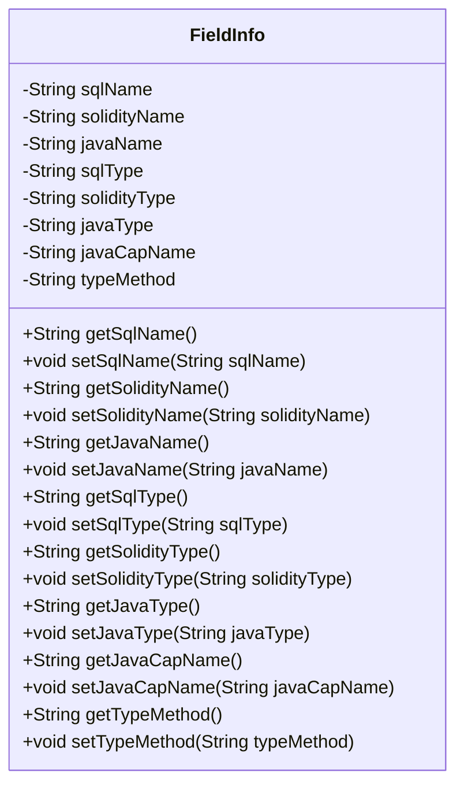

# 基础信息

|      |      |
|------|------|
| 名称 | FieldInfo |
| 编码语言 | .java |
| 代码路径 | WeFe/union/blockchain-data-sync/src/main/java/com/welab/wefe/bo/contract/FieldInfo.java |
| 包名 | com.welab.wefe.bo.contract |
| 依赖项 | [] |
| 概述说明 | FieldInfo类包含SQL、Solidity和Java的字段名、类型及方法，提供getter和setter方法。 |

# 说明

FieldInfo类是一个用于存储字段信息的Java类，包含字段在不同环境中的名称和类型。该类有八个私有字符串属性：sqlName、solidityName、javaName、sqlType、solidityType、javaType、javaCapName和typeMethod。每个属性都有对应的getter和setter方法，用于获取和设置属性值。这些属性分别表示字段在SQL、Solidity和Java中的名称和类型，以及Java中的大写名称和类型方法。

# 类列表 Class Summary

| 名称   | 类型  | 说明 |
|-------|------|-------------|
| FieldInfo | class | FieldInfo类包含SQL、Solidity和Java的字段名和类型，提供getter和setter方法。 |

## 类 FieldInfo

|      |      |
|------|------|
| 访问范围 | public |
| 类型 | class |
| 名称 | FieldInfo |
| 说明 | FieldInfo类包含SQL、Solidity和Java的字段名和类型，提供getter和setter方法。 |

### UML类图

这段代码定义了一个`FieldInfo`类，用于存储和管理字段在不同编程语言（SQL、Solidity、Java）中的名称和类型信息。该类包含8个私有字符串属性，分别表示字段在三种语言中的名称、类型以及Java大写名称和类型方法。通过公有getter和setter方法提供对这些属性的访问和修改。这个类可能用于多语言代码生成或数据映射场景，帮助统一管理跨平台字段定义。

### 内部方法调用关系图

```mermaid
graph TD
    A["类FieldInfo"]
    B["属性: String sqlName"]
    C["属性: String solidityName"]
    D["属性: String javaName"]
    E["属性: String sqlType"]
    F["属性: String solidityType"]
    G["属性: String javaType"]
    H["属性: String javaCapName"]
    I["属性: String typeMethod"]
    J["方法: getSqlName()"]
    K["方法: setSqlName(String)"]
    L["方法: getSolidityName()"]
    M["方法: setSolidityName(String)"]
    N["方法: getJavaName()"]
    O["方法: setJavaName(String)"]
    P["方法: getSqlType()"]
    Q["方法: setSqlType(String)"]
    R["方法: getSolidityType()"]
    S["方法: setSolidityType(String)"]
    T["方法: getJavaType()"]
    U["方法: setJavaType(String)"]
    V["方法: getJavaCapName()"]
    W["方法: setJavaCapName(String)"]
    X["方法: getTypeMethod()"]
    Y["方法: setTypeMethod(String)"]

    A --> B
    A --> C
    A --> D
    A --> E
    A --> F
    A --> G
    A --> H
    A --> I
    A --> J
    A --> K
    A --> L
    A --> M
    A --> N
    A --> O
    A --> P
    A --> Q
    A --> R
    A --> S
    A --> T
    A --> U
    A --> V
    A --> W
    A --> X
    A --> Y
```

这段代码定义了一个FieldInfo类，包含8个私有字符串属性和对应的getter/setter方法。该类用于存储字段在不同技术栈（SQL/Solidity/Java）中的名称和类型信息，其中javaCapName可能表示首字母大写的Java字段名，typeMethod可能表示类型转换方法。所有属性都通过标准访问器方法进行封装，体现了JavaBean的设计模式。

### 字段列表 Field List

| 名称  | 类型  | 说明 |
|-------|-------|------|
| typeMethod | String | 声明一个私有字符串变量typeMethod。 |
| solidityName | String | 声明一个私有字符串变量solidityName。 |
| javaType | String | 声明一个私有字符串变量javaType。 |
| javaCapName | String | 私有字符串变量javaCapName，用于存储名称。 |
| solidityType | String | 声明一个私有字符串变量soldityType。 |
| sqlName | String | 私有字符串变量sqlName。 |
| sqlType | String | 私有字符串变量sqlType，用于存储SQL类型信息。 |
| javaName | String | 私有字符串变量javaName。 |

### 方法列表

| 名称  | 类型  | 说明 |
|-------|-------|------|
| getSolidityName | String | 获取solidityName的方法，返回字符串类型值。 |
| setSqlName | void | 这是一个Java方法，用于设置类的sqlName属性值。方法接收一个字符串参数sqlName，并将其赋值给类的同名成员变量。 |
| setJavaName | void | 这是一个Java方法，用于设置类的javaName属性值。方法接收一个字符串参数javaName，并将其赋值给类的同名成员变量。 |
| getSqlType | String | 这是一个Java方法，返回字符串类型的sqlType属性值。 |
| setSolidityType | void | 这是一个Java方法，用于设置solidityType属性的值。方法接收一个字符串参数并将其赋值给类的成员变量。 |
| getSolidityType | String | 获取Solidity类型的方法，返回字符串类型的solidityType。 |
| getJavaName | String | 获取Java名称的方法，返回变量javaName的值。 |
| setSolidityName | void | 设置Solidity名称的方法，将输入参数赋值给类的成员变量solidityName。 |
| getJavaType | String | 获取Java类型的字符串方法。 |
| setJavaType | void | 设置Java类型的公共方法，参数为字符串javaType，赋值给成员变量this.javaType。 |
| setSqlType | void | Java方法：设置SQL类型字符串参数。 |
| getJavaCapName | String | 这是一个Java方法，返回字符串类型的成员变量javaCapName的值。 |
| setJavaCapName | void | 这是一个Java方法，用于设置类成员变量javaCapName的值。方法接受一个字符串参数，并将其赋值给当前对象的javaCapName属性。 |
| setTypeMethod | void | 这是一个Java方法，用于设置类中的typeMethod属性值。方法接收一个字符串参数typeMethod，并将其赋值给类的同名成员变量。 |
| getSqlName | String | 这是一个Java方法，返回字符串类型的sqlName属性值。 |
| getTypeMethod | String | 获取typeMethod值的公共方法。 |

