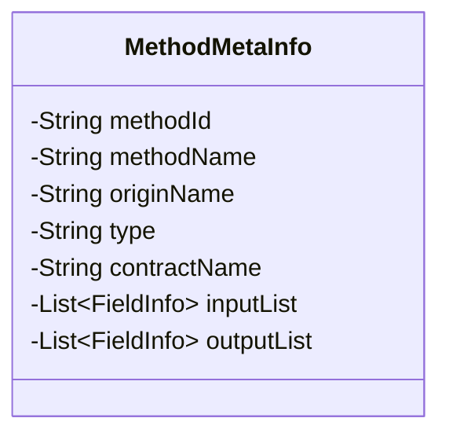
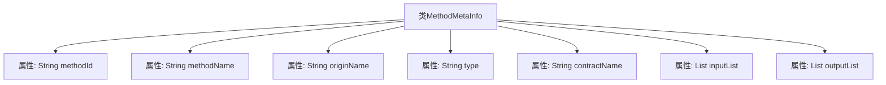

# 基础信息

|      |      |
|------|------|
| 名称 | MethodMetaInfo |
| 编码语言 | .java |
| 代码路径 | WeFe/union/blockchain-data-sync/src/main/java/com/welab/wefe/bo/contract/MethodMetaInfo.java |
| 包名 | com.welab.wefe.bo.contract |
| 依赖项 | ['java.util.List'] |
| 概述说明 | MethodMetaInfo类包含方法ID、名称、原始名、类型、合约名及输入输出参数列表。 |

# 说明

MethodMetaInfo类用于存储方法元信息，包含方法ID、方法名称、原始名称、类型、合约名称等字段。其中inputList和outputList分别表示方法的输入和输出参数列表，由FieldInfo对象组成。类中关键字段均有注释说明其用途。

# 类列表 Class Summary

| 名称   | 类型  | 说明 |
|-------|------|-------------|
| MethodMetaInfo | class | MethodMetaInfo类包含方法ID、名称、原始名、类型、合约名及输入输出参数列表。 |

## 类 MethodMetaInfo

|      |      |
|------|------|
| 访问范围 | public |
| 类型 | class |
| 名称 | MethodMetaInfo |
| 说明 | MethodMetaInfo类包含方法ID、名称、原始名、类型、合约名及输入输出参数列表。 |

### UML类图

这段类图描述了`MethodMetaInfo`类的结构，它是一个包含方法元数据的实体类。该类私有属性包括方法ID、方法名称、原始名称、类型、合约名称，以及输入/输出参数列表（使用泛型`List<FieldInfo>`存储）。所有字段均为私有，未暴露公共方法，表明可能通过外部构造器或Builder模式初始化。类设计专注于封装方法的完整描述信息，适用于需要记录方法签名、所属合约及参数详情的场景。

### 内部方法调用关系图

这段流程图描述了MethodMetaInfo类的结构，包含7个核心属性：methodId(方法标识)、methodName(方法名)、originName(原始名)、type(类型)、contractName(合约名)以及inputList(输入参数列表)和outputList(输出参数列表)。该图清晰地展示了类与属性之间的从属关系，每个属性都通过箭头与主类连接，形成完整的类结构视图。这种结构常用于存储方法的元数据信息，特别适用于需要记录方法签名、参数类型等详细信息的场景。

### 字段列表 Field List

| 名称  | 类型  | 说明 |
|-------|-------|------|
| type | String | 声明一个私有字符串变量type。 |
| methodId | String | 私有字符串类型变量methodId。 |
| methodName | String | 私有字符串变量methodName |
| contractName | String | 私有字符串变量contractName |
| originName | String | 私有字符串变量originName |
| inputList | List<FieldInfo> | 私有字段inputList，类型为FieldInfo的列表。 |
| outputList | List<FieldInfo> | 私有字段outputList，类型为FieldInfo的列表。 |

### 方法列表

| 名称  | 类型  | 说明 |
|-------|-------|------|

