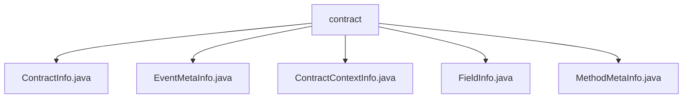

# 基础信息

|      |      |
|------|------|
| 名称 | contract |
| 编码语言 | .java |
| 代码路径 | WeFe/union/blockchain-data-sync/src/main/java/com/welab/wefe/bo/contract |
| 包名 | docs.union.blockchain-data-sync.src.main.java.com.welab.wefe.bo.contract |
| 概述说明 | ContractInfo类存储合约信息，含名称、二进制、ABI等字段。EventMetaInfo类存事件元信息，含名称、合约名和参数列表。ContractContextInfo类管理合约信息映射，提供查询方法。FieldInfo类存字段在不同环境中的名称和类型。MethodMetaInfo类存方法元信息，含输入输出参数列表。 |

# 说明

## 概述  
该模块核心职责是管理区块链合约元数据，包括合约基础信息、方法签名及事件参数的结构化存储。接口规范统一采用Getter/Setter模式访问字段，例如ContractInfo提供合约ABI/版本号等属性访问，EventMetaInfo封装事件名称与参数列表。关键数据结构包括合约二进制映射(ContractContextInfo)、跨语言字段定义(FieldInfo)和方法输入输出模板(MethodMetaInfo)。外部依赖仅涉及CnsService地址验证。实现案例包含通过合约地址码查询信息(ContractContextInfo.getContractInfoByCode)等。

## 主要业务场景  
模块支持合约全生命周期管理，类似配置中心模式。典型流程包括：通过合约地址或名称查询元数据(ContractContextInfo)、解析方法签名(MethodMetaInfo.inputList)和事件结构(EventMetaInfo.fieldInfoList)。交互模式均基于静态Map缓存，例如CONTRACT_BINARY_MAP加速二进制数据检索。功能完整性体现在跨链环境字段适配(FieldInfo定义SQL/Solidity/Java类型映射)，典型应用如智能合约事件监听时解析参数类型。API类型包含元数据查询和结构转换两类。

### 包内部结构视图

该流程图展示了区块链数据同步项目中contract目录下的文件结构关系。contract作为父节点，包含5个Java类文件：ContractInfo、EventMetaInfo、ContractContextInfo、FieldInfo和MethodMetaInfo，这些文件共同构成了智能合约相关的数据模型定义部分。

# 文件列表

| 名称   | 类型  | 说明 |
|-------|------|-------------|
| [ContractInfo.java](ContractInfo.md) | file | ContractInfo类包含合约名称、二进制代码、ABI、版本号、ABI哈希值、方法元信息列表和事件元信息列表，提供各字段的getter和setter方法。 |
| [EventMetaInfo.java](EventMetaInfo.md) | file | EventMetaInfo类包含事件名、合约名和事件参数列表，提供对应的getter和setter方法。 |
| [ContractContextInfo.java](ContractContextInfo.md) | file | ContractContextInfo类包含两个静态Map存储合约信息，提供通过合约地址码或名称查询合约信息的方法。地址码查询处理特殊格式，名称查询匹配地址后返回对应信息。 |
| [FieldInfo.java](FieldInfo.md) | file | FieldInfo类包含SQL、Solidity和Java的字段名、类型及方法，提供getter和setter方法。 |
| [MethodMetaInfo.java](MethodMetaInfo.md) | file | MethodMetaInfo类包含方法ID、名称、原始名、类型、合约名及输入输出参数列表。 |

