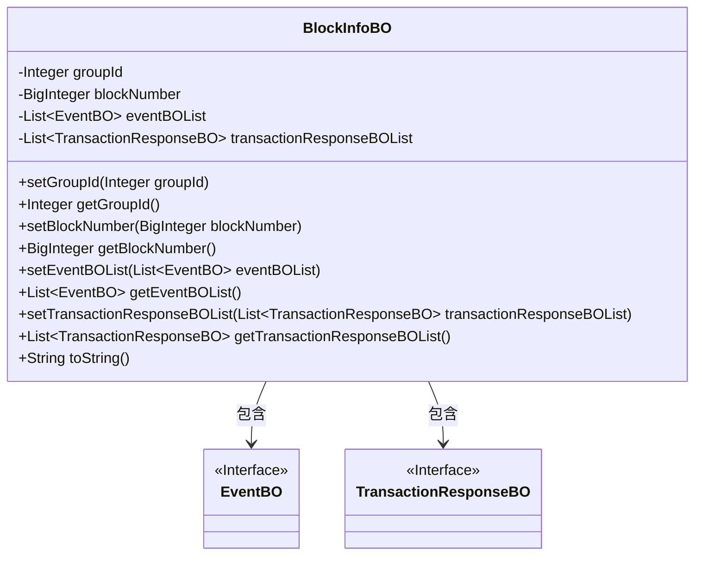

# 基础信息

|      |      |
|------|------|
| 名称 | BlockInfoBO |
| 编码语言 | .java |
| 代码路径 | WeFe/union/blockchain-data-sync/src/main/java/com/welab/wefe/bo/data/BlockInfoBO.java |
| 包名 | com.welab.wefe.bo.data |
| 依赖项 | ['java.math.BigInteger', 'java.util.ArrayList', 'java.util.List'] |
| 概述说明 | BlockInfoBO类包含groupId、blockNumber、eventBOList和transactionResponseBOList属性，提供getter和setter方法，toString方法输出关键字段。 |

# 说明

BlockInfoBO是一个Java类，用于封装区块信息。它包含四个主要属性：groupId表示组ID，blockNumber存储区块号，eventBOList保存事件对象列表，transactionResponseBOList存储交易响应对象列表。类提供了这些属性的getter和setter方法，并重写了toString方法以输出groupId、blockNumber和eventBOList的字符串表示。transactionResponseBOList在声明时被初始化为空ArrayList。

# 类列表 Class Summary

| 名称   | 类型  | 说明 |
|-------|------|-------------|
| BlockInfoBO | class | BlockInfoBO类包含groupId、blockNumber、eventBOList和transactionResponseBOList属性，提供getter和setter方法，toString方法输出部分属性。 |

## 类 BlockInfoBO

|      |      |
|------|------|
| 访问范围 | public |
| 类型 | class |
| 名称 | BlockInfoBO |
| 说明 | BlockInfoBO类包含groupId、blockNumber、eventBOList和transactionResponseBOList属性，提供getter和setter方法，toString方法输出部分属性。 |

### UML类图

这段类图展示了BlockInfoBO类的结构，它是一个包含区块信息的业务对象，具有groupId和blockNumber两个基本属性，以及两个列表类型的属性eventBOList和transactionResponseBOList。该类提供了标准的getter和setter方法，并重写了toString方法。BlockInfoBO与EventBO和TransactionResponseBO两个接口存在关联关系，表示它包含了这两种类型的对象列表。图中清晰地展示了类之间的依赖关系和属性类型，符合标准的UML类图规范。

### 内部方法调用关系图

```mermaid
graph TD
    A["类BlockInfoBO"]
    B["属性: Integer groupId"]
    C["属性: BigInteger blockNumber"]
    D["属性: List<EventBO> eventBOList"]
    E["属性: List<TransactionResponseBO> transactionResponseBOList"]
    F["方法: toString()"]
    G["方法: getGroupId()"]
    H["方法: setGroupId(Integer)"]
    I["方法: getEventBOList()"]
    J["方法: setEventBOList(List<EventBO>)"]
    K["方法: getBlockNumber()"]
    L["方法: setBlockNumber(BigInteger)"]
    M["方法: getTransactionResponseBOList()"]
    N["方法: setTransactionResponseBOList(List<TransactionResponseBO>)"]

    A --> B
    A --> C
    A --> D
    A --> E
    A --> F
    A --> G
    A --> H
    A --> I
    A --> J
    A --> K
    A --> L
    A --> M
    A --> N
```

这段代码定义了一个名为BlockInfoBO的类，用于存储区块信息，包括组ID、区块号、事件列表和交易响应列表。类中提供了属性的getter和setter方法，以及重写的toString方法用于格式化输出对象内容。流程图展示了类结构与各属性方法间的关联关系，所有方法均直接隶属于BlockInfoBO类，用于操作或访问对应的私有属性。

### 字段列表 Field List

| 名称  | 类型  | 说明 |
|-------|-------|------|
| blockNumber | BigInteger | 私有的大整数类型变量，用于存储区块编号。 |
| eventBOList | List<EventBO> | 私有事件业务对象列表。 |
| groupId | Integer | 私有整型变量groupId，用于存储组ID。 |
| transactionResponseBOList = new ArrayList<>() | List<TransactionResponseBO> | 声明一个私有列表变量transactionResponseBOList，初始化为空ArrayList，用于存储TransactionResponseBO类型对象。 |

### 方法列表

| 名称  | 类型  | 说明 |
|-------|-------|------|
| getEventBOList | List<EventBO> | 获取事件BO列表的方法，直接返回成员变量eventBOList。 |
| toString | String | Java重写toString方法，返回包含groupId、blockNumber和eventBOList的字符串。 |
| setEventBOList | void | 设置事件对象列表的方法，将输入列表赋值给类的成员变量eventBOList。 |
| getGroupId | Integer | 获取分组ID的方法，返回整数类型的groupId。 |
| setGroupId | void | 这是一个Java方法，用于设置对象的groupId属性，接受一个Integer类型参数。 |
| getBlockNumber | BigInteger | 获取区块编号的方法，返回BigInteger类型的blockNumber值。 |
| setBlockNumber | void | 这是一个Java方法，用于设置对象的blockNumber属性，参数类型为BigInteger。 |
| getTransactionResponseBOList | List<TransactionResponseBO> | 获取交易响应BO列表的方法，直接返回成员变量transactionResponseBOList。 |
| setTransactionResponseBOList | void | 这是一个Java方法，用于设置transactionResponseBOList属性的值，参数为TransactionResponseBO类型的列表。 |

