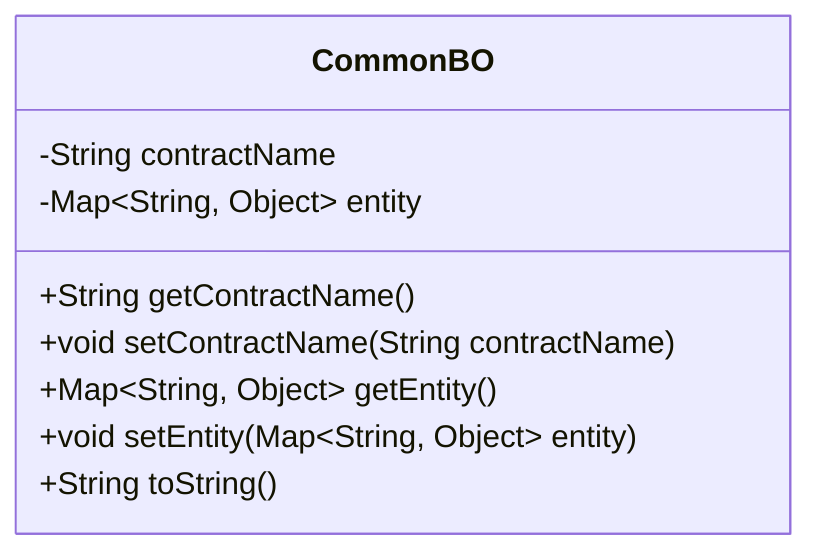
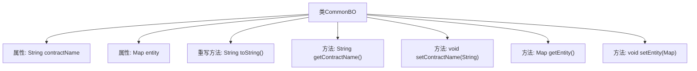

# 基础信息

|      |      |
|------|------|
| 名称 | CommonBO |
| 编码语言 | .java |
| 代码路径 | WeFe/union/blockchain-data-sync/src/main/java/com/welab/wefe/bo/data/CommonBO.java |
| 包名 | com.welab.wefe.bo.data |
| 依赖项 | ['java.util.Map'] |
| 概述说明 | Java类CommonBO包含contractName和entity属性，提供getter/setter方法，toString方法返回属性值。 |

# 说明

CommonBO是一个Java类，包含两个私有属性：contractName（字符串类型）和entity（Map类型，键为字符串，值为对象）。类中提供了这两个属性的getter和setter方法。此外，重写了toString方法，返回包含contractName和entity值的格式化字符串。该类主要用于封装合同名称和实体数据。

# 类列表 Class Summary

| 名称   | 类型  | 说明 |
|-------|------|-------------|
| CommonBO | class | Java类CommonBO包含合同名和实体映射，提供getter/setter和toString方法。 |

## 类 CommonBO

|      |      |
|------|------|
| 访问范围 | public |
| 类型 | class |
| 名称 | CommonBO |
| 说明 | Java类CommonBO包含合同名和实体映射，提供getter/setter和toString方法。 |

### UML类图

该代码定义了一个名为CommonBO的类，包含两个私有成员变量：contractName（字符串类型）和entity（Map类型，键为String，值为Object）。类提供了对这些变量的getter和setter方法，以及重写了toString方法用于格式化输出对象内容。这个类主要用于封装合同名称和关联实体数据，适用于需要处理合同相关数据的业务场景。

### 内部方法调用关系图

该流程图展示了CommonBO类的结构，包含两个私有属性（contractName和entity）和五个方法。核心方法是toString()用于格式化输出对象内容，以及四个标准的getter/setter方法用于属性访问控制。所有方法均直接关联到类主体，无嵌套调用关系，体现了典型的Java Bean设计模式。

### 字段列表 Field List

| 名称  | 类型  | 说明 |
|-------|-------|------|
| contractName | String | 私有字符串变量contractName |
| entity | Map<String, Object> | 私有映射变量entity，键为字符串类型，值为对象类型。 |

### 方法列表

| 名称  | 类型  | 说明 |
|-------|-------|------|
| setContractName | void | 设置合同名称的方法，将输入参数赋值给类的成员变量contractName。 |
| getContractName | String | 获取合约名称的方法，返回字符串类型变量contractName。 |
| toString | String | 重写toString方法，返回包含contractName和entity的字符串。 |
| getEntity | Map<String, Object> | 方法返回名为entity的Map对象，键为String类型，值为Object类型。 |
| setEntity | void | 这是一个Java方法，用于设置类的entity属性，参数为Map类型，键为String，值为Object。 |

