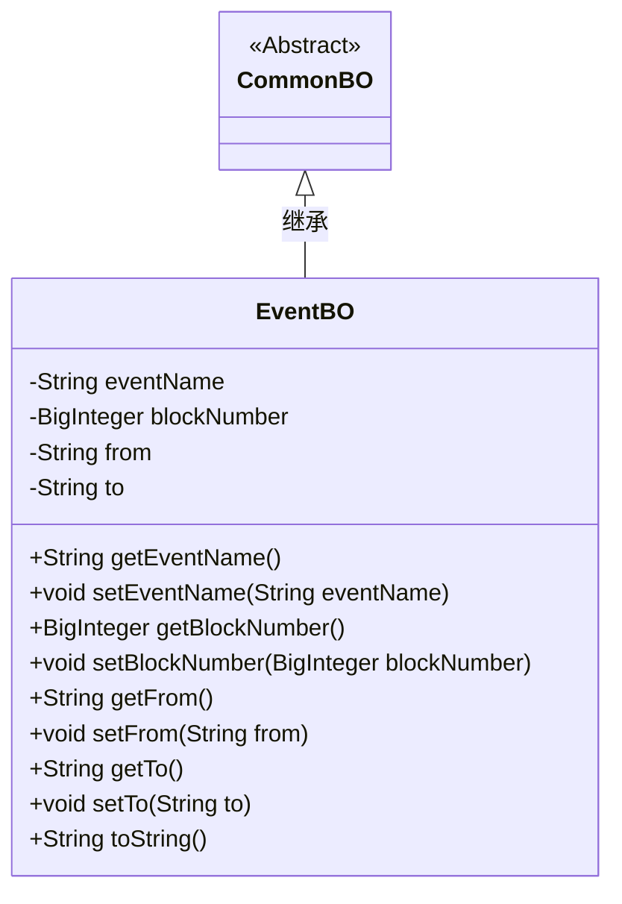

# 基础信息

|      |      |
|------|------|
| 名称 | EventBO |
| 编码语言 | .java |
| 代码路径 | WeFe/union/blockchain-data-sync/src/main/java/com/welab/wefe/bo/data/EventBO.java |
| 包名 | com.welab.wefe.bo.data |
| 依赖项 | ['java.math.BigInteger'] |
| 概述说明 | EventBO类继承CommonBO，包含事件名、区块号、发送方和接收方属性，提供getter/setter方法和toString实现。 |

# 说明

EventBO类继承自CommonBO，包含四个私有属性：eventName（事件名称）、blockNumber（区块号）、from（来源地址）和to（目标地址）。提供了各属性的getter和setter方法，并重写了toString方法以返回包含所有属性的格式化字符串。

# 类列表 Class Summary

| 名称   | 类型  | 说明 |
|-------|------|-------------|
| EventBO | class | EventBO类继承CommonBO，包含事件名、区块号、发送方和接收方字段，提供getter和setter方法及toString实现。 |

## 类 EventBO

|      |      |
|------|------|
| 访问范围 | public |
| 类型 | class |
| 名称 | EventBO |
| 说明 | EventBO类继承CommonBO，包含事件名、区块号、发送方和接收方字段，提供getter和setter方法及toString实现。 |

### UML类图

这段代码展示了一个继承自抽象类CommonBO的EventBO类，主要用于封装事件相关的业务对象数据。EventBO包含事件名称、区块号、来源和目的地四个核心属性，通过getter/setter方法进行封装，并重写了toString()方法实现JSON格式输出。类图清晰地体现了继承关系和类的成员结构，符合JavaBean规范的设计模式。

### 内部方法调用关系图

```mermaid
graph TD
    A["类EventBO继承CommonBO"]
    B["属性: String eventName"]
    C["属性: BigInteger blockNumber"]
    D["属性: String from"]
    E["属性: String to"]
    F["重写方法: String toString()"]
    G["方法: String getEventName()"]
    H["方法: void setEventName(String)"]
    I["方法: BigInteger getBlockNumber()"]
    J["方法: void setBlockNumber(BigInteger)"]
    K["方法: String getFrom()"]
    L["方法: void setFrom(String)"]
    M["方法: String getTo()"]
    N["方法: void setTo(String)"]

    A --> B
    A --> C
    A --> D
    A --> E
    A --> F
    A --> G
    A --> H
    A --> I
    A --> J
    A --> K
    A --> L
    A --> M
    A --> N
```

这段代码展示了一个继承自CommonBO的EventBO类，包含四个私有属性（eventName、blockNumber、from、to）及其对应的getter/setter方法，并重写了toString()方法用于格式化输出对象内容。流程图清晰地呈现了类的继承关系、属性声明和方法结构，其中所有方法均直接关联到EventBO类，体现了标准的Java Bean设计模式，用于封装事件相关数据并支持链式操作。

### 字段列表 Field List

| 名称  | 类型  | 说明 |
|-------|-------|------|
| eventName | String | 私有字符串变量，存储事件名称。 |
| blockNumber | BigInteger | 定义了一个私有的大整数变量blockNumber。 |
| from | String | 声明一个私有字符串变量from。 |
| to | String | 声明一个私有字符串变量to。 |

### 方法列表

| 名称  | 类型  | 说明 |
|-------|-------|------|
| getBlockNumber | BigInteger | 这是一个Java方法，返回名为blockNumber的BigInteger类型变量值。 |
| setBlockNumber | void | 这是一个Java方法，用于设置对象的blockNumber属性，参数类型为BigInteger。方法将传入的blockNumber赋值给当前对象的同名属性。 |
| setEventName | void | 设置事件名称的方法，将输入字符串赋值给类的eventName变量。 |
| toString | String | 重写toString方法，返回包含eventName、blockNumber、from和to字段的字符串。 |
| getFrom | String | 获取from字段值的公共方法。 |
| setFrom | void | 设置来源字符串的方法，将参数from赋值给类成员变量this.from。 |
| getTo | String | 获取目标地址的方法，返回字符串类型变量to。 |
| setTo | void | 设置目标地址的方法，将参数to赋值给类成员变量this.to。 |
| getEventName | String | 获取事件名称的方法，返回字符串类型的事件名称。 |

