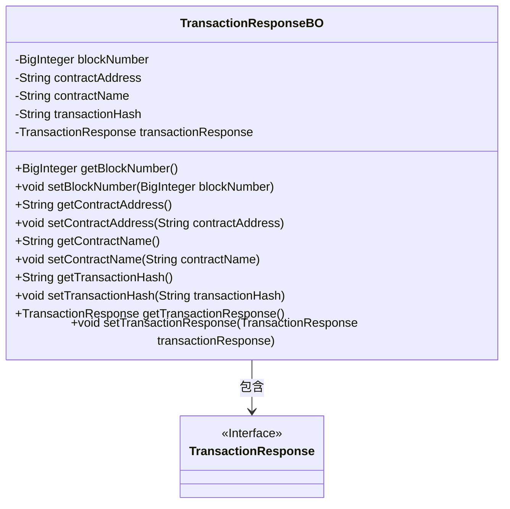

# 基础信息

|      |      |
|------|------|
| 名称 | TransactionResponseBO |
| 编码语言 | .java |
| 代码路径 | WeFe/union/blockchain-data-sync/src/main/java/com/welab/wefe/bo/data/TransactionResponseBO.java |
| 包名 | com.welab.wefe.bo.data |
| 依赖项 | ['org.fisco.bcos.sdk.transaction.model.dto.TransactionResponse', 'java.math.BigInteger'] |
| 概述说明 | 交易响应类，包含区块号、合约地址、合约名称、交易哈希及交易响应信息。 |

# 说明

TransactionResponseBO类包含区块号、合约地址、合约名称、交易哈希和交易响应对象，提供对应的getter和setter方法用于访问和修改这些属性。

# 类列表 Class Summary

| 名称   | 类型  | 说明 |
|-------|------|-------------|
| TransactionResponseBO | class | TransactionResponseBO类包含区块号、合约地址、合约名、交易哈希和交易响应等属性及其getter和setter方法。 |

## 类 TransactionResponseBO

|      |      |
|------|------|
| 访问范围 | public |
| 类型 | class |
| 名称 | TransactionResponseBO |
| 说明 | TransactionResponseBO类包含区块号、合约地址、合约名、交易哈希和交易响应等属性及其getter和setter方法。 |

### UML类图

这段类图展示了TransactionResponseBO类的结构，它是一个包含区块链交易相关数据的业务对象类。该类具有五个私有属性：blockNumber（区块号）、contractAddress（合约地址）、contractName（合约名称）、transactionHash（交易哈希）和transactionResponse（交易响应对象）。通过公有getter和setter方法暴露这些属性的访问和修改能力。其中transactionResponse属性关联到一个TransactionResponse接口，表明该类依赖于该接口的实现。整体结构清晰地反映了交易响应业务对象的数据封装和关联关系。

### 内部方法调用关系图

```mermaid
graph TD
    A["类TransactionResponseBO"]
    B["属性: BigInteger blockNumber"]
    C["属性: String contractAddress"]
    D["属性: String contractName"]
    E["属性: String transactionHash"]
    F["属性: TransactionResponse transactionResponse"]
    G["方法: getBlockNumber()"]
    H["方法: setBlockNumber(BigInteger)"]
    I["方法: getContractAddress()"]
    J["方法: setContractAddress(String)"]
    K["方法: getContractName()"]
    L["方法: setContractName(String)"]
    M["方法: getTransactionHash()"]
    N["方法: setTransactionHash(String)"]
    O["方法: getTransactionResponse()"]
    P["方法: setTransactionResponse(TransactionResponse)"]

    A --> B
    A --> C
    A --> D
    A --> E
    A --> F
    A --> G
    A --> H
    A --> I
    A --> J
    A --> K
    A --> L
    A --> M
    A --> N
    A --> O
    A --> P
```

这段代码定义了一个名为TransactionResponseBO的Java类，用于封装区块链交易响应数据。类包含5个私有属性：blockNumber(区块号)、contractAddress(合约地址)、contractName(合约名称)、transactionHash(交易哈希)和transactionResponse(交易响应对象)，并为每个属性提供了标准的getter和setter方法。该数据结构主要用于存储和传输区块链交易相关的响应信息，通过方法可以安全地访问和修改这些属性值。

### 字段列表 Field List

| 名称  | 类型  | 说明 |
|-------|-------|------|
| contractName | String | 声明一个私有字符串变量contractName。 |
| blockNumber | BigInteger | 定义了一个私有的大整数变量blockNumber。 |
| contractAddress | String | 合约地址字符串变量 |
| transactionResponse | TransactionResponse | 私有交易响应对象。 |
| transactionHash | String | 交易哈希字符串变量 |

### 方法列表

| 名称  | 类型  | 说明 |
|-------|-------|------|
| getBlockNumber | BigInteger | 获取区块编号的方法，返回BigInteger类型的blockNumber值。 |
| getTransactionResponse | TransactionResponse | 获取交易响应对象的方法。 |
| getContractName | String | 这是一个Java方法，返回名为contractName的字符串变量值。 |
| setBlockNumber | void | 定义了一个公共方法setBlockNumber，用于设置对象的blockNumber属性，参数类型为BigInteger。 |
| getContractAddress | String | 获取合约地址的方法，返回字符串类型变量contractAddress。 |
| getTransactionHash | String | 获取交易哈希值的方法，返回字符串类型变量transactionHash。 |
| setContractName | void | 这是一个Java方法，用于设置合约名称。方法接收一个字符串参数contractName，并将其赋值给类的成员变量contractName。 |
| setContractAddress | void | 设置合约地址的方法，将输入参数赋值给类的成员变量contractAddress。 |
| setTransactionResponse | void | 设置交易响应对象的方法，将传入的transactionResponse赋值给当前对象的同名属性。 |
| setTransactionHash | void | 设置交易哈希值的方法，将输入参数赋值给类的transactionHash成员变量。 |

