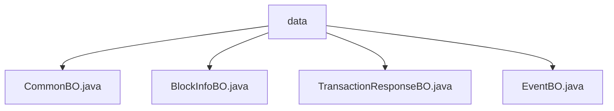

# 基础信息

|      |      |
|------|------|
| 名称 | data |
| 编码语言 | .java |
| 代码路径 | WeFe/union/blockchain-data-sync/src/main/java/com/welab/wefe/bo/data |
| 包名 | docs.union.blockchain-data-sync.src.main.java.com.welab.wefe.bo.data |
| 概述说明 | CommonBO封装合同名和实体数据。BlockInfoBO存储组ID、区块号、事件和交易列表。TransactionResponseBO包含交易相关属性。EventBO继承CommonBO，记录事件名、区块号和地址信息。 |

# 说明

## 概述  
该模块核心职责是封装区块链同步过程中的基础数据实体，类似数据中台模型。接口规范统一采用Java Bean风格，包含私有属性及对应的getter/setter方法，例如CommonBO提供contractName和entity的访问接口。关键数据结构包括：CommonBO（合同基础数据）、BlockInfoBO（区块信息）、TransactionResponseBO（交易响应）和EventBO（事件对象）。外部依赖仅为Java标准库集合类如Map和ArrayList。例如TransactionResponseBO使用ArrayList初始化交易列表。

## 主要业务场景  
模块主要支撑区块链数据同步场景，通过分层对象模型实现链上数据到业务系统的映射。交互模式采用链式组装，例如BlockInfoBO聚合EventBO和TransactionResponseBO形成完整区块视图。功能完整性体现在覆盖区块号、交易哈希等链上核心要素，例如EventBO继承CommonBO并扩展事件特有字段。典型应用包括区块解析、交易追踪等，API类型均为POJO数据载体，例如通过toString()实现调试日志输出。

### 包内部结构视图

该流程图展示了区块链数据同步项目中BO层的类文件结构。data作为父节点，包含四个业务对象类：CommonBO、BlockInfoBO、TransactionResponseBO和EventBO。这些类文件位于同一层级，共同构成了区块链数据同步的核心业务对象模块。

# 文件列表

| 名称   | 类型  | 说明 |
|-------|------|-------------|
| [CommonBO.java](CommonBO.md) | file | Java类CommonBO包含contractName和entity属性，提供getter/setter方法，toString方法返回属性值。 |
| [BlockInfoBO.java](BlockInfoBO.md) | file | BlockInfoBO类包含groupId、blockNumber、eventBOList和transactionResponseBOList属性，提供getter和setter方法，toString方法输出关键字段。 |
| [TransactionResponseBO.java](TransactionResponseBO.md) | file | 交易响应类，包含区块号、合约地址、合约名称、交易哈希及交易响应信息。 |
| [EventBO.java](EventBO.md) | file | EventBO类继承CommonBO，包含事件名、区块号、发送方和接收方属性，提供getter/setter方法和toString实现。 |

