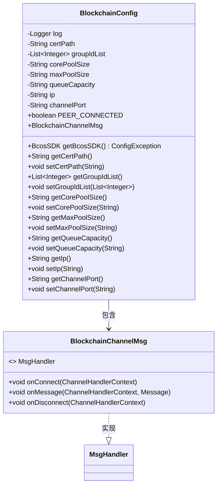
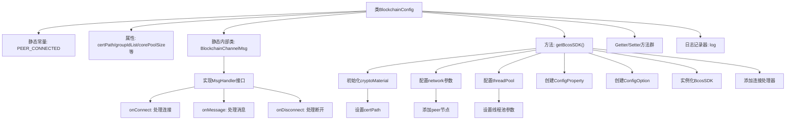

# 基础信息

|      |      |
|------|------|
| 名称 | BlockchainConfig |
| 编码语言 | .java |
| 代码路径 | WeFe/union/blockchain-data-sync/src/main/java/com/welab/wefe/config/BlockchainConfig.java |
| 包名 | com.welab.wefe.config |
| 依赖项 | ['io.netty.channel.ChannelHandlerContext', 'org.fisco.bcos.sdk.BcosSDK', 'org.fisco.bcos.sdk.config.ConfigOption', 'org.fisco.bcos.sdk.config.exceptions.ConfigException', 'org.fisco.bcos.sdk.config.model.ConfigProperty', 'org.fisco.bcos.sdk.model.Message', 'org.fisco.bcos.sdk.network.MsgHandler', 'org.slf4j.Logger', 'org.slf4j.LoggerFactory', 'org.springframework.boot.context.properties.ConfigurationProperties', 'org.springframework.context.annotation.Bean', 'org.springframework.context.annotation.Configuration', 'java.util.ArrayList', 'java.util.HashMap', 'java.util.List', 'java.util.Map'] |
| 概述说明 | 区块链配置类，包含证书路径、群组列表、线程池参数、IP和端口配置，提供连接状态监控和SDK初始化功能。 |

# 说明

该代码定义了一个名为BlockchainConfig的配置类，用于初始化区块链SDK。类中包含证书路径、群组ID列表、线程池参数、IP地址和通道端口等配置属性。内部类BlockchainChannelMsg实现了连接、消息接收和断开连接的处理逻辑。通过@Bean注解的getBcosSDK方法，配置了加密材料、网络节点和线程池参数，并初始化BcosSDK实例。同时添加了连接和断开连接的处理程序。类提供了各属性的getter和setter方法，支持外部配置。

# 类列表 Class Summary

| 名称   | 类型  | 说明 |
|-------|------|-------------|
| BlockchainConfig | class | 区块链配置类，包含证书路径、群组ID列表、线程池参数、IP和端口。提供连接状态管理及BcosSDK初始化功能，支持网络、加密材料和线程池配置。 |

## 类 BlockchainConfig

|      |      |
|------|------|
| 访问范围 | @Configuration;@ConfigurationProperties(prefix = "sdk");public |
| 类型 | class |
| 名称 | BlockchainConfig |
| 说明 | 区块链配置类，包含证书路径、群组ID列表、线程池参数、IP和端口。提供连接状态管理及BcosSDK初始化功能，支持网络、加密材料和线程池配置。 |

### UML类图

类图描述：BlockchainConfig是一个配置类，用于初始化区块链SDK的配置参数，包含证书路径、网络配置和线程池设置等。内部静态类BlockchainChannelMsg实现了MsgHandler接口，处理连接和断开事件。BlockchainConfig通过getBcosSDK方法创建并配置BcosSDK实例，同时注册连接和断开处理器。

### 内部方法调用关系图

这段代码是区块链SDK的Spring Boot配置类，主要完成以下功能：1) 通过@ConfigurationProperties加载SDK配置参数；2) 定义内部消息处理器BlockchainChannelMsg处理节点连接状态变更；3) 核心方法getBcosSDK()构建区块链SDK实例，包含加密材料、网络节点和线程池的完整配置流程；4) 提供所有配置属性的标准Getter/Setter方法。流程图清晰展示了配置类的主要结构和关键方法调用链，特别是SDK初始化时各配置模块的组装顺序。

### 字段列表 Field List

| 名称  | 类型  | 说明 |
|-------|-------|------|
| channelPort = "20200" | String | 私有字符串变量channelPort初始值为"20200"。 |
| PEER_CONNECTED = true | boolean | 静态布尔变量PEER_CONNECTED，值为true，表示连接状态。 |
| ip = "127.0.0.1" | String | 定义私有字符串变量ip，初始值为本地回环地址127.0.0.1。 |
| certPath = "conf" | String | 定义字符串变量certPath，初始值为"conf"。 |
| queueCapacity | String | 私有字符串变量queueCapacity，用于表示队列容量。 |
| corePoolSize | String | 核心线程池大小参数 |
| groupIdList | List<Integer> | 私有整型列表变量，存储组ID集合。 |
| log =            LoggerFactory.getLogger(BlockchainConfig.class) | Logger | 定义区块链配置类的私有静态日志记录器实例。 |
| maxPoolSize | String | 声明一个私有字符串变量maxPoolSize。 |

### 方法列表

| 名称  | 类型  | 说明 |
|-------|-------|------|
| getCertPath | String | 获取证书路径的方法，返回字符串类型变量certPath。 |
| setMaxPoolSize | void | 设置最大池大小的公共方法，将输入参数赋值给类成员变量maxPoolSize。 |
| getGroupIdList | List<Integer> | 这是一个Java方法，返回名为groupIdList的整数列表。方法名为getGroupIdList，无参数。 |
| setCorePoolSize | void | 设置线程池核心大小的公共方法，参数为核心线程数。 |
| getCorePoolSize | String | 获取线程池核心线程数的方法。 |
| getMaxPoolSize | String | 获取最大线程池大小的方法。 |
| setCertPath | void | 设置证书路径的方法，将输入参数certPath赋值给类成员变量certPath。 |
| getBcosSDK | BcosSDK | 初始化BcosSDK，配置证书路径、节点网络和线程池参数，创建ConfigOption并实例化BcosSDK，添加连接和断开处理器。 |
| setGroupIdList | void | 设置分组ID列表的方法，将输入列表赋值给类的成员变量。 |
| setQueueCapacity | void | 设置队列容量的方法，将输入参数queueCapacity赋值给类的同名属性。 |
| getQueueCapacity | String | 获取队列容量的方法，返回字符串类型的队列容量值。 |
| getIp | String | 获取IP地址的方法，返回字符串类型的ip值。 |
| setIp | void | 设置IP地址的方法，将参数ip赋值给类的成员变量ip。 |
| getChannelPort | String | 获取channelPort值的公共方法。 |
| setChannelPort | void | 设置通道端口的方法，将输入参数channelPort赋值给类的同名成员变量。 |

