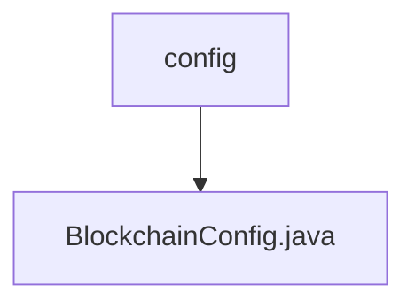

# 基础信息

|      |      |
|------|------|
| 名称 | config |
| 编码语言 | .java |
| 代码路径 | WeFe/union/blockchain-data-sync/src/main/java/com/welab/wefe/config |
| 包名 | docs.union.blockchain-data-sync.src.main.java.com.welab.wefe.config |
| 概述说明 | 区块链配置类，包含证书路径、群组列表、线程池参数、IP和端口配置，提供连接状态监控和SDK初始化功能。 |

# 说明

该代码定义了一个名为BlockchainConfig的配置类，用于初始化区块链SDK。类中包含证书路径、群组ID列表、线程池参数、IP地址和通道端口等配置属性。内部类BlockchainChannelMsg实现了连接、消息接收和断开连接的处理逻辑。通过@Bean注解的getBcosSDK方法，配置了加密材料、网络节点和线程池参数，并初始化BcosSDK实例。同时添加了连接和断开连接的处理程序。类提供了各属性的getter和setter方法，支持外部配置。

### 包内部结构视图

该流程图展示了区块链数据同步项目中配置模块的层级关系。顶层节点为config文件夹，其下包含一个具体的配置文件BlockchainConfig.java。这种结构体现了典型的Java项目配置管理方式，其中核心配置类被组织在专门的配置包中，便于集中管理和维护项目配置参数。

# 文件列表

| 名称   | 类型  | 说明 |
|-------|------|-------------|
| [BlockchainConfig.java](BlockchainConfig.md) | file | 区块链配置类，包含证书路径、群组列表、线程池参数、IP和端口配置，提供连接状态监控和SDK初始化功能。 |

