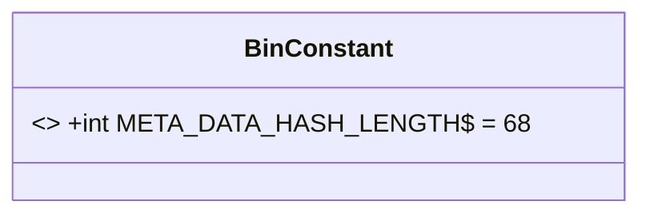
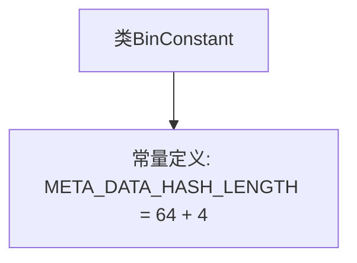

# 基础信息

|      |      |
|------|------|
| 名称 | BinConstant |
| 编码语言 | .java |
| 代码路径 | WeFe/union/blockchain-data-sync/src/main/java/com/welab/wefe/constant/BinConstant.java |
| 包名 | com.welab.wefe.constant |
| 依赖项 | [] |
| 概述说明 | BinConstant类定义了一个静态常量META_DATA_HASH_LENGTH，值为68（64+4）。 |

# 说明

该内容定义了一个名为BinConstant的公开类，其中包含一个静态常量META_DATA_HASH_LENGTH，其值为64加4，即68。该常量用于表示元数据哈希的长度，可能是某种二进制数据处理中的固定长度参数。

# 类列表 Class Summary

| 名称   | 类型  | 说明 |
|-------|------|-------------|
| BinConstant | class | 类BinConstant定义了常量META_DATA_HASH_LENGTH，值为68（64+4）。 |

## 类 BinConstant

|      |      |
|------|------|
| 访问范围 | public |
| 类型 | class |
| 名称 | BinConstant |
| 说明 | 类BinConstant定义了常量META_DATA_HASH_LENGTH，值为68（64+4）。 |

### UML类图

这段代码定义了一个名为BinConstant的类，其中包含一个公开静态常量META_DATA_HASH_LENGTH，其值为68（64+4）。该常量被标记为final，表示其值不可更改，且使用$符号表示其为静态成员。类图清晰地展示了这个简单的常量类结构，适用于存储固定不变的配置值或元数据长度信息，便于在程序各处引用。

### 内部方法调用关系图

该流程图描述了`BinConstant`类的简单结构，仅包含一个静态常量`META_DATA_HASH_LENGTH`的定义。该常量值为68（64+4的计算结果），用于存储元数据哈希值的固定长度。由于类功能单一，流程图仅展示类与常量的从属关系，无复杂方法调用或交互逻辑。

### 字段列表 Field List

| 名称  | 类型  | 说明 |
|-------|-------|------|
| META_DATA_HASH_LENGTH = 64 + 4 | int | 定义元数据哈希长度为64字节加4字节。 |

### 方法列表

| 名称  | 类型  | 说明 |
|-------|-------|------|

