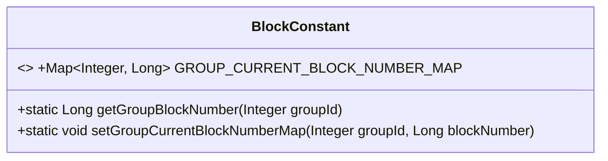
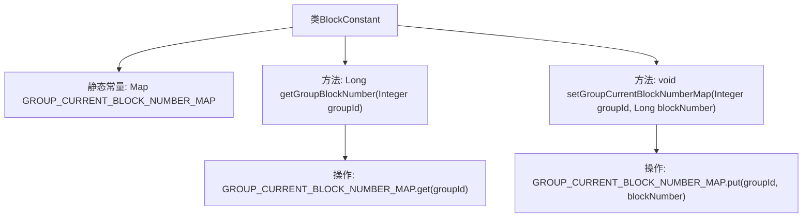

# 基础信息

|      |      |
|------|------|
| 名称 | BlockConstant |
| 编码语言 | .java |
| 代码路径 | WeFe/union/blockchain-data-sync/src/main/java/com/welab/wefe/constant/BlockConstant.java |
| 包名 | com.welab.wefe.constant |
| 依赖项 | ['java.util.Map', 'java.util.concurrent.ConcurrentHashMap'] |
| 概述说明 | BlockConstant类维护各分组最新区块高度，提供获取和更新方法，使用ConcurrentHashMap存储数据。 |

# 说明

BlockConstant类维护一个线程安全的ConcurrentHashMap，用于存储不同组的最新区块高度。提供两个静态方法：getGroupBlockNumber通过组ID获取对应区块高度，setGroupCurrentBlockNumberMap更新指定组的区块高度。该类实现了多组区块高度的线程安全存储与查询功能。

# 类列表 Class Summary

| 名称   | 类型  | 说明 |
|-------|------|-------------|
| BlockConstant | class | BlockConstant类维护各组的当前区块高度，提供获取和更新区块高度的静态方法，使用ConcurrentHashMap保证线程安全。 |

## 类 BlockConstant

|      |      |
|------|------|
| 访问范围 | public |
| 类型 | class |
| 名称 | BlockConstant |
| 说明 | BlockConstant类维护各组的当前区块高度，提供获取和更新区块高度的静态方法，使用ConcurrentHashMap保证线程安全。 |

### UML类图

这段代码定义了一个名为`BlockConstant`的工具类，主要用于管理不同分组的区块链最新高度。该类包含一个静态的线程安全映射`GROUP_CURRENT_BLOCK_NUMBER_MAP`，用于存储各分组ID及其对应的最新区块高度，并提供了`getGroupBlockNumber`和`setGroupCurrentBlockNumberMap`两个静态方法，分别用于查询和更新指定分组的最新区块高度。由于使用`ConcurrentHashMap`实现，该数据结构支持多线程并发访问，适用于分布式区块链系统中的高度同步场景。

### 内部方法调用关系图

这段代码流程图展示了BlockConstant类的结构，该类维护一个线程安全的ConcurrentHashMap用于存储不同组(groupId)对应的最新区块高度(blockNumber)。类提供两个核心方法：getGroupBlockNumber用于查询指定组的区块高度，setGroupCurrentBlockNumberMap用于更新组的区块高度。流程图清晰地反映了数据存储结构和方法的调用关系，突出了并发安全Map的操作特性。

### 字段列表 Field List

| 名称  | 类型  | 说明 |
|-------|-------|------|
| GROUP_CURRENT_BLOCK_NUMBER_MAP = new ConcurrentHashMap<>() | Map<Integer, Long> | 定义线程安全的静态常量映射GROUP_CURRENT_BLOCK_NUMBER_MAP，键为整型，值为长整型。 |

### 方法列表

| 名称  | 类型  | 说明 |
|-------|-------|------|
| getGroupBlockNumber | Long | 该方法根据传入的groupId从GROUP_CURRENT_BLOCK_NUMBER_MAP中获取并返回对应的区块号。 |
| setGroupCurrentBlockNumberMap | void | 静态方法`setGroupCurrentBlockNumberMap`将给定`groupId`和`blockNumber`存入`GROUP_CURRENT_BLOCK_NUMBER_MAP`映射中。 |

