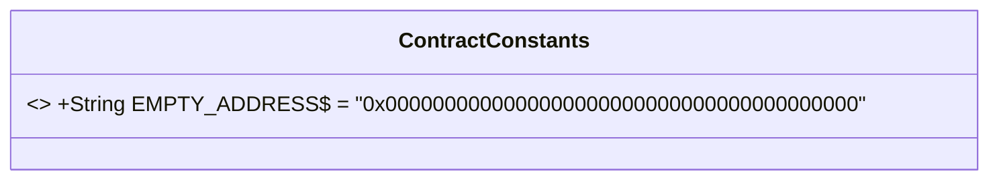
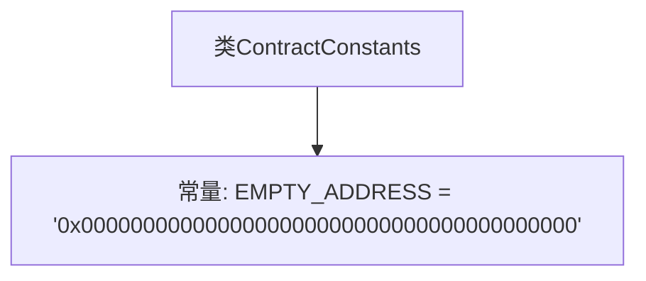

# 基础信息

|      |      |
|------|------|
| 名称 | ContractConstants |
| 编码语言 | .java |
| 代码路径 | WeFe/union/blockchain-data-sync/src/main/java/com/welab/wefe/constant/ContractConstants.java |
| 包名 | com.welab.wefe.constant |
| 依赖项 | [] |
| 概述说明 | ContractConstants类定义了一个公共静态常量EMPTY_ADDRESS，表示空地址的十六进制字符串。 |

# 说明

该代码定义了一个名为ContractConstants的公共类，其中包含一个静态常量EMPTY_ADDRESS，其值为表示空地址的十六进制字符串"0x0000000000000000000000000000000000000000"。这个常量通常用于区块链或智能合约开发中，表示无效或未设置的地址。

# 类列表 Class Summary

| 名称   | 类型  | 说明 |
|-------|------|-------------|
| ContractConstants | class | ContractConstants类定义了一个公共静态常量EMPTY_ADDRESS，表示空地址的十六进制字符串值。 |

## 类 ContractConstants

|      |      |
|------|------|
| 访问范围 | public |
| 类型 | class |
| 名称 | ContractConstants |
| 说明 | ContractConstants类定义了一个公共静态常量EMPTY_ADDRESS，表示空地址的十六进制字符串值。 |

### UML类图

这段代码定义了一个名为`ContractConstants`的类，其中包含一个公开静态常量`EMPTY_ADDRESS`，用于表示以太坊区块链中的空地址（全零地址）。该常量被标记为`final`表示不可修改，并通过`$`符号表明其静态属性。这种设计模式常用于存储项目中需要全局使用的常量值，特别是区块链开发中常见的特殊地址标识。

### 内部方法调用关系图

这段代码定义了一个名为ContractConstants的类，其中包含一个公共静态常量EMPTY_ADDRESS，该常量被初始化为一个表示空地址的字符串"0x0000000000000000000000000000000000000000"。这个空地址通常用于区块链或智能合约开发中，表示一个无效或未设置的地址。类的作用是集中管理合约相关的常量，便于代码维护和重用。流程图清晰地展示了类与常量之间的简单层级关系。

### 字段列表 Field List

| 名称  | 类型  | 说明 |
|-------|-------|------|
| EMPTY_ADDRESS = "0x0000000000000000000000000000000000000000" | String | 定义了一个公共静态常量EMPTY_ADDRESS，表示空地址，值为全零的十六进制字符串。 |

### 方法列表

| 名称  | 类型  | 说明 |
|-------|-------|------|

