# 基础信息

|      |      |
|------|------|
| 名称 | EventConstant |
| 编码语言 | .java |
| 代码路径 | WeFe/union/blockchain-data-sync/src/main/java/com/welab/wefe/constant/EventConstant.java |
| 包名 | com.welab.wefe.constant |
| 依赖项 | [] |
| 概述说明 | EventConstant类定义了多个事件常量，包括通用事件（如RUN_SUCCESS_CODE）、数据集事件（如INSERT_EVENT）、成员事件（如UPDATE_PUBLICKEY_EVENT）、权限事件（如DELETE_BY_DATASETID_EVENT）等，涵盖增删改操作。 |

# 说明

该代码定义了一个名为EventConstant的公共类，包含多个静态常量字符串和嵌套类，用于表示各种事件类型。主要包含运行成功代码RUN_SUCCESS_CODE，以及多个嵌套类如DataSetEvent、ImageDataSetEvent、MemberEvent等，每个嵌套类中定义了不同类型的事件常量，如插入、更新、删除等操作。这些事件常量用于标识不同模块的操作类型，例如数据集、成员权限、数据资源等。整体结构清晰，便于在代码中引用和维护。

# 类列表 Class Summary

| 名称   | 类型  | 说明 |
|-------|------|-------------|
| EventConstant | class | EventConstant类定义了多个事件常量，包括数据集、成员、数据资源等操作的增删改事件类型，如INSERTEVENT、UPDATEEVENT等，用于标识不同业务场景的操作。 |

## 类 EventConstant

|      |      |
|------|------|
| 访问范围 | public |
| 类型 | class |
| 名称 | EventConstant |
| 说明 | EventConstant类定义了多个事件常量，包括数据集、成员、数据资源等操作的增删改事件类型，如INSERTEVENT、UPDATEEVENT等，用于标识不同业务场景的操作。 |

### UML类图

```mermaid
classDiagram
    class EventConstant {
        <<final>>
        +String RUN_SUCCESS_CODE
        +String UPDATE_EXTJSON_EVENT
        +String DELETE_BY_DATA_RESOURCE_ID_EVENT
    }

    class DataSetEvent {
        <<final>>
        +String INSERT_EVENT
        +String UPDATE_EVENT
        +String DELETE_BY_DATASETID_EVENT
    }

    class ImageDataSetEvent {
        <<final>>
        +String INSERT_EVENT
        +String UPDATE_EVENT
        +String DELETE_BY_DATA_RESOURCE_ID_EVENT
        +String UPDATE_ENABLE_EVENT
    }

    class MemberEvent {
        <<final>>
        +String INSERT_EVENT
        +String UPDATE_EVENT
        +String UPDATE_EXCLUDE_PUBLICKEY_EVENT
        +String UPDATE_PUBLICKEY_EVENT
        +String DELETE_BY_ID_EVENT
        +String UPDATE_EXCLUDE_LOGO_EVENT
        +String UPDATE_LOGO_BY_ID_EVENT
        +String UPDATE_LAST_ACTIVITY_TIME_BY_ID_EVENT
    }

    class DataSetMemberPermissionEvent {
        <<final>>
        +String INSERT_EVENT
        +String UPDATE_EVENT
        +String DELETE_BY_DATASETID_EVENT
    }

    class DataSetDefaultTagEvent {
        <<final>>
        +String INSERT_EVENT
        +String UPDATE_EVENT
        +String DELETE_BY_TAGID_EVENT
    }

    class MemberAuthTypeEvent {
        <<final>>
        +String INSERT_EVENT
        +String UPDATE_EVENT
        +String DELETE_BY_TYPEID_EVENT
    }

    class UnionNodeEvent {
        <<final>>
        +String INSERT_EVENT
        +String UPDATE_EVENT
        +String UPDATE_ENABLE_EVENT
        +String UPDATE_PUBLIC_KEY_EVENT
        +String DELETE_BY_UNIONNODEID_EVENT
    }

    class DataResourceEvent {
        <<final>>
        +String INSERT_EVENT
        +String UPDATE_EVENT
        +String UPDATE_ENABLE_EVENT
    }

    class TableDataSetEvent {
        <<final>>
        +String INSERT_EVENT
        +String UPDATE_EVENT
    }

    class BloomFilterEvent {
        <<final>>
        +String INSERT_EVENT
        +String UPDATE_HASH_FUNCTION_EVENT
    }

    class MemberService {
        <<final>>
        +String INSERT_EVENT
        +String UPDATE_EVENT
        +String DELETE_BY_SERVICE_ID_EVENT
        +String UPDATE_SERVICE_STATUS_EVENT
    }

    class DataResourceDefaultTagEvent {
        <<final>>
        +String INSERT_EVENT
        +String UPDATE_EVENT
        +String DELETE_BY_TAGID_EVENT
    }

    class TrustCerts {
        <<final>>
        +String INSERT_EVENT
        +String DELETE_BY_SERIAL_NUMBER
    }

    EventConstant --> DataSetEvent : 包含
    EventConstant --> ImageDataSetEvent : 包含
    EventConstant --> MemberEvent : 包含
    EventConstant --> DataSetMemberPermissionEvent : 包含
    EventConstant --> DataSetDefaultTagEvent : 包含
    EventConstant --> MemberAuthTypeEvent : 包含
    EventConstant --> UnionNodeEvent : 包含
    EventConstant --> DataResourceEvent : 包含
    EventConstant --> TableDataSetEvent : 包含
    EventConstant --> BloomFilterEvent : 包含
    EventConstant --> MemberService : 包含
    EventConstant --> DataResourceDefaultTagEvent : 包含
    EventConstant --> TrustCerts : 包含
```

类图描述：该图展示了一个事件常量类`EventConstant`及其嵌套的12个静态内部类，所有类均为final且仅包含公共静态字符串常量。主类通过组合关系包含各子类，子类分别表示不同模块（如数据集、成员、认证类型等）的事件类型常量。这种设计实现了事件类型的集中管理和分类存储，便于系统各模块统一引用事件标识符。

### 内部方法调用关系图

```mermaid
graph TD
    A["类EventConstant"]
    B["常量: RUN_SUCCESS_CODE"]
    C["常量: UPDATE_EXTJSON_EVENT"]
    D["常量: DELETE_BY_DATA_RESOURCE_ID_EVENT"]
    E["内部类DataSetEvent"]
    F["内部类ImageDataSetEvent"]
    G["内部类MemberEvent"]
    H["内部类DataSetMemberPermissionEvent"]
    I["内部类DataSetDefaultTagEvent"]
    J["内部类MemberAuthTypeEvent"]
    K["内部类UnionNodeEvent"]
    L["内部类DataResourceEvent"]
    M["内部类TableDataSetEvent"]
    N["内部类BloomFilterEvent"]
    O["内部类MemberService"]
    P["内部类DataResourceDefaultTagEvent"]
    Q["内部类TrustCerts"]

    A --> B
    A --> C
    A --> D
    A --> E
    A --> F
    A --> G
    A --> H
    A --> I
    A --> J
    A --> K
    A --> L
    A --> M
    A --> N
    A --> O
    A --> P
    A --> Q
```

这段代码定义了一个名为EventConstant的类，主要用于存储各种事件类型的常量字符串。该类包含15个静态内部类，每个内部类代表不同模块的事件类型（如数据集事件、成员事件等），每个事件类型都有特定的操作常量（如INSERT_EVENT表示插入操作）。整体结构采用分层设计，顶层类管理通用常量，内部类组织特定领域的事件常量，便于系统各模块统一引用事件标识符。这种设计模式常用于事件驱动架构或消息系统中，确保事件类型标识的全局唯一性和可维护性。

### 字段列表 Field List

| 名称  | 类型  | 说明 |
|-------|-------|------|
| UPDATE_EXTJSON_EVENT = "UPDATEEXTJSONEVENT" | String | 静态常量字符串UPDATE_EXTJSON_EVENT，值为"UPDATEEXTJSONEVENT"。 |
| RUN_SUCCESS_CODE = "0" | String | 定义静态常量RUN_SUCCESS_CODE，值为字符串"0"，表示运行成功状态码。 |
| DELETE_BY_DATA_RESOURCE_ID_EVENT = "DELETEBYDATARESOURCEIDEVENT" | String | 静态常量DELETE_BY_DATA_RESOURCE_ID_EVENT，值为"DELETEBYDATARESOURCEIDEVENT"，表示按数据资源ID删除事件。 |

### 方法列表

| 名称  | 类型  | 说明 |
|-------|-------|------|

