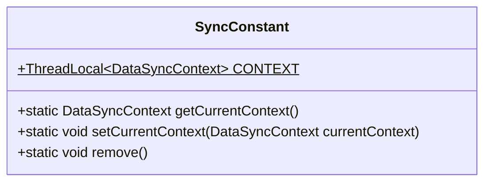
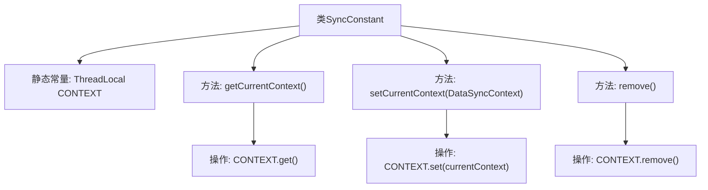

# 基础信息

|      |      |
|------|------|
| 名称 | SyncConstant |
| 编码语言 | .java |
| 代码路径 | WeFe/union/blockchain-data-sync/src/main/java/com/welab/wefe/constant/SyncConstant.java |
| 包名 | com.welab.wefe.constant |
| 依赖项 | ['com.welab.wefe.tool.DataSyncContext'] |
| 概述说明 | SyncConstant类提供线程本地存储的DataSyncContext管理，包含获取、设置和移除上下文的方法。 |

# 说明

SyncConstant类是一个用于管理线程本地数据同步上下文的工具类。它通过ThreadLocal机制维护DataSyncContext实例，提供三个静态方法：getCurrentContext获取当前线程上下文，setCurrentContext设置当前线程上下文，remove清除当前线程上下文。该类确保线程间数据隔离，适用于多线程环境下的数据同步场景。

# 类列表 Class Summary

| 名称   | 类型  | 说明 |
|-------|------|-------------|
| SyncConstant | class | SyncConstant类使用ThreadLocal存储DataSyncContext，提供获取、设置和移除当前线程上下文的方法。 |

## 类 SyncConstant

|      |      |
|------|------|
| 访问范围 | public |
| 类型 | class |
| 名称 | SyncConstant |
| 说明 | SyncConstant类使用ThreadLocal存储DataSyncContext，提供获取、设置和移除当前线程上下文的方法。 |

### UML类图

该代码定义了一个`SyncConstant`工具类，用于管理线程本地变量`CONTEXT`，该变量存储`DataSyncContext`类型的对象。类提供了三个静态方法：`getCurrentContext`获取当前线程的上下文，`setCurrentContext`设置当前线程的上下文，`remove`清除当前线程的上下文。通过`ThreadLocal`机制，实现了线程间上下文的隔离，确保多线程环境下数据同步的安全性。类图展示了静态变量和方法的公有访问权限，以及`ThreadLocal`的泛型参数结构。

### 内部方法调用关系图

该流程图展示了SyncConstant类的结构，核心是维护线程本地变量CONTEXT的静态工具类。通过getCurrentContext获取当前线程上下文，setCurrentContext设置新上下文，remove清除线程状态。所有方法均直接操作ThreadLocal实例，确保线程安全的数据隔离。

### 字段列表 Field List

| 名称  | 类型  | 说明 |
|-------|-------|------|
| CONTEXT = new ThreadLocal<>() | ThreadLocal<DataSyncContext> | 定义了一个静态常量CONTEXT，类型为ThreadLocal<DataSyncContext>，用于线程局部存储DataSyncContext对象。 |

### 方法列表

| 名称  | 类型  | 说明 |
|-------|-------|------|
| getCurrentContext | DataSyncContext | 获取当前线程的DataSyncContext实例。 |
| setCurrentContext | void | 设置当前数据同步上下文，将传入的currentContext存入静态变量CONTEXT中。 |
| remove | void | 静态方法remove()调用CONTEXT.remove()清除上下文。 |

