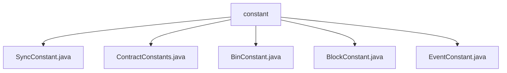

# 基础信息

|      |      |
|------|------|
| 名称 | constant |
| 编码语言 | .java |
| 代码路径 | WeFe/union/blockchain-data-sync/src/main/java/com/welab/wefe/constant |
| 包名 | docs.union.blockchain-data-sync.src.main.java.com.welab.wefe.constant |
| 概述说明 | SyncConstant类管理线程本地数据同步上下文。ContractConstants类定义空地址常量。BinConstant类定义元数据哈希长度常量。BlockConstant类维护线程安全的区块高度映射。EventConstant类定义多种事件类型常量。 |

# 说明

## 概述  
该模块是区块链数据同步的核心常量管理系统，通过多组工具类实现线程安全的数据隔离与事件管理。接口规范包括ThreadLocal上下文操作（SyncConstant）、ConcurrentHashMap区块高度维护（BlockConstant）以及静态常量定义（如ContractConstants.EMPTY_ADDRESS）。关键数据结构包含DataSyncContext线程上下文、ConcurrentHashMap存储的组区块高度映射，以及68字节的元数据哈希长度（BinConstant）。外部依赖仅涉及Java标准库的ThreadLocal和ConcurrentHashMap。例如SyncConstant通过ThreadLocal实现线程隔离，BlockConstant用ConcurrentHashMap保证多组区块高度更新的原子性。

## 主要业务场景  
模块支持多线程环境下区块链数据的同步与事件分发，类似事件总线模式。典型流程包括：通过SyncConstant管理线程本地同步上下文，BlockConstant维护各组最新区块高度，EventConstant定义的事件类型（例如DataSetEvent.INSERT）驱动业务操作。交互模式涵盖从地址校验（ContractConstants）、二进制数据处理（BinConstant）到事件驱动的全链路，例如成员权限变更触发MemberEvent.UPDATE。API类型均为静态方法或常量，集成案例包括线程安全的高度更新和事件标识符引用。

### 包内部结构视图

该流程图展示了区块链数据同步项目中常量包的文件结构。根节点"constant"包含5个常量类文件：SyncConstant、ContractConstants、BinConstant、BlockConstant和EventConstant，这些文件可能分别用于定义同步参数、合约参数、二进制参数、区块参数和事件参数等常量配置。这种结构清晰地组织了不同类型的常量定义，便于维护和使用。

# 文件列表

| 名称   | 类型  | 说明 |
|-------|------|-------------|
| [SyncConstant.java](SyncConstant.md) | file | SyncConstant类提供线程本地存储的DataSyncContext管理，包含获取、设置和移除上下文的方法。 |
| [ContractConstants.java](ContractConstants.md) | file | ContractConstants类定义了一个公共静态常量EMPTY_ADDRESS，表示空地址的十六进制字符串。 |
| [BinConstant.java](BinConstant.md) | file | BinConstant类定义了一个静态常量META_DATA_HASH_LENGTH，值为68（64+4）。 |
| [BlockConstant.java](BlockConstant.md) | file | BlockConstant类维护各分组最新区块高度，提供获取和更新方法，使用ConcurrentHashMap存储数据。 |
| [EventConstant.java](EventConstant.md) | file | EventConstant类定义了多个事件常量，包括通用事件（如RUN_SUCCESS_CODE）、数据集事件（如INSERT_EVENT）、成员事件（如UPDATE_PUBLICKEY_EVENT）、权限事件（如DELETE_BY_DATASETID_EVENT）等，涵盖增删改操作。 |

