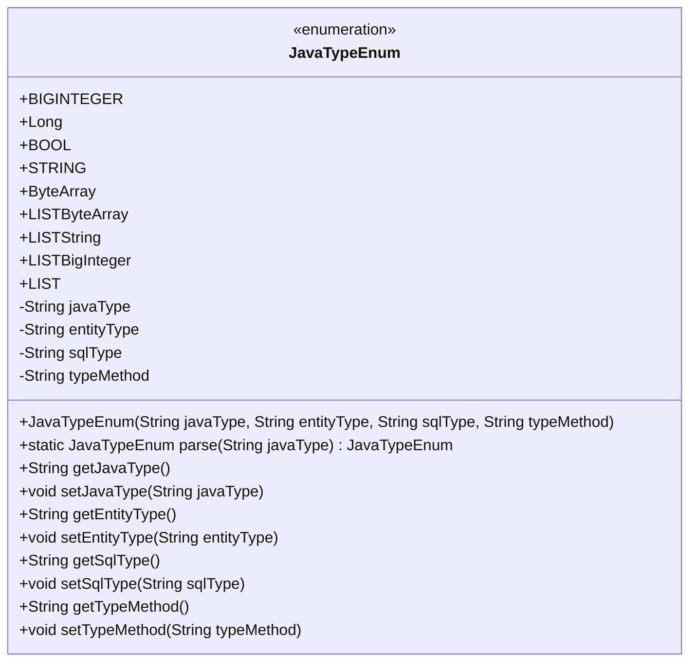

# 基础信息

|      |      |
|------|------|
| 名称 | JavaTypeEnum |
| 编码语言 | .java |
| 代码路径 | WeFe/union/blockchain-data-sync/src/main/java/com/welab/wefe/enums/JavaTypeEnum.java |
| 包名 | com.welab.wefe.enums |
| 依赖项 | ['org.apache.commons.lang3.StringUtils'] |
| 概述说明 | Java枚举类定义数据类型映射，包含Java类型、实体类型、SQL类型及转换方法，提供解析方法parse。 |

# 说明

JavaTypeEnum枚举定义了多种Java数据类型及其相关属性，包括javaType（Java类型）、entityType（实体类型）、sqlType（SQL类型）和typeMethod（类型转换方法）。枚举包含BIGINTEGER、Long、BOOL、STRING等类型，支持List泛型处理。parse方法可根据javaType字符串匹配对应枚举值，各属性均有getter和setter方法。

# 类列表 Class Summary

| 名称   | 类型  | 说明 |
|-------|------|-------------|
| JavaTypeEnum | enum | JavaTypeEnum枚举定义Java类型与实体类型、SQL类型及转换方法的映射关系，包含解析方法和属性访问器。 |

## 类 JavaTypeEnum

|      |      |
|------|------|
| 访问范围 | public |
| 类型 | enum |
| 名称 | JavaTypeEnum |
| 说明 | JavaTypeEnum枚举定义Java类型与实体类型、SQL类型及转换方法的映射关系，包含解析方法和属性访问器。 |

### UML类图

这段代码定义了一个枚举类`JavaTypeEnum`，用于表示Java类型与实体类型、SQL类型以及类型转换方法之间的映射关系。枚举包含9个预定义类型（如BIGINTEGER、Long等），每个枚举实例存储了javaType、entityType、sqlType和typeMethod四个属性，并提供了相应的getter/setter方法。核心功能是通过parse方法根据输入的javaType字符串匹配对应的枚举值，支持泛型类型解析（如List<String>）。该设计主要用于类型系统转换场景，简化类型映射的维护工作。

### 内部方法调用关系图

```mermaid
graph TD
    A["枚举JavaTypeEnum"]
    B["枚举值: BIGINTEGER/Long/BOOL/STRING/ByteArray/LISTByteArray/LISTString/LISTBigInteger/LIST"]
    C["属性: String javaType"]
    D["属性: String entityType"]
    E["属性: String sqlType"]
    F["属性: String typeMethod"]
    G["构造方法: JavaTypeEnum(String, String, String, String)"]
    H["静态方法: parse(String javaType)"]
    I["方法: getJavaType()"]
    J["方法: setJavaType(String)"]
    K["方法: getEntityType()"]
    L["方法: setEntityType(String)"]
    M["方法: getSqlType()"]
    N["方法: setSqlType(String)"]
    O["方法: getTypeMethod()"]
    P["方法: setTypeMethod(String)"]

    A --> B
    A --> C
    A --> D
    A --> E
    A --> F
    A --> G
    A --> H
    A --> I
    A --> J
    A --> K
    A --> L
    A --> M
    A --> N
    A --> O
    A --> P
```

该流程图展示了JavaTypeEnum枚举的结构，包含9个预定义枚举值、4个核心属性和10个方法。核心功能是通过parse方法将字符串映射到对应枚举值，每个枚举值关联了Java类型、实体类型、SQL类型和类型转换方法。构造方法用于初始化枚举实例，其他方法用于属性访问和修改，整体设计用于类型系统映射和转换。

### 字段列表 Field List

| 名称  | 类型  | 说明 |
|-------|-------|------|

### 方法列表

| 名称  | 类型  | 说明 |
|-------|-------|------|

