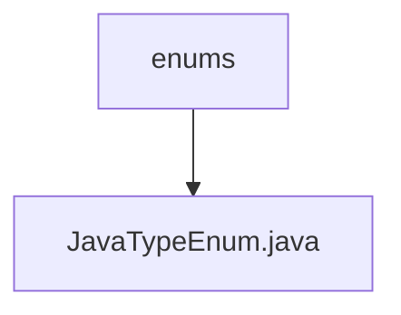

# 基础信息

|      |      |
|------|------|
| 名称 | enums |
| 编码语言 | .java |
| 代码路径 | WeFe/union/blockchain-data-sync/src/main/java/com/welab/wefe/enums |
| 包名 | docs.union.blockchain-data-sync.src.main.java.com.welab.wefe.enums |
| 概述说明 | Java枚举类定义数据类型映射，包含Java类型、实体类型、SQL类型及转换方法，提供解析方法parse。 |

# 说明

JavaTypeEnum枚举定义了多种Java数据类型及其相关属性，包括javaType（Java类型）、entityType（实体类型）、sqlType（SQL类型）和typeMethod（类型转换方法）。枚举包含BIGINTEGER、Long、BOOL、STRING等类型，支持List泛型处理。parse方法可根据javaType字符串匹配对应枚举值，各属性均有getter和setter方法。

### 包内部结构视图

该流程图展示了WeFe项目中枚举类型的层级关系。根节点"enums"表示枚举类所在的包路径，子节点"JavaTypeEnum.java"是该包下的具体枚举类文件。整个结构简洁明了，体现了Java项目中典型的包-类层级关系。

# 文件列表

| 名称   | 类型  | 说明 |
|-------|------|-------------|
| [JavaTypeEnum.java](JavaTypeEnum.md) | file | Java枚举类定义数据类型映射，包含Java类型、实体类型、SQL类型及转换方法，提供解析方法parse。 |

