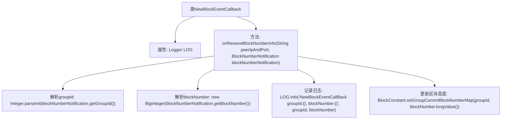

# 基础信息

|      |      |
|------|------|
| 名称 | NewBlockEventCallback |
| 编码语言 | .java |
| 代码路径 | WeFe/union/blockchain-data-sync/src/main/java/com/welab/wefe/event/NewBlockEventCallback.java |
| 包名 | com.welab.wefe.event |
| 依赖项 | ['com.welab.wefe.constant.BlockConstant', 'org.fisco.bcos.sdk.service.callback.BlockNumberNotifyCallback', 'org.fisco.bcos.sdk.service.model.BlockNumberNotification', 'org.slf4j.Logger', 'org.slf4j.LoggerFactory', 'java.math.BigInteger'] |
| 概述说明 | NewBlockEventCallback类实现BlockNumberNotifyCallback接口，处理新区块事件。通过onReceiveBlockNumberInfo方法获取组ID和区块号，更新组的最新区块高度信息。 |

# 说明

该代码定义了一个名为NewBlockEventCallback的类，实现了BlockNumberNotifyCallback接口。主要功能是处理接收到新区块编号信息的回调。当触发onReceiveBlockNumberInfo方法时，会从参数中解析出群组ID和区块高度，记录日志后更新该群组的最新区块高度信息。类中包含一个静态日志对象用于输出日志信息。方法内部将字符串类型的群组ID转换为整型，区块高度转换为大整数类型，并通过BlockConstant工具类更新群组当前区块高度映射表。

# 类列表 Class Summary

| 名称   | 类型  | 说明 |
|-------|------|-------------|
| NewBlockEventCallback | class | NewBlockEventCallback类实现BlockNumberNotifyCallback接口，处理新区块事件。通过onReceiveBlockNumberInfo方法获取群组ID和区块高度，更新群组最新区块信息。 |


## 类 NewBlockEventCallback

|      |      |
|------|------|
| 访问范围 | public |
| 类型 | class |
| 名称 | NewBlockEventCallback |
| 说明 | NewBlockEventCallback类实现BlockNumberNotifyCallback接口，处理新区块事件。通过onReceiveBlockNumberInfo方法获取群组ID和区块高度，更新群组最新区块信息。 |


### UML类图

```mermaid
classDiagram
    class NewBlockEventCallback {
        -Logger LOG
        +onReceiveBlockNumberInfo(String peerIpAndPort, BlockNumberNotification blockNumberNotification) void
    }
    <<Interface>> BlockNumberNotifyCallback {
        <<abstract>>
        +onReceiveBlockNumberInfo(String peerIpAndPort, BlockNumberNotification blockNumberNotification) void
    }
    class BlockNumberNotification {
        +String getGroupId()
        +String getBlockNumber()
    }
    class BlockConstant {
        +setGroupCurrentBlockNumberMap(int groupId, long blockNumber) void
    }

    NewBlockEventCallback ..|> BlockNumberNotifyCallback : 实现
    NewBlockEventCallback --> BlockNumberNotification : 使用
    NewBlockEventCallback --> BlockConstant : 调用
```

这段代码展示了一个区块链事件回调处理类NewBlockEventCallback，它实现了BlockNumberNotifyCallback接口，用于接收新区块通知。主要功能是解析区块组ID和区块高度信息，更新内存中的最新区块高度映射。类图中清晰地体现了接口实现关系（NewBlockEventCallback实现BlockNumberNotifyCallback）以及与其他类（BlockNumberNotification、BlockConstant）的协作关系，展示了从接收通知到处理数据的完整流程。


### 内部方法调用关系图



该流程图展示了NewBlockEventCallback类的核心处理逻辑。当接收到新区块通知时，首先解析群组ID和区块高度，然后记录日志信息，最后更新该群组的最新区块高度。整个过程清晰地描述了从事件触发到数据更新的完整处理流程，体现了回调函数对区块链网络事件的响应机制。

### 字段列表 Field List

| 名称  | 类型  | 说明 |
|-------|-------|------|
| LOG = LoggerFactory.getLogger(NewBlockEventCallback.class) | Logger | 定义了一个静态不可变的日志记录器实例，用于NewBlockEventCallback类的日志输出。 |

### 方法列表

| 名称  | 类型  | 说明 |
|-------|-------|------|
| onReceiveBlockNumberInfo | void | 方法接收区块号信息，解析群组ID和区块号，记录日志并更新群组最新区块高度。 |


