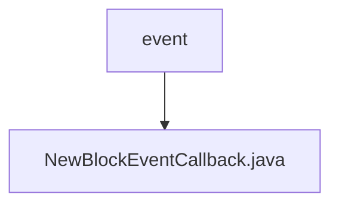

# 基础信息

|      |      |
|------|------|
| 名称 | event |
| 编码语言 | .java |
| 代码路径 | WeFe/union/blockchain-data-sync/src/main/java/com/welab/wefe/event |
| 包名 | docs.union.blockchain-data-sync.src.main.java.com.welab.wefe.event |
| 概述说明 | NewBlockEventCallback类实现BlockNumberNotifyCallback接口，处理新区块事件。通过onReceiveBlockNumberInfo方法获取组ID和区块号，更新组的最新区块高度信息。 |

# 说明

该代码定义了一个名为NewBlockEventCallback的类，实现了BlockNumberNotifyCallback接口。主要功能是处理接收到新区块编号信息的回调。当触发onReceiveBlockNumberInfo方法时，会从参数中解析出群组ID和区块高度，记录日志后更新该群组的最新区块高度信息。类中包含一个静态日志对象用于输出日志信息。方法内部将字符串类型的群组ID转换为整型，区块高度转换为大整数类型，并通过BlockConstant工具类更新群组当前区块高度映射表。

### 包内部结构视图

该流程图展示了区块链数据同步项目中事件模块的简单结构。根节点"event"下包含一个具体的事件回调实现文件"NewBlockEventCallback.java"，表示这是一个处理新区块事件的回调类。整个结构清晰地反映了事件处理模块的最小化组织方式。

# 文件列表

| 名称   | 类型  | 说明 |
|-------|------|-------------|
| [NewBlockEventCallback.java](NewBlockEventCallback.md) | file | NewBlockEventCallback类实现BlockNumberNotifyCallback接口，处理新区块事件。通过onReceiveBlockNumberInfo方法获取组ID和区块号，更新组的最新区块高度信息。 |

