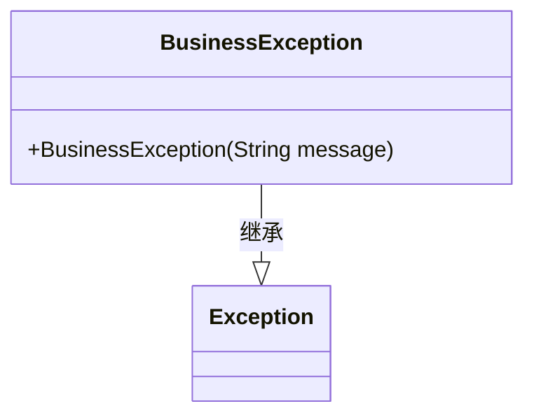
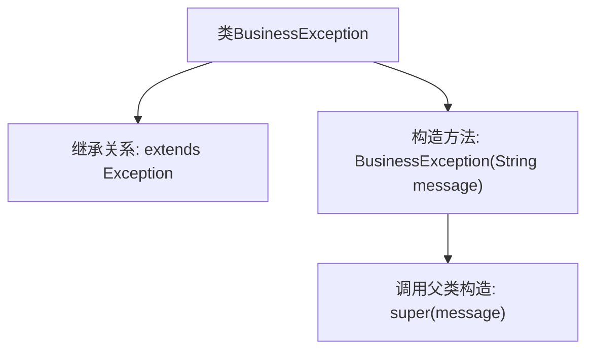

# 基础信息

|      |      |
|------|------|
| 名称 | BusinessException |
| 编码语言 | .java |
| 代码路径 | WeFe/union/blockchain-data-sync/src/main/java/com/welab/wefe/exception/BusinessException.java |
| 包名 | com.welab.wefe.exception |
| 依赖项 | [] |
| 概述说明 | 自定义业务异常类，继承Exception，含带消息参数的构造方法。 |

# 说明

该内容定义了一个名为BusinessException的自定义异常类，继承自Java标准库中的Exception基类。该类包含一个构造函数，接受字符串类型的message参数，并通过super调用将消息传递给父类Exception的构造函数。这个设计允许在业务逻辑中抛出带有特定错误信息的自定义异常，便于区分和处理不同类型的业务错误。整个实现简洁明了，符合Java异常处理的基本规范。

# 类列表 Class Summary

| 名称   | 类型  | 说明 |
|-------|------|-------------|
| BusinessException | class | 自定义业务异常类，继承Exception，含带消息参数的构造方法。 |

## 类 BusinessException

|      |      |
|------|------|
| 访问范围 | public |
| 类型 | class |
| 名称 | BusinessException |
| 说明 | 自定义业务异常类，继承Exception，含带消息参数的构造方法。 |

### UML类图

这段类图描述了一个简单的异常类 `BusinessException`，它继承自 Java 标准库中的 `Exception` 类。`BusinessException` 类提供了一个公有构造函数，接受一个字符串参数用于传递异常信息。通过继承关系，`BusinessException` 具备了标准异常的所有特性，同时可以用于表示业务逻辑相关的错误情况。这种设计模式常用于在业务层抛出特定类型的异常，以便于调用方进行区分和处理。

### 内部方法调用关系图

这段流程图描述了BusinessException类的结构，该类继承自Exception基类，核心是一个带String参数的构造方法，在构造时调用父类的super(message)方法传递异常信息。该设计模式是Java标准异常体系的典型实现，用于创建具有自定义消息的业务异常类型，继承关系确保了异常处理机制的一致性。

### 字段列表 Field List

| 名称  | 类型  | 说明 |
|-------|-------|------|

### 方法列表

| 名称  | 类型  | 说明 |
|-------|-------|------|

