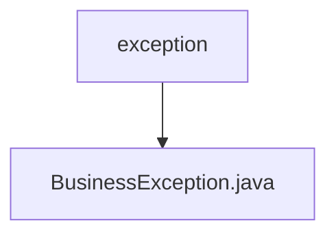

# 基础信息

|      |      |
|------|------|
| 名称 | exception |
| 编码语言 | .java |
| 代码路径 | WeFe/union/blockchain-data-sync/src/main/java/com/welab/wefe/exception |
| 包名 | docs.union.blockchain-data-sync.src.main.java.com.welab.wefe.exception |
| 概述说明 | 自定义业务异常类，继承Exception，含带消息参数的构造方法。 |

# 说明

该内容定义了一个名为BusinessException的自定义异常类，继承自Java标准库中的Exception基类。该类包含一个构造函数，接受字符串类型的message参数，并通过super调用将消息传递给父类Exception的构造函数。这个设计允许在业务逻辑中抛出带有特定错误信息的自定义异常，便于区分和处理不同类型的业务错误。整个实现简洁明了，符合Java异常处理的基本规范。

### 包内部结构视图

该流程图展示了WeFe项目中异常处理的简单层级结构。exception作为父目录包含BusinessException.java文件，表示业务异常类的存放位置。这种结构在Java项目中常见，用于集中管理自定义异常类，保持代码组织清晰。

# 文件列表

| 名称   | 类型  | 说明 |
|-------|------|-------------|
| [BusinessException.java](BusinessException.md) | file | 自定义业务异常类，继承Exception，含带消息参数的构造方法。 |

