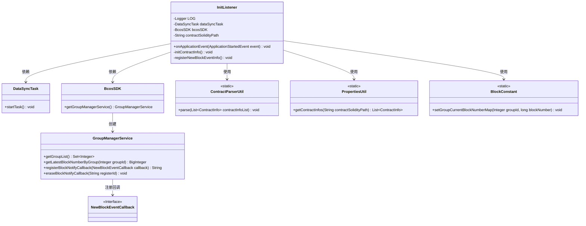
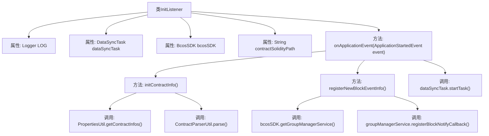
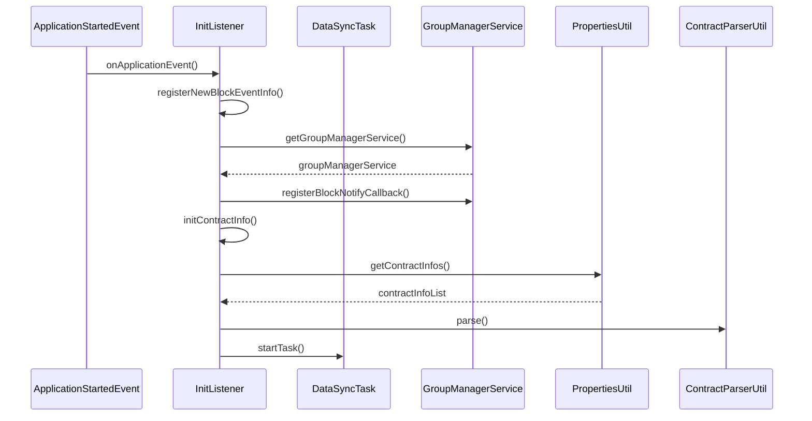

# 基础信息

|      |      |
|------|------|
| 名称 | InitListener |
| 编码语言 | .java |
| 代码路径 | WeFe/union/blockchain-data-sync/src/main/java/com/welab/wefe/listener/InitListener.java |
| 包名 | com.welab.wefe.listener |
| 依赖项 | ['com.welab.wefe.bo.contract.ContractInfo', 'com.welab.wefe.constant.BlockConstant', 'com.welab.wefe.event.NewBlockEventCallback', 'com.welab.wefe.task.DataSyncTask', 'com.welab.wefe.util.ContractParserUtil', 'com.welab.wefe.util.PropertiesUtil', 'org.apache.commons.collections4.CollectionUtils', 'org.fisco.bcos.sdk.BcosSDK', 'org.fisco.bcos.sdk.service.GroupManagerService', 'org.slf4j.Logger', 'org.slf4j.LoggerFactory', 'org.springframework.beans.factory.annotation.Autowired', 'org.springframework.beans.factory.annotation.Value', 'org.springframework.boot.context.event.ApplicationStartedEvent', 'org.springframework.context.ApplicationListener', 'org.springframework.stereotype.Component', 'java.util.List', 'java.util.Set'] |
| 概述说明 | InitListener监听应用启动事件，初始化合约信息并注册新区块事件回调，启动数据同步任务。依赖BcosSDK和合约路径配置。 |

# 说明

InitListener是一个Spring组件，监听应用启动事件。它通过@Autowired注入DataSyncTask和BcosSDK，并通过@Value获取合约文件路径。启动时执行三个操作：注册新区块事件回调、初始化合约信息、启动数据同步任务。初始化合约时会检查指定路径下的合约ABI/BIN文件，缺失则退出系统。注册区块事件时获取各群组最新区块号并设置回调，异常时注销回调并退出。整个过程通过日志记录关键操作和错误。

# 类列表 Class Summary

| 名称   | 类型  | 说明 |
|-------|------|-------------|
| InitListener | class | InitListener监听应用启动事件，初始化合约信息并注册新区块事件回调，启动数据同步任务。依赖BcosSDK和合约路径配置。 |

## 类 InitListener

|      |      |
|------|------|
| 访问范围 | @Component;public |
| 类型 | class |
| 名称 | InitListener |
| 说明 | InitListener监听应用启动事件，初始化合约信息并注册新区块事件回调，启动数据同步任务。依赖BcosSDK和合约路径配置。 |

### UML类图

该图展示了InitListener类及其相关依赖关系。InitListener是一个Spring组件，监听应用启动事件，主要功能包括初始化合约信息、注册新区块事件回调以及启动数据同步任务。它依赖DataSyncTask执行同步任务，通过BcosSDK与区块链交互，使用PropertiesUtil加载合约信息，借助ContractParserUtil解析合约，并调用BlockConstant维护区块号映射。GroupManagerService负责管理区块链组并处理区块通知回调。

### 内部方法调用关系图

该流程图展示了InitListener类的结构及其方法调用关系，时序图则详细描述了应用启动事件触发后的执行流程。InitListener作为Spring组件，在应用启动时通过监听ApplicationStartedEvent事件，依次执行区块事件注册、合约信息初始化和数据同步任务启动。其中涉及与区块链服务的交互（获取最新区块号、注册回调）、合约文件解析等关键操作，并通过异常处理确保系统稳定性。整个流程体现了模块化设计和职责分离原则，核心逻辑集中在三个私有方法中。

### 字段列表 Field List

| 名称  | 类型  | 说明 |
|-------|-------|------|
| dataSyncTask | DataSyncTask | 代码片段使用Spring的@Autowired注解自动注入DataSyncTask实例。 |
| bcosSDK | BcosSDK | 使用@Autowired自动注入BcosSDK实例。 |
| LOG = LoggerFactory.getLogger(InitListener.class) | Logger | 声明一个私有静态不可变日志对象，用于InitListener类的日志记录。 |
| contractSolidityPath | String | 代码定义了一个私有字符串变量contractSolidityPath，其值通过@Value注解从配置属性contract.solidity-path注入。 |

### 方法列表

| 名称  | 类型  | 说明 |
|-------|-------|------|
| onApplicationEvent | void | 应用启动时执行三个操作：注册新区块事件、初始化合约信息、启动数据同步任务。 |
| initContractInfo | void | 初始化合约信息：加载合约数据，检查是否为空，为空则提示上传ABI和BIN文件并退出；否则解析合约信息。 |
| registerNewBlockEventInfo | void | 注册新区块事件回调，获取各群组最新区块号并存储，异常时注销回调并退出。 |

