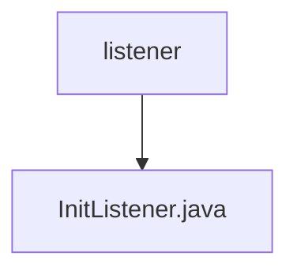

# 基础信息

|      |      |
|------|------|
| 名称 | listener |
| 编码语言 | .java |
| 代码路径 | WeFe/union/blockchain-data-sync/src/main/java/com/welab/wefe/listener |
| 包名 | docs.union.blockchain-data-sync.src.main.java.com.welab.wefe.listener |
| 概述说明 | InitListener监听应用启动事件，初始化合约信息并注册新区块事件回调，启动数据同步任务。依赖BcosSDK和合约路径配置。 |

# 说明

InitListener是一个Spring组件，监听应用启动事件。它通过@Autowired注入DataSyncTask和BcosSDK，并通过@Value获取合约文件路径。启动时执行三个操作：注册新区块事件回调、初始化合约信息、启动数据同步任务。初始化合约时会检查指定路径下的合约ABI/BIN文件，缺失则退出系统。注册区块事件时获取各群组最新区块号并设置回调，异常时注销回调并退出。整个过程通过日志记录关键操作和错误。

### 包内部结构视图

该流程图展示了区块链数据同步项目中监听器模块的简单结构。根节点"listener"代表监听器目录，其下包含一个具体的监听器实现文件"InitListener.java"。这种结构常见于需要初始化监听器的Java项目中，通常用于在应用启动时执行特定操作或注册事件处理器。

# 文件列表

| 名称   | 类型  | 说明 |
|-------|------|-------------|
| [InitListener.java](InitListener.md) | file | InitListener监听应用启动事件，初始化合约信息并注册新区块事件回调，启动数据同步任务。依赖BcosSDK和合约路径配置。 |

