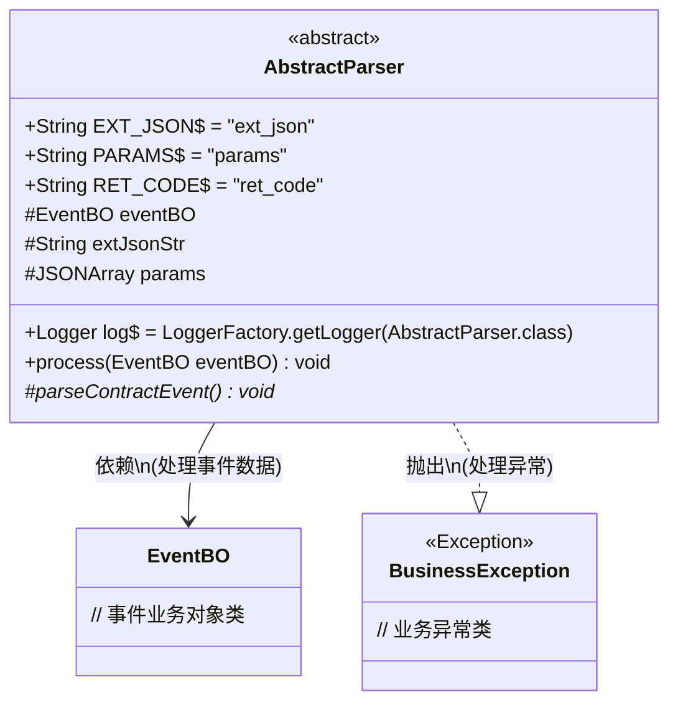
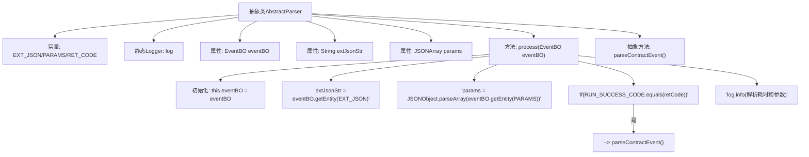

# 基础信息

|      |      |
|------|------|
| 名称 | AbstractParser |
| 编码语言 | .java |
| 代码路径 | WeFe/union/blockchain-data-sync/src/main/java/com/welab/wefe/parser/AbstractParser.java |
| 包名 | com.welab.wefe.parser |
| 依赖项 | ['com.alibaba.fastjson.JSONArray', 'com.alibaba.fastjson.JSONObject', 'com.welab.wefe.bo.data.EventBO', 'com.welab.wefe.constant.EventConstant', 'com.welab.wefe.exception.BusinessException', 'org.slf4j.Logger', 'org.slf4j.LoggerFactory'] |
| 概述说明 | 抽象类AbstractParser定义事件解析基础逻辑，含常量、日志和关键方法process处理事件数据，成功时调用parseContractEvent抽象方法，并记录耗时日志。 |

# 说明

这是一个名为AbstractParser的抽象类，定义了事件解析的基础框架。类中包含三个静态常量EXT_JSON、PARAMS和RET_CODE，用于标识事件实体中的关键字段。核心方法process接收EventBO对象，从中提取extJsonStr和params数据，并根据retCode判断是否调用抽象方法parseContractEvent执行具体解析逻辑。方法执行前后会记录耗时日志，包含解析器类名、区块号、事件名和扩展JSON等信息。parseContractEvent是留给子类实现的抽象方法，用于处理具体合约事件。整个类提供了事件解析的通用处理流程和日志记录功能。

# 类列表 Class Summary

| 名称   | 类型  | 说明 |
|-------|------|-------------|
| AbstractParser | class | 抽象类AbstractParser定义了处理事件的基础逻辑，包含常量、日志和解析方法，子类需实现parseContractEvent方法。 |

## 类 AbstractParser

|      |      |
|------|------|
| 访问范围 | public abstract |
| 类型 | class |
| 名称 | AbstractParser |
| 说明 | 抽象类AbstractParser定义了处理事件的基础逻辑，包含常量、日志和解析方法，子类需实现parseContractEvent方法。 |

### UML类图

这段代码展示了一个抽象类`AbstractParser`的设计，主要用于处理事件业务对象(EventBO)的解析工作。该类包含三个静态常量定义、一个日志记录器和三个受保护的成员变量。核心方法`process()`负责处理事件数据，包括解析JSON参数和返回码，并根据返回码决定是否调用抽象方法`parseContractEvent()`。该设计采用模板方法模式，强制子类实现具体的事件解析逻辑，同时统一处理日志记录和性能监控。类图中清晰展示了与EventBO的依赖关系以及可能抛出的BusinessException异常。

### 内部方法调用关系图

流程图描述：该流程图展示了AbstractParser抽象类的核心结构和工作流程。类包含常量定义、日志对象和三个关键属性。process方法首先初始化eventBO，然后提取extJsonStr和params参数，根据retCode判断是否调用抽象方法parseContractEvent，最后记录解析耗时日志。整个流程体现了事件解析的完整生命周期，包括参数提取、条件判断和日志记录等关键步骤。

### 字段列表 Field List

| 名称  | 类型  | 说明 |
|-------|-------|------|
| log = LoggerFactory.getLogger(AbstractParser.class) | Logger | 定义静态常量日志记录器log，用于AbstractParser类的日志输出。 |
| extJsonStr | String | 保护字符串类型变量extJsonStr |
| RET_CODE = "ret_code" | String | 定义静态常量字符串RET_CODE，值为"ret_code"。 |
| EXT_JSON = "ext_json" | String | 定义静态常量字符串EXT_JSON，值为"ext_json"。 |
| params | JSONArray | 受保护的JSON数组参数。 |
| PARAMS = "params" | String | 定义了一个公共静态常量字符串PARAMS，值为"params"。 |
| eventBO | EventBO | 定义受保护的事件业务对象变量eventBO。 |

### 方法列表

| 名称  | 类型  | 说明 |
|-------|-------|------|
| parseContractEvent | void | 抽象方法parseContractEvent，用于解析合约事件，可能抛出业务异常BusinessException。 |
| process | void | 方法process处理EventBO事件，解析参数和返回码，成功时调用parseContractEvent，记录解析耗时和关键信息。 |

