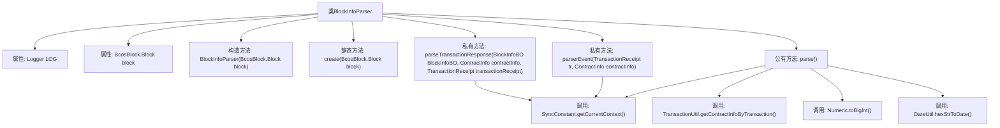
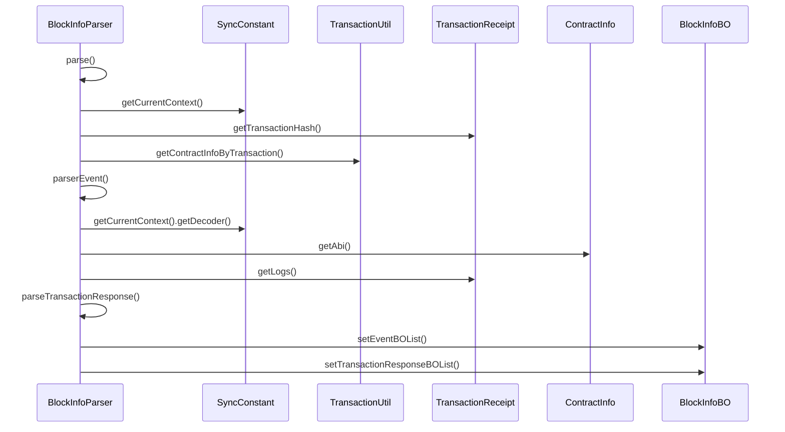

# 基础信息

|      |      |
|------|------|
| 名称 | BlockInfoParser |
| 编码语言 | .java |
| 代码路径 | WeFe/union/blockchain-data-sync/src/main/java/com/welab/wefe/parser/BlockInfoParser.java |
| 包名 | com.welab.wefe.parser |
| 依赖项 | ['com.welab.wefe.bo.contract.ContractInfo', 'com.welab.wefe.bo.contract.EventMetaInfo', 'com.welab.wefe.bo.contract.FieldInfo', 'com.welab.wefe.bo.data.BlockInfoBO', 'com.welab.wefe.bo.data.EventBO', 'com.welab.wefe.bo.data.TransactionResponseBO', 'com.welab.wefe.common.util.DateUtil', 'com.welab.wefe.common.util.JObject', 'com.welab.wefe.common.util.StringUtil', 'com.welab.wefe.constant.ContractConstants', 'com.welab.wefe.constant.SyncConstant', 'com.welab.wefe.util.TransactionUtil', 'org.apache.commons.collections4.CollectionUtils', 'org.fisco.bcos.sdk.abi.ABICodecException', 'org.fisco.bcos.sdk.client.protocol.model.JsonTransactionResponse', 'org.fisco.bcos.sdk.client.protocol.response.BcosBlock', 'org.fisco.bcos.sdk.client.protocol.response.BcosTransactionReceipt', 'org.fisco.bcos.sdk.model.TransactionReceipt', 'org.fisco.bcos.sdk.transaction.codec.decode.TransactionDecoderInterface', 'org.fisco.bcos.sdk.transaction.model.dto.TransactionResponse', 'org.fisco.bcos.sdk.transaction.model.exception.ContractException', 'org.fisco.bcos.sdk.utils.Numeric', 'org.slf4j.Logger', 'org.slf4j.LoggerFactory', 'java.util', 'java.util.stream.Collectors'] |
| 概述说明 | BlockInfoParser类解析区块链区块信息，处理交易回执和事件日志，生成包含事件和交易响应的BlockInfoBO对象。 |

# 说明

BlockInfoParser类用于解析区块链区块信息，包含事件日志和交易响应。构造函数接收BcosBlock.Block对象，提供create静态方法创建实例。parserEvent方法解析交易事件日志，将事件数据转换为EventBO对象列表。parse方法处理区块中的交易，获取交易收据并解析事件和交易响应，最终生成BlockInfoBO对象，包含区块号、组ID、事件列表和交易响应列表。parseTransactionResponse方法解析交易响应，将结果存入TransactionResponseBO对象。整个过程涉及事件解码、合约信息处理和异常捕获。

# 类列表 Class Summary

| 名称   | 类型  | 说明 |
|-------|------|-------------|
| BlockInfoParser | class | BlockInfoParser类解析区块链交易和事件日志，生成事件和交易响应对象。包含事件解析、交易响应处理和区块信息提取功能。 |


## 类 BlockInfoParser

|      |      |
|------|------|
| 访问范围 | public |
| 类型 | class |
| 名称 | BlockInfoParser |
| 说明 | BlockInfoParser类解析区块链交易和事件日志，生成事件和交易响应对象。包含事件解析、交易响应处理和区块信息提取功能。 |


### UML类图

```mermaid
classDiagram
    class BlockInfoParser {
        -Logger LOG
        -BcosBlock.Block block
        +BlockInfoParser(BcosBlock.Block block)
        +BlockInfoParser create(BcosBlock.Block block)$
        -List~EventBO~ parserEvent(TransactionReceipt tr, ContractInfo contractInfo)
        +BlockInfoBO parse()
        -void parseTransactionResponse(BlockInfoBO blockInfoBO, ContractInfo contractInfo, TransactionReceipt transactionReceipt)
    }

    class BcosBlock {
        <<inner>>
        class Block {
            +List~TransactionResult~ getTransactions()
            +String getNumber()
            +String getTimestamp()
        }
        <<inner>>
        class TransactionResult {
        }
        <<inner>>
        class TransactionObject {
            +JsonTransactionResponse get()
        }
    }

    class TransactionReceipt {
        +String getTransactionHash()
        +String getContractAddress()
        +String getBlockNumber()
        +String getFrom()
        +String getTo()
        +List~Log~ getLogs()
        +void setContractAddress(String address)
    }

    class ContractInfo {
        +String getContractName()
        +String getAbi()
        +List~EventMetaInfo~ getEventMetaInfoList()
    }

    class EventMetaInfo {
        +String getEventName()
        +String getContractName()
        +List~FieldInfo~ getFieldInfoList()
    }

    class FieldInfo {
        +String getSqlName()
    }

    class EventBO {
        +void setContractName(String name)
        +void setEventName(String name)
        +void setBlockNumber(String number)
        +void setFrom(String from)
        +void setTo(String to)
        +void setEntity(Map~String, Object~ entity)
    }

    class BlockInfoBO {
        +void setBlockNumber(String number)
        +void setGroupId(String groupId)
        +void setEventBOList(List~EventBO~ list)
        +List~TransactionResponseBO~ getTransactionResponseBOList()
    }

    class TransactionResponseBO {
        +void setTransactionHash(String hash)
        +void setBlockNumber(String number)
        +void setContractAddress(String address)
        +void setContractName(String name)
        +void setTransactionResponse(TransactionResponse response)
    }

    class TransactionResponse {
    }

    class JsonTransactionResponse {
        +String getHash()
        +String getTo()
    }

    class BcosTransactionReceipt {
        +Optional~TransactionReceipt~ getTransactionReceipt()
    }

    BlockInfoParser --> BcosBlock.Block : 包含
    BlockInfoParser --> TransactionReceipt : 解析
    BlockInfoParser --> ContractInfo : 依赖
    BlockInfoParser --> EventBO : 生成
    BlockInfoParser --> BlockInfoBO : 生成
    BlockInfoParser --> TransactionResponseBO : 生成
    ContractInfo --> EventMetaInfo : 包含
    EventMetaInfo --> FieldInfo : 包含
    BcosBlock.TransactionResult <|-- BcosBlock.TransactionObject
    BcosBlock.TransactionObject --> JsonTransactionResponse : 包含
    BcosTransactionReceipt --> TransactionReceipt : 包含
    BlockInfoBO --> TransactionResponseBO : 包含
```

这段代码实现了一个区块链区块信息解析器，主要功能是解析区块中的交易和事件日志。BlockInfoParser类接收BcosBlock.Block对象，通过parse()方法解析区块信息，生成包含事件列表和交易响应的BlockInfoBO对象。解析过程涉及交易收据处理、合约信息匹配、事件日志解码等操作，使用了多个辅助类如TransactionReceipt、ContractInfo、EventBO等来封装中间数据。整个设计采用分层处理模式，将复杂的区块链数据解析过程分解为多个职责单一的方法。


### 内部方法调用关系图





流程图描述：该流程图展示了BlockInfoParser类的结构，包含属性、构造方法、静态创建方法和三个核心业务方法。parse()作为主入口，调用parserEvent()解析事件日志，调用parseTransactionResponse()处理交易响应，依赖SyncConstant获取上下文解码器，通过TransactionUtil获取合约信息。时序图则详细描述了parse()方法执行时的交互流程，包括与外部组件的协作关系。

### 字段列表 Field List

| 名称  | 类型  | 说明 |
|-------|-------|------|
| block | BcosBlock.Block | 私有区块对象，类型为BcosBlock.Block。 |
| LOG = LoggerFactory.getLogger(BlockInfoParser.class) | Logger | 定义BlockInfoParser类的私有静态日志对象LOG，使用LoggerFactory获取实例。 |

### 方法列表

| 名称  | 类型  | 说明 |
|-------|-------|------|
| parse | BlockInfoBO | 解析区块信息，提取交易结果和事件，生成BlockInfoBO对象。处理交易收据和合约信息，过滤无效数据，解析事件和交易响应，最终返回包含事件列表的区块信息对象。 |
| parserEvent | List<EventBO> | 解析交易事件日志，生成事件对象列表。检查合约事件元信息，解码日志数据，映射字段并填充事件属性，包括时间戳、交易哈希、合约地址等，最后返回事件列表。 |
| create | BlockInfoParser | 创建BlockInfoParser实例，传入BcosBlock.Block对象并返回。 |
| parseTransactionResponse | void | 解析交易响应方法：解码交易收据，提取交易哈希、区块号、合约地址和名称等信息，构建交易响应对象并加入区块信息。异常时记录错误日志。 |


