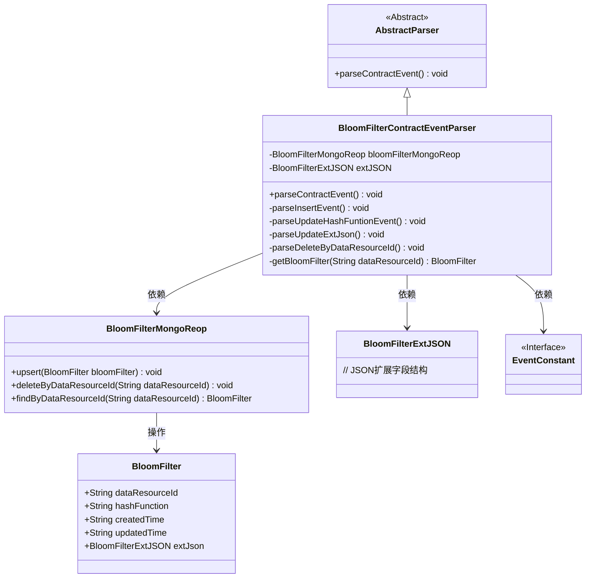
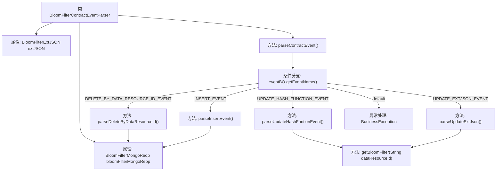

# 基础信息

|      |      |
|------|------|
| 名称 | BloomFilterContractEventParser |
| 编码语言 | .java |
| 代码路径 | WeFe/union/blockchain-data-sync/src/main/java/com/welab/wefe/parser/BloomFilterContractEventParser.java |
| 包名 | com.welab.wefe.parser |
| 依赖项 | ['com.alibaba.fastjson.JSONObject', 'com.welab.wefe.BlockchainDataSyncApp', 'com.welab.wefe.common.data.mongodb.entity.union.BloomFilter', 'com.welab.wefe.common.data.mongodb.entity.union.ext.BloomFilterExtJSON', 'com.welab.wefe.common.data.mongodb.repo.BloomFilterMongoReop', 'com.welab.wefe.common.util.StringUtil', 'com.welab.wefe.constant.EventConstant', 'com.welab.wefe.exception.BusinessException', 'org.apache.commons.lang3.StringUtils'] |
| 概述说明 | BloomFilterContractEventParser类解析布隆过滤器相关事件，包括插入、更新哈希函数、更新扩展JSON和按ID删除操作，使用MongoDB存储数据。 |

# 说明

BloomFilterContractEventParser类继承AbstractParser，用于解析布隆过滤器相关事件。它通过bloomFilterMongoReop操作MongoDB，处理四种事件：INSERT_EVENT创建新记录并设置数据资源ID、哈希函数等字段；UPDATE_HASH_FUNCTION_EVENT更新哈希函数；UPDATE_EXTJSON_EVENT更新扩展JSON；DELETE_BY_DATA_RESOURCE_ID_EVENT按ID删除记录。所有操作均校验数据存在性，并通过upsert方法保存变更。

# 类列表 Class Summary

| 名称   | 类型  | 说明 |
|-------|------|-------------|
| BloomFilterContractEventParser | class | BloomFilterContractEventParser类解析布隆过滤器相关事件，包括插入、更新哈希函数、更新扩展JSON和删除操作，通过MongoDB存储数据。 |

## 类 BloomFilterContractEventParser

|      |      |
|------|------|
| 访问范围 | public |
| 类型 | class |
| 名称 | BloomFilterContractEventParser |
| 说明 | BloomFilterContractEventParser类解析布隆过滤器相关事件，包括插入、更新哈希函数、更新扩展JSON和删除操作，通过MongoDB存储数据。 |

### UML类图

该类图展示了布隆过滤器合约事件解析器的核心结构。BloomFilterContractEventParser继承自抽象解析器，通过BloomFilterMongoReop操作BloomFilter实体，处理INSERT/UPDATE/DELETE等事件。解析器依赖BloomFilterExtJSON存储扩展数据，并引用EventConstant获取事件类型常量。整体采用分层设计，数据访问层与业务逻辑分离，符合单一职责原则。

### 内部方法调用关系图

该流程图展示了BloomFilterContractEventParser类的核心逻辑结构。类通过parseContractEvent()作为入口，根据事件类型(eventName)分派到4种不同的处理方法(INSERT/UPDATE/DELETE)，均涉及对bloomFilterMongoReop数据库操作。其中parseUpdateHashFuntionEvent和parseUpdateExtJson会调用getBloomFilter方法校验数据存在性，所有数据库操作最终都指向bloomFilterMongoReop实例。异常情况下会抛出BusinessException，整体呈现清晰的事件驱动处理流程。

### 字段列表 Field List

| 名称  | 类型  | 说明 |
|-------|-------|------|
| extJSON | BloomFilterExtJSON | 保护成员变量extJSON，类型为BloomFilterExtJSON。 |
| bloomFilterMongoReop = BlockchainDataSyncApp.CONTEXT.getBean(BloomFilterMongoReop.class) | BloomFilterMongoReop | 获取BloomFilterMongoReop实例，通过BlockchainDataSyncApp的CONTEXT容器注入。 |

### 方法列表

| 名称  | 类型  | 说明 |
|-------|-------|------|
| parseContractEvent | void | 解析合约事件方法，根据事件名称调用对应处理逻辑，包括插入、更新哈希函数、更新扩展JSON和按资源ID删除，无效事件抛出异常。 |
| parseUpdateHashFuntionEvent | void | 解析更新哈希函数事件，获取数据资源ID、哈希函数和更新时间，更新布隆过滤器并保存。 |
| parseInsertEvent | void | 解析插入事件：创建BloomFilter对象，设置数据资源ID、哈希函数、创建和更新时间及扩展JSON，最后执行MongoDB更新插入操作。 |
| parseUpdateExtJson | void | 解析更新扩展JSON数据，设置布隆过滤器属性并更新到数据库。 |
| parseDeleteByDataResourceId | void | 解析并删除指定数据资源ID的布隆过滤器记录。 |
| getBloomFilter | BloomFilter | 根据数据资源ID获取布隆过滤器，若不存在则抛出异常。 |

