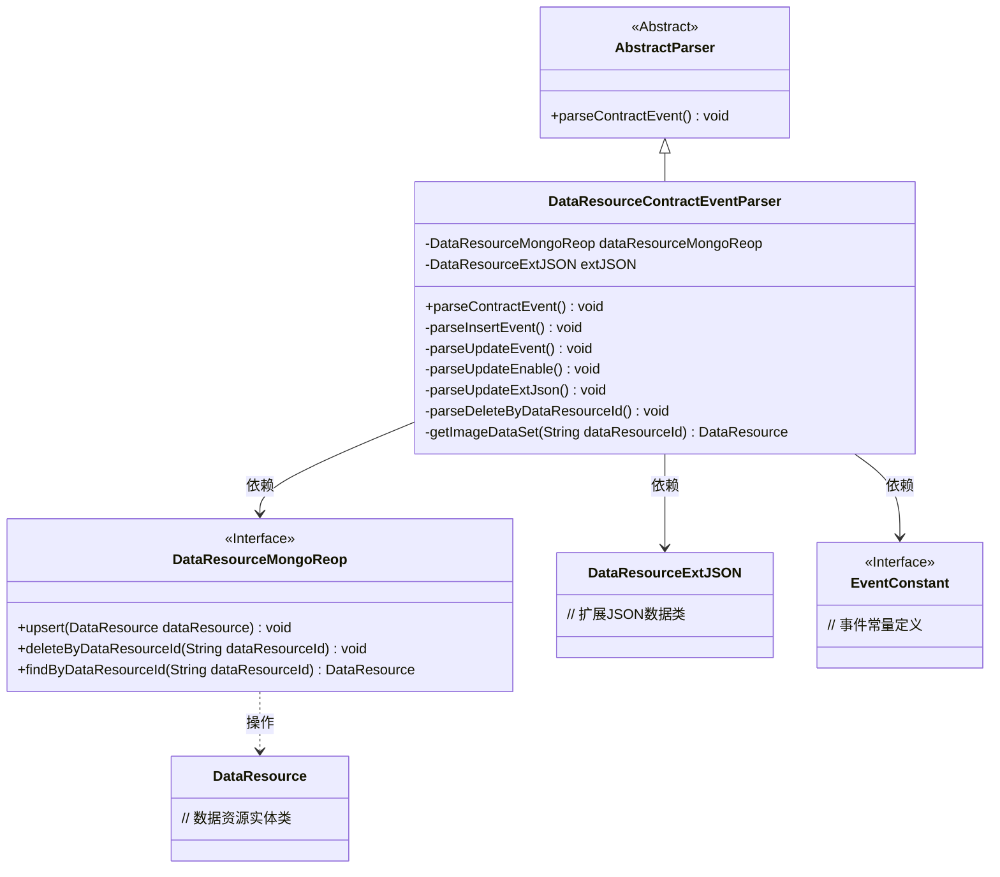
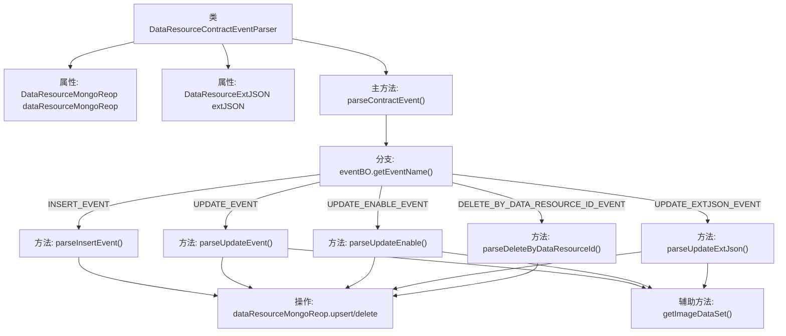
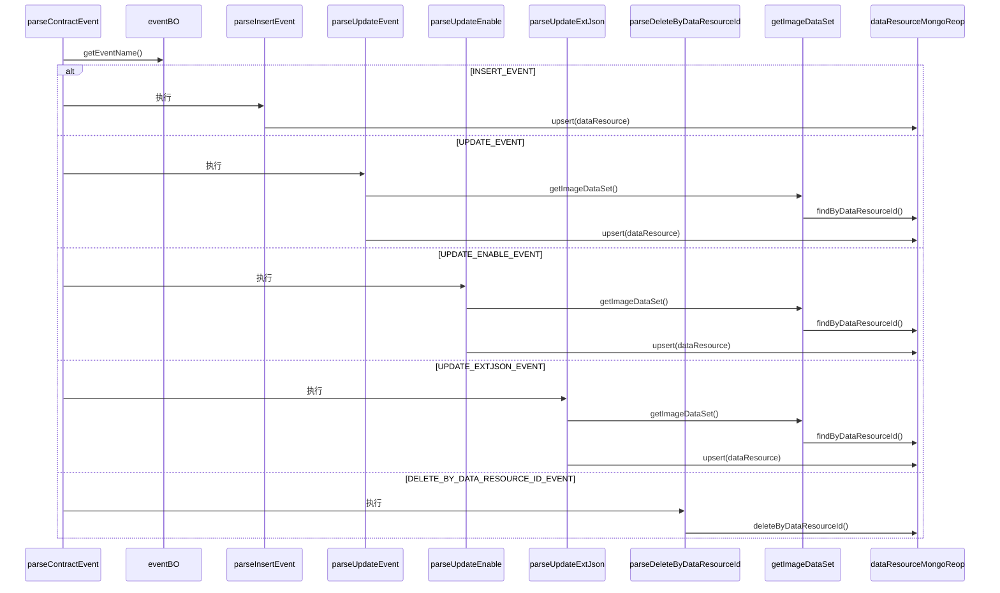

# 基础信息

|      |      |
|------|------|
| 名称 | DataResourceContractEventParser |
| 编码语言 | .java |
| 代码路径 | WeFe/union/blockchain-data-sync/src/main/java/com/welab/wefe/parser/DataResourceContractEventParser.java |
| 包名 | com.welab.wefe.parser |
| 依赖项 | ['com.alibaba.fastjson.JSONObject', 'com.welab.wefe.BlockchainDataSyncApp', 'com.welab.wefe.common.data.mongodb.entity.union.DataResource', 'com.welab.wefe.common.data.mongodb.entity.union.ext.DataResourceExtJSON', 'com.welab.wefe.common.data.mongodb.repo.DataResourceMongoReop', 'com.welab.wefe.common.util.StringUtil', 'com.welab.wefe.common.wefe.enums.DataResourceType', 'com.welab.wefe.constant.EventConstant', 'com.welab.wefe.exception.BusinessException', 'org.apache.commons.lang3.StringUtils'] |
| 概述说明 | DataResourceContractEventParser类解析数据资源事件，处理插入、更新、启用、扩展JSON更新和删除操作，通过MongoDB存储数据。 |

# 说明

DataResourceContractEventParser类继承AbstractParser，用于解析数据资源相关事件。它包含DataResourceMongoReop和DataResourceExtJSON字段，通过parseContractEvent方法处理不同事件类型。支持的事件包括插入、更新、更新启用状态、更新扩展JSON和按ID删除。插入事件会设置数据资源的各种属性并保存；更新事件修改指定属性；更新扩展JSON和启用状态仅修改对应字段；删除事件根据ID移除数据。所有操作都通过dataResourceMongoReop与数据库交互，确保数据一致性。

# 类列表 Class Summary

| 名称   | 类型  | 说明 |
|-------|------|-------------|
| DataResourceContractEventParser | class | DataResourceContractEventParser类解析数据资源事件，处理插入、更新、启用状态、扩展JSON和删除操作，使用MongoDB存储数据。 |

## 类 DataResourceContractEventParser

|      |      |
|------|------|
| 访问范围 | public |
| 类型 | class |
| 名称 | DataResourceContractEventParser |
| 说明 | DataResourceContractEventParser类解析数据资源事件，处理插入、更新、启用状态、扩展JSON和删除操作，使用MongoDB存储数据。 |

### UML类图

该类图展示了数据资源合约事件解析器的结构。DataResourceContractEventParser继承自AbstractParser，实现了对不同类型合约事件（如插入、更新、删除等）的解析逻辑。它依赖DataResourceMongoReop接口进行MongoDB操作，使用DataResourceExtJSON处理扩展数据，并通过EventConstant获取事件类型常量。解析器通过多种私有方法处理具体事件，核心操作包括数据资源的增删改查，并严格校验数据存在性。整体设计体现了事件驱动架构和分层处理思想。

### 内部方法调用关系图

该流程图展示了DataResourceContractEventParser类的事件处理逻辑，核心是通过parseContractEvent方法根据不同事件类型(INSERT/UPDATE/DELETE等)分发到对应的处理方法。所有分支最终都会操作MongoDB存储，包含数据插入/更新/删除等操作。时序图则详细描述了事件解析过程中各组件间的调用顺序，突出显示了基于事件类型的分支路由和数据持久化过程。

### 字段列表 Field List

| 名称  | 类型  | 说明 |
|-------|-------|------|
| extJSON | DataResourceExtJSON | 定义了受保护的数据资源扩展JSON字段extJSON。 |
| dataResourceMongoReop = BlockchainDataSyncApp.CONTEXT.getBean(DataResourceMongoReop.class) | DataResourceMongoReop | 获取DataResourceMongoReop实例，通过BlockchainDataSyncApp的CONTEXT容器注入。 |

### 方法列表

| 名称  | 类型  | 说明 |
|-------|-------|------|
| parseUpdateEvent | void | 解析更新事件，获取资源ID和更新时间，更新数据资源属性并保存到数据库。 |
| parseDeleteByDataResourceId | void | 解析并删除指定数据资源ID的记录。 |
| parseUpdateEnable | void | 解析更新启用状态：从eventBO获取资源ID、启用状态和更新时间，更新对应数据资源并保存到MongoDB。 |
| parseContractEvent | void | 解析合约事件方法，根据事件名称调用对应处理逻辑，包括插入、更新、启用、扩展JSON更新和删除操作，无效事件抛出异常。 |
| parseInsertEvent | void | 解析插入事件，设置DataResource对象属性并存入数据库。属性包括ID、名称、描述、标签、数据量、公开级别、使用统计等。 |
| getImageDataSet | DataResource | 该方法通过ID从MongoDB获取图片数据集，若不存在则抛出业务异常。 |
| parseUpdateExtJson | void | 解析更新扩展JSON数据，获取资源ID和更新时间，更新数据资源并保存到数据库。 |

