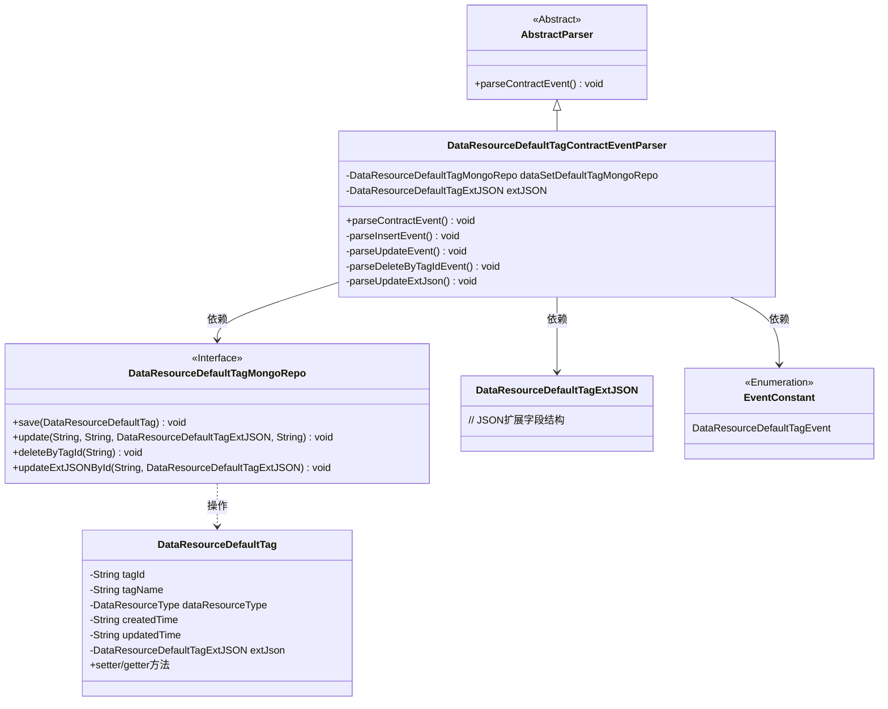
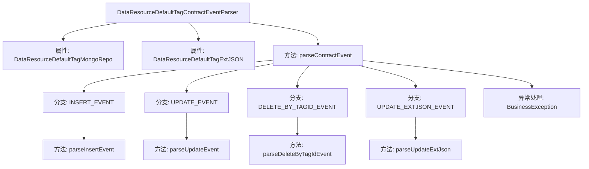
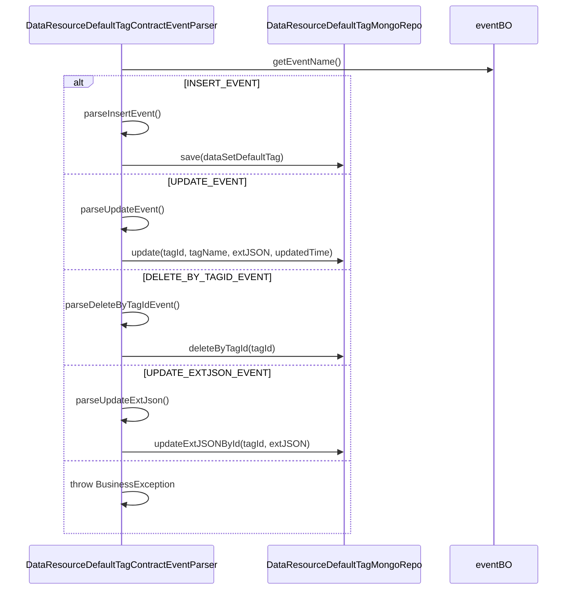

# 基础信息

|      |      |
|------|------|
| 名称 | DataResourceDefaultTagContractEventParser |
| 编码语言 | .java |
| 代码路径 | WeFe/union/blockchain-data-sync/src/main/java/com/welab/wefe/parser/DataResourceDefaultTagContractEventParser.java |
| 包名 | com.welab.wefe.parser |
| 依赖项 | ['com.alibaba.fastjson.JSONObject', 'com.welab.wefe.BlockchainDataSyncApp', 'com.welab.wefe.common.data.mongodb.entity.union.DataResource', 'com.welab.wefe.common.data.mongodb.entity.union.DataResourceDefaultTag', 'com.welab.wefe.common.data.mongodb.entity.union.DataSetDefaultTag', 'com.welab.wefe.common.data.mongodb.entity.union.ext.DataResourceDefaultTagExtJSON', 'com.welab.wefe.common.data.mongodb.entity.union.ext.DataSetDefaultTagExtJSON', 'com.welab.wefe.common.data.mongodb.repo.DataResourceDefaultTagMongoRepo', 'com.welab.wefe.common.data.mongodb.repo.DataSetDefaultTagMongoRepo', 'com.welab.wefe.common.util.StringUtil', 'com.welab.wefe.common.wefe.enums.DataResourceType', 'com.welab.wefe.constant.EventConstant', 'com.welab.wefe.exception.BusinessException', 'org.apache.commons.lang3.StringUtils'] |
| 概述说明 | 解析数据资源默认标签合约事件的类，处理插入、更新、删除和更新扩展JSON事件，使用MongoDB存储数据。 |

# 说明

该代码定义了一个名为DataResourceDefaultTagContractEventParser的类，继承自AbstractParser，用于解析和处理与数据资源默认标签相关的合约事件。类中包含了对MongoDB仓库的操作，通过注入的dataSetDefaultTagMongoRepo进行数据存取。主要功能包括解析四种事件：插入事件（创建新标签并保存到数据库）、更新事件（修改标签名称和扩展JSON）、按标签ID删除事件、更新扩展JSON事件。每个事件处理方法都从输入参数中提取必要信息，并调用相应的MongoDB仓库方法执行操作。异常情况下会抛出业务异常。

# 类列表 Class Summary

| 名称   | 类型  | 说明 |
|-------|------|-------------|
| DataResourceDefaultTagContractEventParser | class | DataResourceDefaultTagContractEventParser类解析数据资源默认标签事件，处理插入、更新、删除和更新扩展JSON操作，使用MongoDB存储数据。 |

## 类 DataResourceDefaultTagContractEventParser

|      |      |
|------|------|
| 访问范围 | public |
| 类型 | class |
| 名称 | DataResourceDefaultTagContractEventParser |
| 说明 | DataResourceDefaultTagContractEventParser类解析数据资源默认标签事件，处理插入、更新、删除和更新扩展JSON操作，使用MongoDB存储数据。 |

### UML类图

该类图展示了数据资源默认标签合约事件解析器的结构。DataResourceDefaultTagContractEventParser继承自抽象解析器，通过MongoDB仓库操作数据标签实体，处理四种事件类型（增删改查）。核心依赖包括标签实体类、JSON扩展结构以及事件枚举常量，体现了区块链数据同步场景下的事件驱动解析机制。

### 内部方法调用关系图

该流程图展示了DataResourceDefaultTagContractEventParser类的核心结构和事件处理逻辑。类通过解析不同事件类型（INSERT/UPDATE/DELETE/EXTJSON更新）调用对应的处理方法，最终与MongoDB仓库交互完成数据操作。时序图则详细描述了事件处理过程中各组件间的交互顺序，突出基于事件名称的分支路由机制。所有操作均围绕tagId展开，确保数据一致性和事务完整性。

### 字段列表 Field List

| 名称  | 类型  | 说明 |
|-------|-------|------|
| dataSetDefaultTagMongoRepo = BlockchainDataSyncApp.CONTEXT.getBean(DataResourceDefaultTagMongoRepo.class) | DataResourceDefaultTagMongoRepo | 获取DataResourceDefaultTagMongoRepo实例，通过BlockchainDataSyncApp的CONTEXT注入。 |
| extJSON | DataResourceDefaultTagExtJSON | 受保护的DataResourceDefaultTagExtJSON类型变量extJSON。 |

### 方法列表

| 名称  | 类型  | 说明 |
|-------|-------|------|
| parseUpdateEvent | void | 解析更新事件，获取标签ID、名称和更新时间，并更新MongoDB中的默认标签数据。 |
| parseContractEvent | void | 解析合约事件方法，根据事件名调用不同处理逻辑：插入、更新、按标签ID删除、更新扩展JSON，无效事件抛出异常。 |
| parseInsertEvent | void | 解析插入事件：创建DataResourceDefaultTag对象，设置标签ID、名称、资源类型、创建和更新时间及扩展JSON，最后保存至MongoDB。 |
| parseDeleteByTagIdEvent | void | 该方法解析删除标签事件，获取标签ID后调用MongoDB仓库删除对应标签数据。 |
| parseUpdateExtJson | void | 解析更新扩展JSON数据，通过tagId调用MongoDB仓库更新对应记录的extJSON字段。 |

