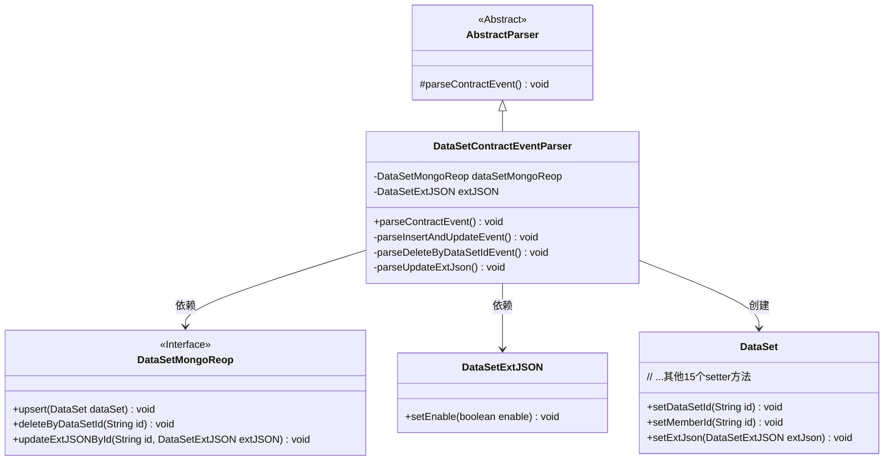
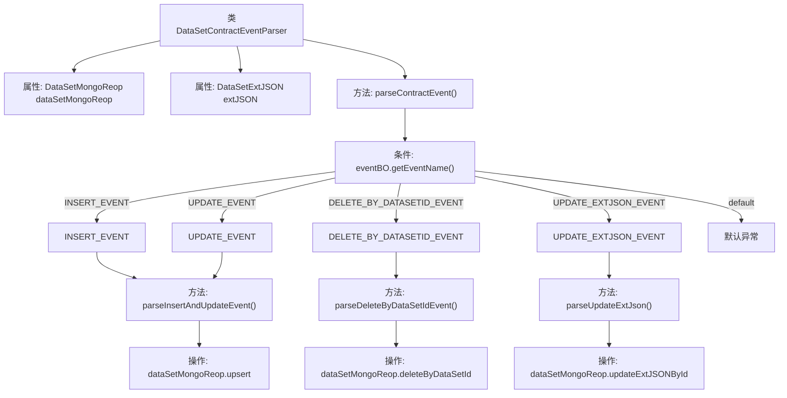

# 基础信息

|      |      |
|------|------|
| 名称 | DataSetContractEventParser |
| 编码语言 | .java |
| 代码路径 | WeFe/union/blockchain-data-sync/src/main/java/com/welab/wefe/parser/DataSetContractEventParser.java |
| 包名 | com.welab.wefe.parser |
| 依赖项 | ['org.apache.commons.lang3.StringUtils', 'com.alibaba.fastjson.JSONObject', 'com.welab.wefe.BlockchainDataSyncApp', 'com.welab.wefe.common.data.mongodb.entity.union.DataSet', 'com.welab.wefe.common.data.mongodb.entity.union.ext.DataSetExtJSON', 'com.welab.wefe.common.data.mongodb.repo.DataSetMongoReop', 'com.welab.wefe.common.util.StringUtil', 'com.welab.wefe.constant.EventConstant', 'com.welab.wefe.exception.BusinessException'] |
| 概述说明 | DataSetContractEventParser类解析合约事件，处理插入、更新、删除和更新扩展JSON操作，将数据存储到MongoDB。 |

# 说明

DataSetContractEventParser是一个继承自AbstractParser的类，用于解析与数据集相关的合约事件。它包含一个DataSetMongoReop实例和一个DataSetExtJSON对象。主要方法parseContractEvent根据事件名称处理不同操作：INSERT_EVENT和UPDATE_EVENT调用parseInsertAndUpdateEvent方法，DELETE_BY_DATASETID_EVENT调用parseDeleteByDataSetIdEvent方法，UPDATE_EXTJSON_EVENT调用parseUpdateExtJson方法。parseInsertAndUpdateEvent方法创建并填充DataSet对象，然后执行upsert操作。parseDeleteByDataSetIdEvent和parseUpdateExtJson方法分别根据ID删除数据集和更新扩展JSON。未识别的事件会抛出BusinessException异常。

# 类列表 Class Summary

| 名称   | 类型  | 说明 |
|-------|------|-------------|
| DataSetContractEventParser | class | DataSetContractEventParser类解析合约事件，处理插入、更新、删除和更新扩展JSON操作，并将数据存入MongoDB。 |

## 类 DataSetContractEventParser

|      |      |
|------|------|
| 访问范围 | public |
| 类型 | class |
| 名称 | DataSetContractEventParser |
| 说明 | DataSetContractEventParser类解析合约事件，处理插入、更新、删除和更新扩展JSON操作，并将数据存入MongoDB。 |

### UML类图

这段代码描述了一个数据集合约事件解析器，继承自抽象解析器，主要处理四种事件类型（插入/更新/删除/扩展JSON更新）。类图展示了核心类关系：解析器通过MongoDB仓库操作数据集，使用扩展JSON对象存储额外属性，并创建数据集实体进行持久化。关键点包括事件类型的分派处理、数据集字段的精细映射，以及通过仓库模式实现数据访问。

### 内部方法调用关系图

这段代码是用于解析数据集合约事件的处理器，继承自AbstractParser类。主要功能是根据不同的事件类型（INSERT_EVENT、UPDATE_EVENT等）执行相应的数据库操作，包括插入/更新数据集、根据ID删除数据集或更新扩展JSON数据。流程图展示了从事件解析到具体操作的完整流程，包括事件类型判断分支和对应的数据库操作方法调用路径，最后都会执行MongoDB的CRUD操作。代码结构清晰，通过switch-case处理不同事件类型，每个事件类型对应一个专门的解析方法。

### 字段列表 Field List

| 名称  | 类型  | 说明 |
|-------|-------|------|
| dataSetMongoReop = BlockchainDataSyncApp.CONTEXT.getBean(DataSetMongoReop.class) | DataSetMongoReop | 获取DataSetMongoReop实例，通过BlockchainDataSyncApp的CONTEXT容器注入。 |
| extJSON | DataSetExtJSON | 受保护的扩展JSON数据集对象。 |

### 方法列表

| 名称  | 类型  | 说明 |
|-------|-------|------|
| parseDeleteByDataSetIdEvent | void | 该方法解析删除事件，通过事件对象获取ID并调用MongoDB删除对应数据集。 |
| parseInsertAndUpdateEvent | void | 方法parseInsertAndUpdateEvent创建DataSet对象并设置其属性，包括ID、名称、行列数、特征等，最后调用upsert方法保存到数据库。 |
| parseContractEvent | void | 解析合约事件方法，根据事件名处理不同逻辑：插入或更新事件启用extJSON并解析，删除事件按数据集ID处理，更新事件解析extJSON，无效事件名抛出异常。 |
| parseUpdateExtJson | void | 方法parseUpdateExtJson通过eventBO获取ID，调用dataSetMongoReop的updateExtJSONById方法更新指定ID的extJSON数据。 |

