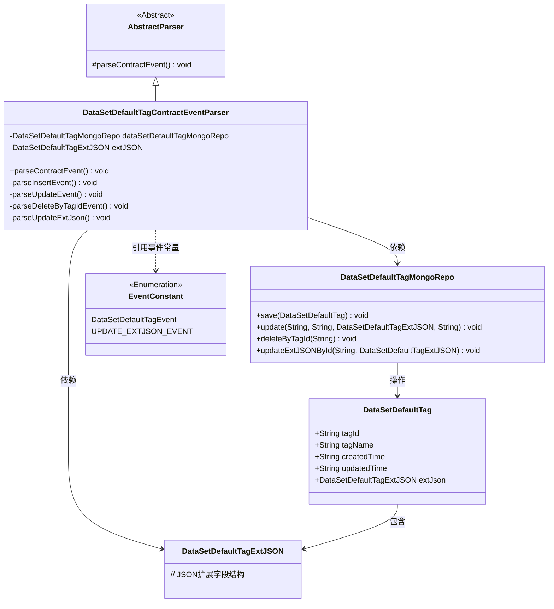
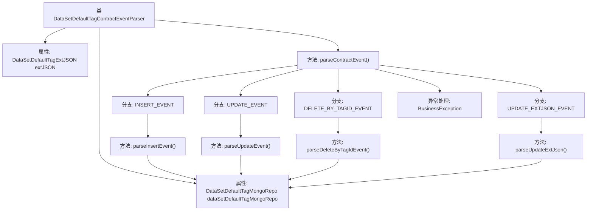

# 基础信息

|      |      |
|------|------|
| 名称 | DataSetDefaultTagContractEventParser |
| 编码语言 | .java |
| 代码路径 | WeFe/union/blockchain-data-sync/src/main/java/com/welab/wefe/parser/DataSetDefaultTagContractEventParser.java |
| 包名 | com.welab.wefe.parser |
| 依赖项 | ['org.apache.commons.lang3.StringUtils', 'com.alibaba.fastjson.JSONObject', 'com.welab.wefe.BlockchainDataSyncApp', 'com.welab.wefe.common.data.mongodb.entity.union.DataSetDefaultTag', 'com.welab.wefe.common.data.mongodb.entity.union.ext.DataSetDefaultTagExtJSON', 'com.welab.wefe.common.data.mongodb.repo.DataSetDefaultTagMongoRepo', 'com.welab.wefe.common.util.StringUtil', 'com.welab.wefe.constant.EventConstant', 'com.welab.wefe.exception.BusinessException'] |
| 概述说明 | 解析数据集默认标签合约事件的Java类，包含插入、更新、删除和更新扩展JSON的方法，使用MongoDB存储数据。 |

# 说明

DataSetDefaultTagContractEventParser是一个继承自AbstractParser的类，用于解析与数据集默认标签相关的合约事件。它通过dataSetDefaultTagMongoRepo与MongoDB交互，并处理四种事件类型：插入、更新、按tagId删除和更新extJSON。插入事件会创建新的DataSetDefaultTag对象并保存到MongoDB；更新事件会修改标签名称和extJSON；删除事件根据tagId移除记录；更新extJSON事件仅修改extJSON字段。所有操作都涉及对MongoDB的增删改查。

# 类列表 Class Summary

| 名称   | 类型  | 说明 |
|-------|------|-------------|
| DataSetDefaultTagContractEventParser | class | 数据集默认标签事件解析类，处理插入、更新、删除及扩展JSON更新操作，与MongoDB交互。 |

## 类 DataSetDefaultTagContractEventParser

|      |      |
|------|------|
| 访问范围 | public |
| 类型 | class |
| 名称 | DataSetDefaultTagContractEventParser |
| 说明 | 数据集默认标签事件解析类，处理插入、更新、删除及扩展JSON更新操作，与MongoDB交互。 |

### UML类图

该类图展示了数据集默认标签合约事件解析器的核心结构。DataSetDefaultTagContractEventParser继承自抽象解析器，通过MongoDB仓库操作DataSetDefaultTag实体，处理插入/更新/删除等事件。实体包含标签基础信息和扩展JSON结构，事件类型由枚举常量定义。解析器根据不同事件类型调用对应私有方法，完成与MongoDB的交互。

### 内部方法调用关系图

该流程图展示了DataSetDefaultTagContractEventParser类的结构及其主要方法调用关系。该类继承自AbstractParser，包含两个属性和五个核心方法。parseContractEvent()作为主入口方法，根据事件类型调用不同的处理方法（插入/更新/删除/更新扩展JSON），所有方法最终都会操作dataSetDefaultTagMongoRepo进行数据库交互。流程图清晰呈现了事件分发逻辑和异常处理路径，体现了区块链数据同步场景下对数据集默认标签事件的处理流程。

### 字段列表 Field List

| 名称  | 类型  | 说明 |
|-------|-------|------|
| extJSON | DataSetDefaultTagExtJSON | 受保护的DataSetDefaultTagExtJSON类型变量extJSON。 |
| dataSetDefaultTagMongoRepo = BlockchainDataSyncApp.CONTEXT.getBean(DataSetDefaultTagMongoRepo.class) | DataSetDefaultTagMongoRepo | 获取DataSetDefaultTagMongoRepo实例，通过BlockchainDataSyncApp的CONTEXT注入。 |

### 方法列表

| 名称  | 类型  | 说明 |
|-------|-------|------|
| parseInsertEvent | void | 解析插入事件，设置DataSetDefaultTag属性并保存到MongoDB。 |
| parseContractEvent | void | 解析合约事件方法，根据事件名调用对应处理逻辑，包括插入、更新、按标签ID删除和更新扩展JSON，无效事件抛出异常。 |
| parseUpdateEvent | void | 解析更新事件，获取标签ID、名称和更新时间，更新MongoDB中的默认标签数据。 |
| parseDeleteByTagIdEvent | void | 解析删除标签事件，根据标签ID从MongoDB中删除对应数据。 |
| parseUpdateExtJson | void | 方法parseUpdateExtJson通过eventBO获取tag_id，调用dataSetDefaultTagMongoRepo更新对应ID的extJSON字段。 |

