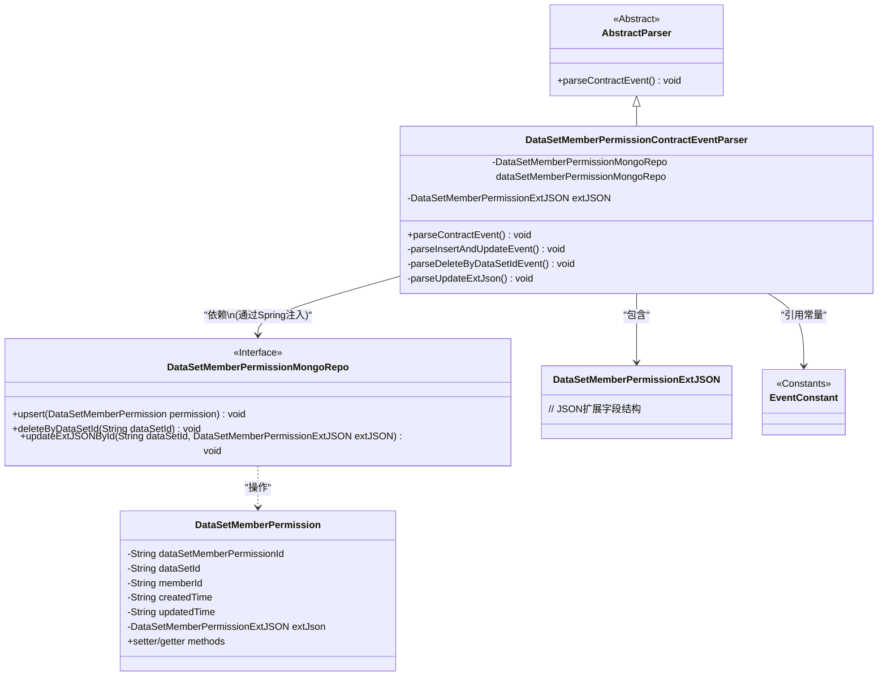
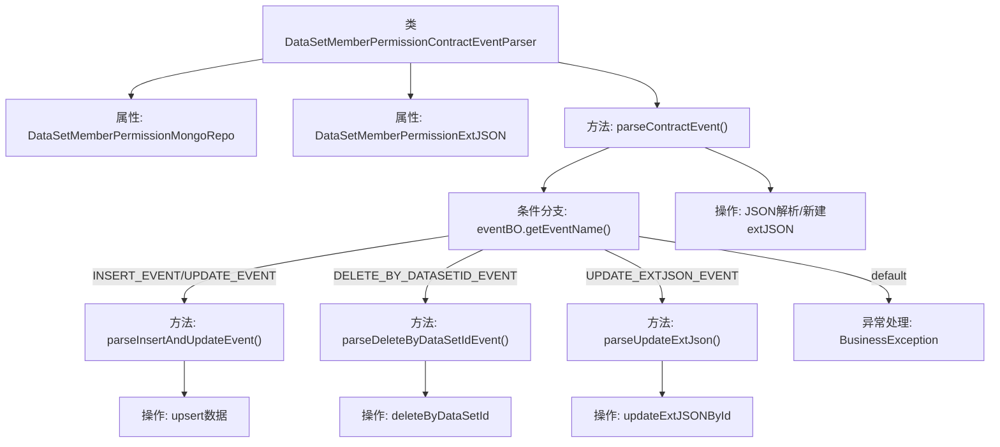

# 基础信息

|      |      |
|------|------|
| 名称 | DataSetMemberPermissionContractEventParser |
| 编码语言 | .java |
| 代码路径 | WeFe/union/blockchain-data-sync/src/main/java/com/welab/wefe/parser/DataSetMemberPermissionContractEventParser.java |
| 包名 | com.welab.wefe.parser |
| 依赖项 | ['com.alibaba.fastjson.JSONObject', 'com.welab.wefe.BlockchainDataSyncApp', 'com.welab.wefe.common.data.mongodb.entity.union.DataSetMemberPermission', 'com.welab.wefe.common.data.mongodb.entity.union.ext.DataSetMemberPermissionExtJSON', 'com.welab.wefe.common.data.mongodb.repo.DataSetMemberPermissionMongoRepo', 'com.welab.wefe.constant.EventConstant', 'com.welab.wefe.exception.BusinessException', 'org.apache.commons.lang3.StringUtils', 'java.util.Map'] |
| 概述说明 | 解析合约事件的类，处理数据集成员权限的增删改查操作，包括插入、更新、删除及扩展JSON更新，使用MongoDB存储数据。 |

# 说明

DataSetMemberPermissionContractEventParser类继承AbstractParser，用于解析数据集成员权限相关合约事件。它通过dataSetMemberPermissionMongoRepo操作MongoDB，包含四种事件处理：INSERT_EVENT和UPDATE_EVENT会解析并插入或更新成员权限数据；DELETE_BY_DATASETID_EVENT根据数据集ID删除记录；UPDATE_EXTJSON_EVENT更新扩展JSON字段。所有操作均基于eventBO中的事件数据和extJsonStr参数。

# 类列表 Class Summary

| 名称   | 类型  | 说明 |
|-------|------|-------------|
| DataSetMemberPermissionContractEventParser | class | 解析数据集成员权限合约事件的类，处理插入、更新、删除和扩展JSON更新操作，使用MongoDB存储数据。 |

## 类 DataSetMemberPermissionContractEventParser

|      |      |
|------|------|
| 访问范围 | public |
| 类型 | class |
| 名称 | DataSetMemberPermissionContractEventParser |
| 说明 | 解析数据集成员权限合约事件的类，处理插入、更新、删除和扩展JSON更新操作，使用MongoDB存储数据。 |

### UML类图

这段类图描述了一个数据集成员权限合约事件解析器的结构。DataSetMemberPermissionContractEventParser继承自抽象类AbstractParser，通过依赖注入使用DataSetMemberPermissionMongoRepo接口进行MongoDB操作，包含DataSetMemberPermissionExtJSON作为扩展字段容器。它根据不同事件类型（INSERT/UPDATE/DELETE）调用对应解析方法，最终将处理后的DataSetMemberPermission对象持久化到数据库。整个设计采用策略模式处理不同事件类型，符合开闭原则。

### 内部方法调用关系图

这段代码流程图展示了数据集成员权限合约事件解析器的完整处理逻辑。核心流程从parseContractEvent()方法开始，根据事件类型分发到三个子处理方法：处理插入/更新事件的parseInsertAndUpdateEvent()，处理按数据集ID删除的parseDeleteByDataSetIdEvent()，以及处理扩展JSON更新的parseUpdateExtJson()。每个子方法都涉及不同的MongoDB操作，包括upsert、deleteByDataSetId和updateExtJSONById。流程中包含了JSON数据的初始解析和异常处理分支，形成了一个完整的合约事件处理闭环。

### 字段列表 Field List

| 名称  | 类型  | 说明 |
|-------|-------|------|
| dataSetMemberPermissionMongoRepo = BlockchainDataSyncApp.CONTEXT.getBean(DataSetMemberPermissionMongoRepo.class) | DataSetMemberPermissionMongoRepo | 从应用上下文中获取DataSetMemberPermissionMongoRepo类的Bean实例并赋值给受保护变量。 |
| extJSON | DataSetMemberPermissionExtJSON | 受保护的DataSetMemberPermissionExtJSON类型变量extJSON。 |

### 方法列表

| 名称  | 类型  | 说明 |
|-------|-------|------|
| parseDeleteByDataSetIdEvent | void | 方法解析删除事件，获取数据集ID并删除对应权限记录。 |
| parseInsertAndUpdateEvent | void | 解析插入和更新事件，从eventBO获取数据并设置DataSetMemberPermission对象属性，最后执行MongoDB的upsert操作。 |
| parseContractEvent | void | 解析合约事件方法，根据事件类型调用不同处理逻辑：插入/更新、按数据集ID删除、更新扩展JSON，无效事件抛出异常。 |
| parseUpdateExtJson | void | 解析更新扩展JSON：根据事件数据获取数据集ID，调用MongoDB仓库更新对应ID的扩展JSON字段。 |

