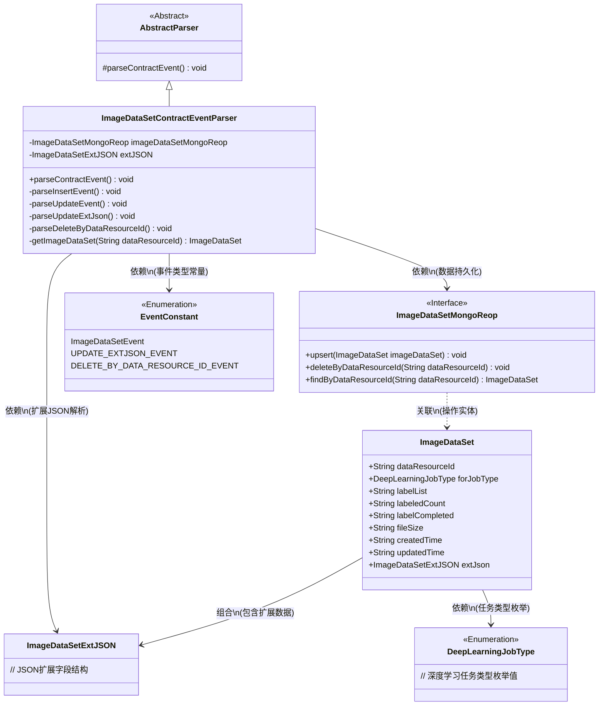
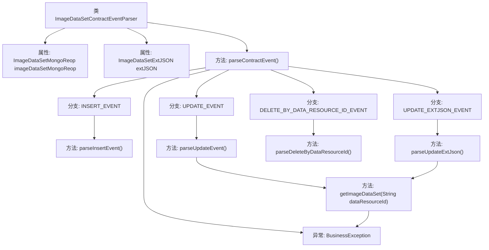
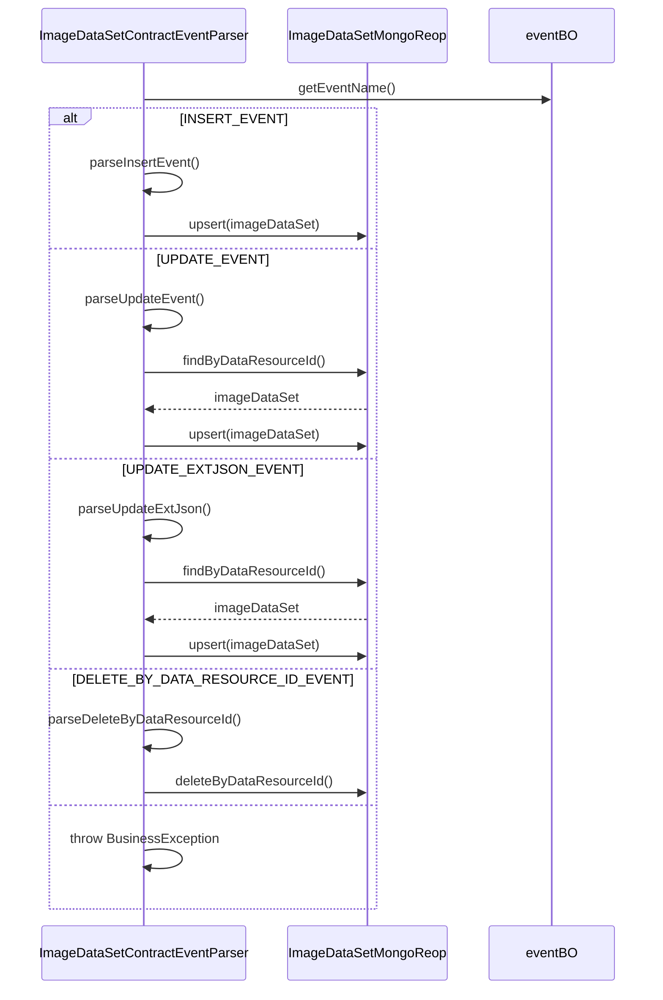

# 基础信息

|      |      |
|------|------|
| 名称 | ImageDataSetContractEventParser |
| 编码语言 | .java |
| 代码路径 | WeFe/union/blockchain-data-sync/src/main/java/com/welab/wefe/parser/ImageDataSetContractEventParser.java |
| 包名 | com.welab.wefe.parser |
| 依赖项 | ['com.alibaba.fastjson.JSONObject', 'com.welab.wefe.BlockchainDataSyncApp', 'com.welab.wefe.common.data.mongodb.entity.union.ImageDataSet', 'com.welab.wefe.common.data.mongodb.entity.union.ext.ImageDataSetExtJSON', 'com.welab.wefe.common.data.mongodb.repo.ImageDataSetMongoReop', 'com.welab.wefe.common.util.StringUtil', 'com.welab.wefe.common.wefe.enums.DeepLearningJobType', 'com.welab.wefe.constant.EventConstant', 'com.welab.wefe.exception.BusinessException', 'org.apache.commons.lang3.StringUtils'] |
| 概述说明 | ImageDataSetContractEventParser类继承AbstractParser，解析图像数据集事件，包括插入、更新、删除等操作，操作MongoDB存储数据。 |

# 说明

ImageDataSetContractEventParser类继承AbstractParser，用于解析图像数据集相关合约事件。它包含ImageDataSetMongoReop和ImageDataSetExtJSON字段，通过parseContractEvent方法处理不同事件类型：INSERT_EVENT创建新数据集并设置各项属性；UPDATE_EVENT更新现有数据集属性；UPDATE_EXTJSON_EVENT更新扩展JSON；DELETE_BY_DATA_RESOURCE_ID_EVENT按ID删除数据。各方法通过MongoDB存储库进行数据操作，处理异常情况。

# 类列表 Class Summary

| 名称   | 类型  | 说明 |
|-------|------|-------------|
| ImageDataSetContractEventParser | class | ImageDataSetContractEventParser类解析图像数据集事件，处理插入、更新、删除等操作，与MongoDB交互存储数据。 |

## 类 ImageDataSetContractEventParser

|      |      |
|------|------|
| 访问范围 | public |
| 类型 | class |
| 名称 | ImageDataSetContractEventParser |
| 说明 | ImageDataSetContractEventParser类解析图像数据集事件，处理插入、更新、删除等操作，与MongoDB交互存储数据。 |

### UML类图

该类图展示了图像数据集合约事件解析器的核心结构。ImageDataSetContractEventParser继承自AbstractParser，通过ImageDataSetMongoReop接口实现数据持久化，处理INSERT/UPDATE/DELETE等事件类型。系统依赖ImageDataSetExtJSON处理扩展数据，使用EventConstant定义事件类型枚举，并通过DeepLearningJobType枚举标识任务类型。整体采用分层设计，各模块职责明确，事件处理与数据操作解耦。

### 内部方法调用关系图

该流程图展示了ImageDataSetContractEventParser类的核心逻辑结构，包括4种事件处理分支和异常处理路径。时序图详细描述了不同事件类型下的交互流程，突出显示了与MongoDB仓库的CRUD操作。解析器通过eventBO获取事件类型后，会进入对应的事件处理方法，最终通过imageDataSetMongoReop完成数据持久化操作，整个过程包含严格的数据校验和异常处理机制。

### 字段列表 Field List

| 名称  | 类型  | 说明 |
|-------|-------|------|
| imageDataSetMongoReop = BlockchainDataSyncApp.CONTEXT.getBean(ImageDataSetMongoReop.class) | ImageDataSetMongoReop | 获取ImageDataSetMongoReop实例，通过BlockchainDataSyncApp的CONTEXT容器注入。 |
| extJSON | ImageDataSetExtJSON | 定义了一个受保护的ImageDataSetExtJSON类型变量extJSON。 |

### 方法列表

| 名称  | 类型  | 说明 |
|-------|-------|------|
| parseUpdateEvent | void | 解析更新事件，获取数据资源ID和更新时间，更新图像数据集属性并保存。 |
| parseInsertEvent | void | 解析插入事件，创建ImageDataSet对象并设置各项属性，包括数据源ID、任务类型、标签列表等，最后执行MongoDB的更新或插入操作。 |
| parseContractEvent | void | 解析合约事件方法，根据事件名称调用不同处理逻辑，包括插入、更新、删除等操作，无效事件抛出异常。 |
| parseUpdateExtJson | void | 解析更新扩展JSON数据：获取资源ID和更新时间，更新图像数据集扩展JSON和修改时间，并保存到MongoDB。 |
| parseDeleteByDataResourceId | void | 解析并删除指定数据资源ID对应的图像数据集。 |
| getImageDataSet | ImageDataSet | 通过数据资源ID获取图像数据集，若不存在则抛出业务异常。 |

