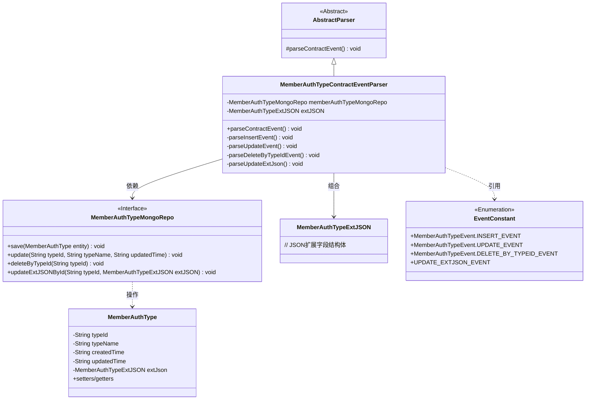
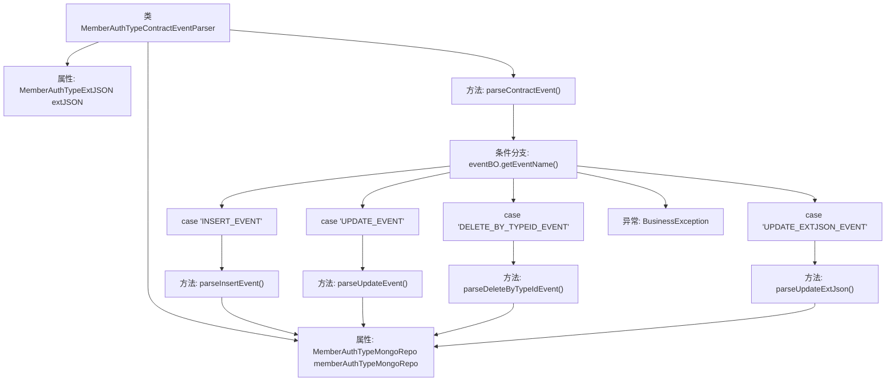

# 基础信息

|      |      |
|------|------|
| 名称 | MemberAuthTypeContractEventParser |
| 编码语言 | .java |
| 代码路径 | WeFe/union/blockchain-data-sync/src/main/java/com/welab/wefe/parser/MemberAuthTypeContractEventParser.java |
| 包名 | com.welab.wefe.parser |
| 依赖项 | ['com.alibaba.fastjson.JSONObject', 'com.welab.wefe.BlockchainDataSyncApp', 'com.welab.wefe.common.data.mongodb.entity.union.MemberAuthType', 'com.welab.wefe.common.data.mongodb.entity.union.ext.MemberAuthTypeExtJSON', 'com.welab.wefe.common.data.mongodb.repo.MemberAuthTypeMongoRepo', 'com.welab.wefe.common.util.StringUtil', 'com.welab.wefe.constant.EventConstant', 'com.welab.wefe.exception.BusinessException', 'org.apache.commons.lang3.StringUtils'] |
| 概述说明 | MemberAuthTypeContractEventParser类解析成员认证类型事件，处理插入、更新、删除及扩展JSON更新操作，使用MongoDB存储数据。 |

# 说明

MemberAuthTypeContractEventParser类继承AbstractParser，用于解析成员认证类型相关事件。它依赖MemberAuthTypeMongoRepo进行数据库操作，包含四个事件处理方法：parseInsertEvent创建新记录并保存到MongoDB；parseUpdateEvent更新类型名称和修改时间；parseDeleteByTypeIdEvent根据类型ID删除记录；parseUpdateExtJson更新扩展JSON数据。主方法parseContractEvent根据事件名称路由到对应处理方法，若事件无效则抛出异常。所有方法均通过memberAuthTypeMongoRepo与数据库交互。

# 类列表 Class Summary

| 名称   | 类型  | 说明 |
|-------|------|-------------|
| MemberAuthTypeContractEventParser | class | MemberAuthTypeContractEventParser类解析成员认证类型事件，处理插入、更新、删除及扩展JSON更新操作，使用MongoDB存储数据。 |

## 类 MemberAuthTypeContractEventParser

|      |      |
|------|------|
| 访问范围 | public |
| 类型 | class |
| 名称 | MemberAuthTypeContractEventParser |
| 说明 | MemberAuthTypeContractEventParser类解析成员认证类型事件，处理插入、更新、删除及扩展JSON更新操作，使用MongoDB存储数据。 |

### UML类图

该类图展示了一个会员认证类型合约事件解析器的结构。MemberAuthTypeContractEventParser继承自抽象解析器，通过成员变量依赖MongoDB仓库接口和扩展JSON实体。核心方法parseContractEvent()根据事件类型分发到4种私有处理方法，分别处理插入、更新、删除和扩展字段更新操作。所有操作都通过MemberAuthTypeMongoRepo接口与数据库交互，操作对象为MemberAuthType实体类。事件类型常量由EventConstant枚举维护。

### 内部方法调用关系图

这段代码流程图展示了MemberAuthTypeContractEventParser类的核心结构和逻辑流程。该类继承自AbstractParser，主要功能是解析不同类型的成员认证类型合约事件。流程从parseContractEvent()方法开始，根据事件名称(eventName)进行分支处理，分别调用对应的解析方法(插入/更新/删除/更新扩展JSON)。每个具体解析方法都会操作memberAuthTypeMongoRepo进行数据库操作，体现了清晰的事件驱动处理模式。异常情况下会抛出BusinessException，整体结构符合开闭原则，便于扩展新的事件类型处理。

### 字段列表 Field List

| 名称  | 类型  | 说明 |
|-------|-------|------|
| memberAuthTypeMongoRepo = BlockchainDataSyncApp.CONTEXT.getBean(MemberAuthTypeMongoRepo.class) | MemberAuthTypeMongoRepo | 获取MemberAuthTypeMongoRepo实例，通过BlockchainDataSyncApp的CONTEXT注入。 |
| extJSON | MemberAuthTypeExtJSON | 受保护的成员变量extJSON，类型为MemberAuthTypeExtJSON。 |

### 方法列表

| 名称  | 类型  | 说明 |
|-------|-------|------|
| parseInsertEvent | void | 解析插入事件：创建MemberAuthType对象，设置类型ID、名称、创建时间、更新时间及扩展JSON，最后保存到MongoDB。 |
| parseUpdateEvent | void | 解析更新事件，获取类型ID、名称和更新时间，并更新MongoDB中的成员认证类型记录。 |
| parseContractEvent | void | 解析合约事件方法，根据事件名称调用对应处理逻辑，包括新增、更新、删除和更新扩展JSON事件，无效事件抛出异常。 |
| parseDeleteByTypeIdEvent | void | 解析删除事件，根据typeId从memberAuthTypeMongoRepo中删除对应记录。 |
| parseUpdateExtJson | void | 方法parseUpdateExtJson通过typeId更新memberAuthTypeMongoRepo中的extJSON字段。 |

