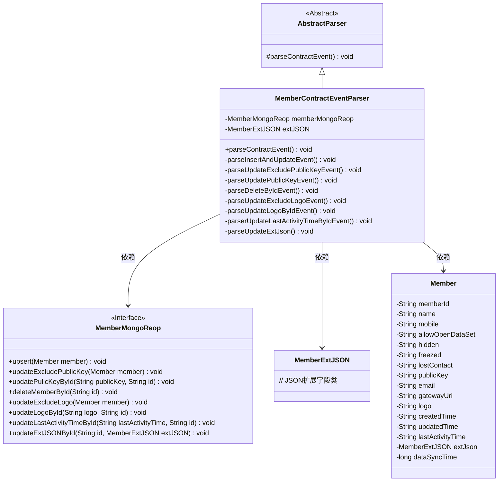

# 基础信息

|      |      |
|------|------|
| 名称 | MemberContractEventParser |
| 编码语言 | .java |
| 代码路径 | WeFe/union/blockchain-data-sync/src/main/java/com/welab/wefe/parser/MemberContractEventParser.java |
| 包名 | com.welab.wefe.parser |
| 依赖项 | ['com.alibaba.fastjson.JSONObject', 'com.welab.wefe.BlockchainDataSyncApp', 'com.welab.wefe.common.data.mongodb.entity.union.Member', 'com.welab.wefe.common.data.mongodb.entity.union.ext.MemberExtJSON', 'com.welab.wefe.common.data.mongodb.repo.MemberMongoReop', 'com.welab.wefe.common.util.StringUtil', 'com.welab.wefe.constant.EventConstant', 'com.welab.wefe.exception.BusinessException', 'org.apache.commons.lang3.StringUtils'] |
| 概述说明 | MemberContractEventParser类解析成员合约事件，处理插入、更新、删除等操作，操作包括成员信息、公钥、logo等字段的更新，并将数据同步到MongoDB。 |

# 说明

MemberContractEventParser类继承AbstractParser，用于解析成员相关合约事件。它包含多个事件处理方法，如插入更新、排除公钥更新、公钥更新、删除、排除Logo更新、Logo更新、最后活动时间更新和扩展JSON更新等。每个方法根据事件类型处理成员数据，并通过memberMongoReop操作MongoDB。处理过程中记录耗时，确保数据同步。

# 类列表 Class Summary

| 名称   | 类型  | 说明 |
|-------|------|-------------|
| MemberContractEventParser | class | MemberContractEventParser类解析成员合约事件，处理插入、更新、删除等操作，操作MongoDB存储成员数据，包含日志记录和异常处理。 |

## 类 MemberContractEventParser

|      |      |
|------|------|
| 访问范围 | public |
| 类型 | class |
| 名称 | MemberContractEventParser |
| 说明 | MemberContractEventParser类解析成员合约事件，处理插入、更新、删除等操作，操作MongoDB存储成员数据，包含日志记录和异常处理。 |

### UML类图

这段代码展示了一个区块链数据同步应用中的成员合约事件解析器。MemberContractEventParser继承自AbstractParser，通过解析不同事件类型（如插入、更新、删除等）来操作MongoDB中的成员数据。核心类包括处理成员数据的Member类、存储扩展字段的MemberExtJSON类，以及定义数据库操作的MemberMongoReop接口。解析器根据事件类型调用不同的私有方法，每个方法对应特定的数据库操作，实现了细粒度的数据同步控制。

### 内部方法调用关系图

这段代码是MemberContractEventParser类的实现，继承自AbstractParser，主要用于解析成员合约事件。根据不同的事件类型调用不同的解析方法，如插入/更新事件、排除公钥更新事件、公钥更新事件等。每个解析方法都会操作MemberMongoReop进行数据库操作，并记录处理时间。流程图展示了类结构和主要方法之间的调用关系，以及根据不同事件类型的分支处理逻辑。

### 字段列表 Field List

| 名称  | 类型  | 说明 |
|-------|-------|------|
| extJSON | MemberExtJSON | 保护成员变量extJSON，类型为MemberExtJSON。 |
| memberMongoReop = BlockchainDataSyncApp.CONTEXT.getBean(MemberMongoReop.class) | MemberMongoReop | 获取MemberMongoReop实例，通过BlockchainDataSyncApp的CONTEXT上下文注入。 |

### 方法列表

| 名称  | 类型  | 说明 |
|-------|-------|------|
| parseUpdatePublicKeyEvent | void | 解析更新公钥事件，获取ID和公钥，通过ID更新MongoDB中的公钥。 |
| parseInsertAndUpdateEvent | void | 解析插入和更新事件，创建Member对象并设置各属性值，包括ID、姓名、手机等，最后存入数据库并记录耗时。 |
| parseUpdateLogoByIdEvent | void | 解析更新Logo事件，获取ID和Logo，调用成员库更新对应ID的Logo。 |
| parseUpdateExcludeLogoEvent | void | 方法parseUpdateExcludeLogoEvent用于更新成员信息，排除logo字段。从参数中提取成员ID、姓名、手机号等12项数据，设置同步时间为当前时间，最后调用memberMongoReop更新数据库。 |
| parseDeleteByIdEvent | void | 解析删除事件，获取ID并调用成员库删除对应ID的记录。 |
| parseUpdateExcludePublicKeyEvent | void | 解析更新排除公钥事件，设置成员信息并更新数据库，记录耗时。 |
| parserUpdateLastActivityTimeByIdEvent | void | 方法解析更新事件，通过ID和最后活动时间更新成员记录。 |
| parseUpdateExtJson | void | 解析更新扩展JSON数据，通过ID定位并更新MongoDB中的成员扩展信息。 |
| parseContractEvent | void | 解析合约事件方法，根据事件类型调用不同处理逻辑，包括增删改查等操作，异常时抛出业务错误。 |

