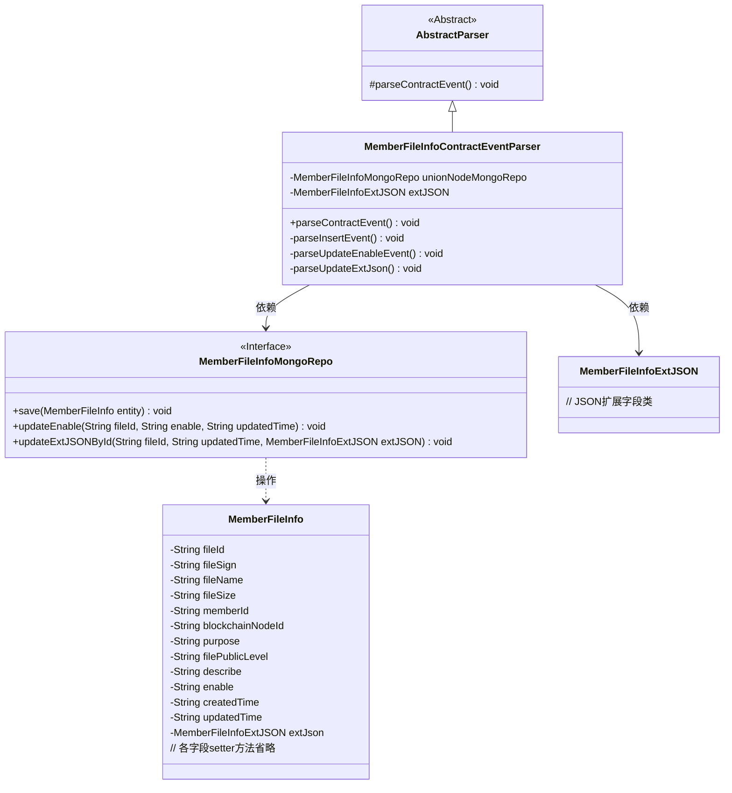
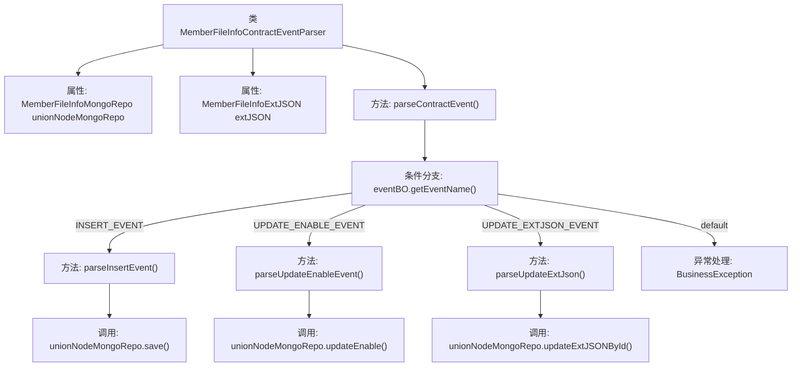

# 基础信息

|      |      |
|------|------|
| 名称 | MemberFileInfoContractEventParser |
| 编码语言 | .java |
| 代码路径 | WeFe/union/blockchain-data-sync/src/main/java/com/welab/wefe/parser/MemberFileInfoContractEventParser.java |
| 包名 | com.welab.wefe.parser |
| 依赖项 | ['com.alibaba.fastjson.JSONObject', 'com.welab.wefe.BlockchainDataSyncApp', 'com.welab.wefe.common.data.mongodb.entity.union.MemberFileInfo', 'com.welab.wefe.common.data.mongodb.entity.union.ext.MemberFileInfoExtJSON', 'com.welab.wefe.common.data.mongodb.repo.MemberFileInfoMongoRepo', 'com.welab.wefe.common.util.StringUtil', 'com.welab.wefe.constant.EventConstant', 'com.welab.wefe.exception.BusinessException', 'org.apache.commons.lang3.StringUtils'] |
| 概述说明 | MemberFileInfoContractEventParser类解析成员文件信息事件，处理插入、更新启用状态和扩展JSON事件，操作MongoDB存储。 |

# 说明

MemberFileInfoContractEventParser类继承AbstractParser，用于解析成员文件信息合约事件。通过unionNodeMongoRepo操作MongoDB，处理三种事件：INSERT_EVENT创建包含文件ID、签名、名称等属性的MemberFileInfo对象并保存；UPDATE_ENABLE_EVENT更新文件启用状态；UPDATE_EXTJSON_EVENT更新扩展JSON数据。事件名无效时抛出BusinessException。

# 类列表 Class Summary

| 名称   | 类型  | 说明 |
|-------|------|-------------|
| MemberFileInfoContractEventParser | class | MemberFileInfoContractEventParser类解析合约事件，处理插入、更新启用状态和更新扩展JSON操作，并将数据保存至MongoDB。 |

## 类 MemberFileInfoContractEventParser

|      |      |
|------|------|
| 访问范围 | public |
| 类型 | class |
| 名称 | MemberFileInfoContractEventParser |
| 说明 | MemberFileInfoContractEventParser类解析合约事件，处理插入、更新启用状态和更新扩展JSON操作，并将数据保存至MongoDB。 |

### UML类图

类图描述：该图展示了会员文件信息合约事件解析器的类结构，继承自抽象解析器，依赖MongoDB仓库接口和扩展JSON类。解析器根据事件类型调用不同私有方法处理数据，包含插入、更新状态和扩展字段三种操作。MongoDB仓库接口定义了数据持久化方法，与会员文件信息实体类交互。整体采用分层设计，符合单一职责原则。

### 内部方法调用关系图

该流程图展示了MemberFileInfoContractEventParser类的核心逻辑结构。类通过parseContractEvent()作为入口方法，根据事件名称(eventName)触发不同的解析方法：parseInsertEvent()用于新增文件信息，parseUpdateEnableEvent()更新启用状态，parseUpdateExtJson()更新扩展JSON数据。每个方法最终调用MongoDB仓库(unionNodeMongoRepo)的对应持久化操作，形成完整的事件处理链路。异常情况下会抛出BusinessException。

### 字段列表 Field List

| 名称  | 类型  | 说明 |
|-------|-------|------|
| extJSON | MemberFileInfoExtJSON | 保护成员变量extJSON，类型为MemberFileInfoExtJSON。 |
| unionNodeMongoRepo = BlockchainDataSyncApp.CONTEXT.getBean(MemberFileInfoMongoRepo.class) | MemberFileInfoMongoRepo | 获取MemberFileInfoMongoRepo实例，通过BlockchainDataSyncApp上下文注入。 |

### 方法列表

| 名称  | 类型  | 说明 |
|-------|-------|------|
| parseInsertEvent | void | 解析插入事件，创建MemberFileInfo对象并设置各项属性，包括文件ID、签名、名称、大小等，最后保存到MongoDB。 |
| parseContractEvent | void | 解析合约事件方法，根据事件名称调用对应处理逻辑：插入事件、更新启用事件或更新扩展JSON事件，无效事件抛出异常。 |
| parseUpdateEnableEvent | void | 解析更新启用事件，获取文件ID、启用状态和更新时间，调用Mongo仓库更新数据。 |
| parseUpdateExtJson | void | 解析更新扩展JSON数据，获取文件ID和更新时间，调用MongoDB仓库更新对应记录。 |

