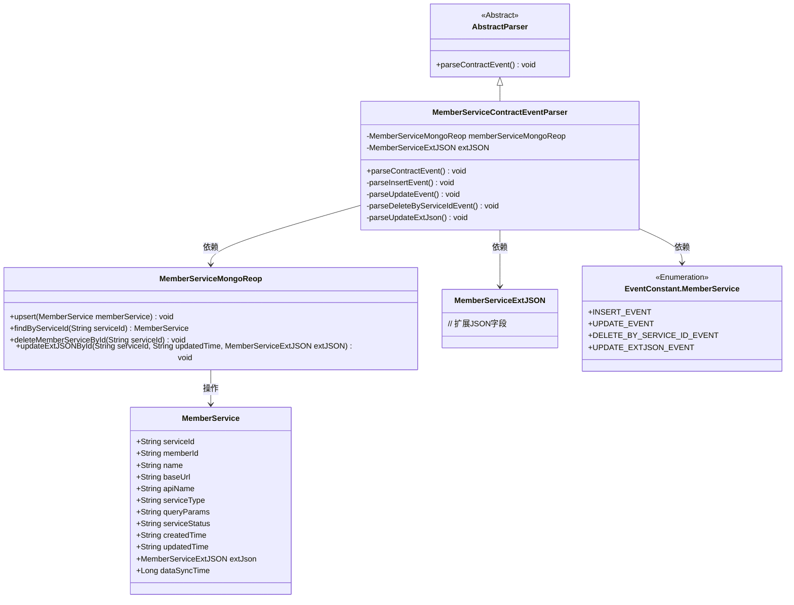
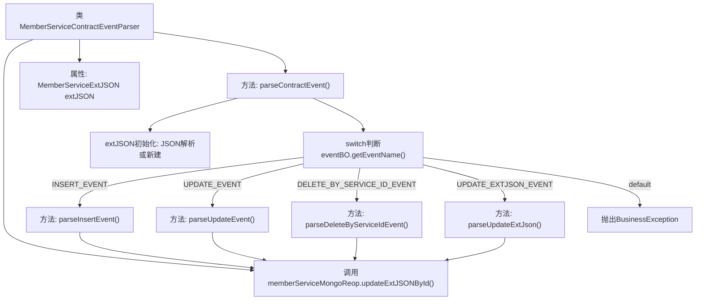

# 基础信息

|      |      |
|------|------|
| 名称 | MemberServiceContractEventParser |
| 编码语言 | .java |
| 代码路径 | WeFe/union/blockchain-data-sync/src/main/java/com/welab/wefe/parser/MemberServiceContractEventParser.java |
| 包名 | com.welab.wefe.parser |
| 依赖项 | ['com.alibaba.fastjson.JSONObject', 'com.welab.wefe.BlockchainDataSyncApp', 'com.welab.wefe.common.data.mongodb.entity.union.MemberService', 'com.welab.wefe.common.data.mongodb.entity.union.ext.MemberServiceExtJSON', 'com.welab.wefe.common.data.mongodb.repo.MemberServiceMongoReop', 'com.welab.wefe.common.util.StringUtil', 'com.welab.wefe.constant.EventConstant', 'com.welab.wefe.exception.BusinessException', 'org.apache.commons.lang3.StringUtils'] |
| 概述说明 | MemberServiceContractEventParser类解析合约事件，处理插入、更新、删除及扩展JSON更新操作，与MongoDB交互。 |

# 说明

MemberServiceContractEventParser类继承AbstractParser，用于解析会员服务合约事件。通过memberServiceMongoReop操作MongoDB数据库，处理四种事件类型：INSERT_EVENT创建新会员服务记录并设置各项属性；UPDATE_EVENT更新现有记录的字段；DELETE_BY_SERVICE_ID_EVENT根据ID删除记录；UPDATE_EXTJSON_EVENT更新扩展JSON数据。所有操作均包含数据同步时间戳，异常事件会抛出BusinessException。

# 类列表 Class Summary

| 名称   | 类型  | 说明 |
|-------|------|-------------|
| MemberServiceContractEventParser | class | MemberServiceContractEventParser类解析成员服务合约事件，处理插入、更新、删除及扩展JSON更新操作，与MongoDB交互存储数据。 |

## 类 MemberServiceContractEventParser

|      |      |
|------|------|
| 访问范围 | public |
| 类型 | class |
| 名称 | MemberServiceContractEventParser |
| 说明 | MemberServiceContractEventParser类解析成员服务合约事件，处理插入、更新、删除及扩展JSON更新操作，与MongoDB交互存储数据。 |

### UML类图

这段类图描述了会员服务合约事件解析器的结构。MemberServiceContractEventParser继承自AbstractParser，负责处理四种不同类型的事件（插入、更新、删除和更新扩展JSON）。它依赖MemberServiceMongoReop进行数据库操作，使用MemberServiceExtJSON存储扩展数据，并引用EventConstant.MemberService中的事件类型常量。MemberService类包含了会员服务的完整属性，MemberServiceMongoReop提供了对会员服务数据的CRUD操作接口。整个设计采用了分层架构，将解析逻辑与数据访问分离。

### 内部方法调用关系图

该流程图描述了MemberServiceContractEventParser类的核心逻辑结构。该类继承自AbstractParser，主要功能是解析不同合约事件（增删改查），通过switch-case分发到4个具体处理方法。所有方法最终都会调用memberServiceMongoReop的MongoDB操作，包括upsert、delete和update操作。流程起始于parseContractEvent()方法，根据事件类型路由到对应的子方法，每个子方法都涉及对MemberService对象的不同操作，最终通过MongoDB存储库实现数据持久化。

### 字段列表 Field List

| 名称  | 类型  | 说明 |
|-------|-------|------|
| memberServiceMongoReop = BlockchainDataSyncApp.CONTEXT.getBean(MemberServiceMongoReop.class) | MemberServiceMongoReop | 从应用上下文中获取MemberServiceMongoReop类的Bean实例并赋值给保护成员变量。 |
| extJSON | MemberServiceExtJSON | 保护成员变量extJSON，类型为MemberServiceExtJSON。 |

### 方法列表

| 名称  | 类型  | 说明 |
|-------|-------|------|
| parseUpdateEvent | void | 解析更新事件：根据事件BO获取服务ID和更新时间，查询并更新成员服务的名称、基础URL、API名称、服务类型、查询参数、服务状态及更新时间，最后执行MongoDB的upsert操作。 |
| parseContractEvent | void | 解析合约事件方法，根据事件名调用对应处理逻辑，包括插入、更新、删除和更新扩展JSON事件，无效事件抛出异常。 |
| parseInsertEvent | void | 解析插入事件，设置MemberService属性并存入数据库。 |
| parseDeleteByServiceIdEvent | void | 解析删除事件，根据service_id调用服务删除成员数据。 |
| parseUpdateExtJson | void | 解析更新扩展JSON数据，获取服务ID和更新时间，调用MongoDB更新对应记录。 |

