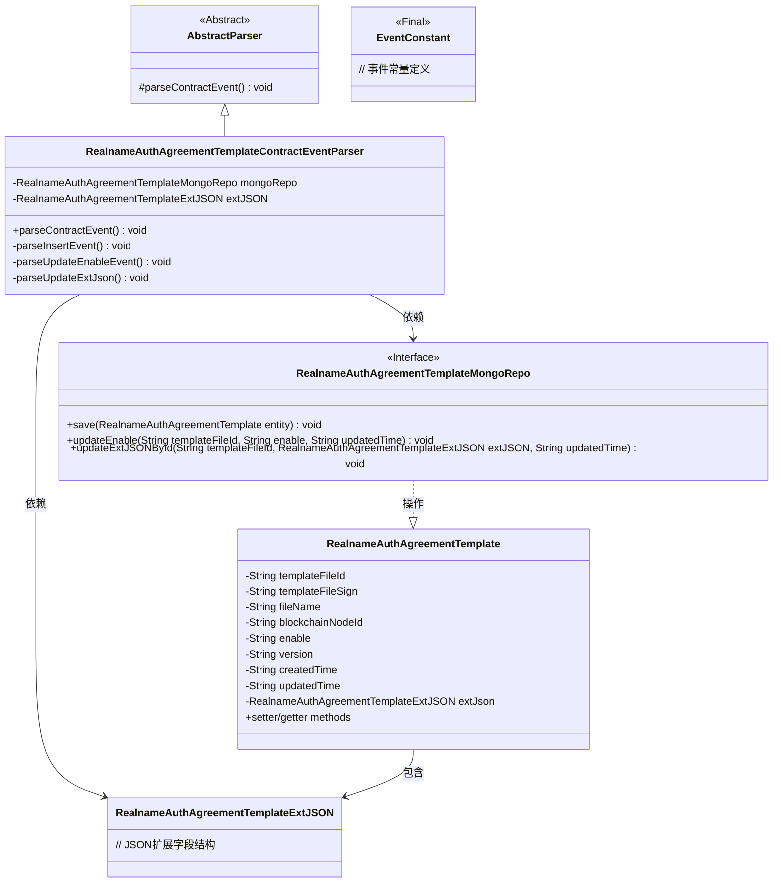
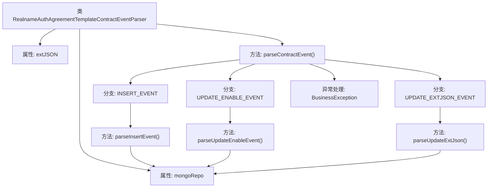
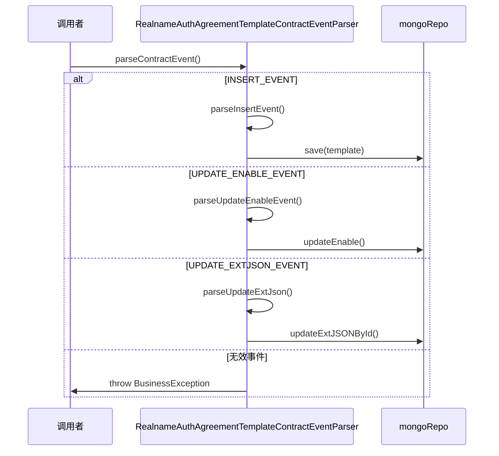

# 基础信息

|      |      |
|------|------|
| 名称 | RealnameAuthAgreementTemplateContractEventParser |
| 编码语言 | .java |
| 代码路径 | WeFe/union/blockchain-data-sync/src/main/java/com/welab/wefe/parser/RealnameAuthAgreementTemplateContractEventParser.java |
| 包名 | com.welab.wefe.parser |
| 依赖项 | ['com.alibaba.fastjson.JSONObject', 'com.welab.wefe.BlockchainDataSyncApp', 'com.welab.wefe.common.data.mongodb.entity.union.RealnameAuthAgreementTemplate', 'com.welab.wefe.common.data.mongodb.entity.union.ext.RealnameAuthAgreementTemplateExtJSON', 'com.welab.wefe.common.data.mongodb.repo.RealnameAuthAgreementTemplateMongoRepo', 'com.welab.wefe.common.util.StringUtil', 'com.welab.wefe.constant.EventConstant', 'com.welab.wefe.exception.BusinessException', 'org.apache.commons.lang3.StringUtils'] |
| 概述说明 | RealnameAuthAgreementTemplateContractEventParser类解析实名认证协议模板事件，处理插入、更新启用状态和更新扩展JSON三种事件，操作MongoDB存储数据。 |

# 说明

RealnameAuthAgreementTemplateContractEventParser类继承AbstractParser，用于解析实名认证协议模板相关事件。通过mongoRepo操作MongoDB数据库，处理三种事件：INSERT_EVENT创建新模板并保存全部字段；UPDATE_ENABLE_EVENT更新模板启用状态；UPDATE_EXTJSON_EVENT更新模板扩展JSON数据。未识别事件会抛出业务异常。所有操作均包含模板文件ID和时间戳字段，确保数据一致性。

# 类列表 Class Summary

| 名称   | 类型  | 说明 |
|-------|------|-------------|
| RealnameAuthAgreementTemplateContractEventParser | class | 解析实名认证协议模板合约事件的类，处理插入、更新启用状态和更新扩展JSON事件，操作MongoDB存储数据。 |

## 类 RealnameAuthAgreementTemplateContractEventParser

|      |      |
|------|------|
| 访问范围 | public |
| 类型 | class |
| 名称 | RealnameAuthAgreementTemplateContractEventParser |
| 说明 | 解析实名认证协议模板合约事件的类，处理插入、更新启用状态和更新扩展JSON事件，操作MongoDB存储数据。 |

### UML类图

该类图展示了一个实名认证协议模板的事件解析系统。核心类RealnameAuthAgreementTemplateContractEventParser继承自抽象解析器，通过MongoDB仓库实现数据持久化，处理三种合约事件（新增、启用状态更新、扩展JSON更新）。系统采用分层设计，包含实体类、数据访问接口和常量定义，通过事件驱动方式实现业务逻辑，体现了清晰的职责分离和模块化架构。

### 内部方法调用关系图

这段代码是一个区块链合约事件解析器，专门处理实名认证协议模板相关事件。流程图展示了类结构及其方法调用关系，包含3种事件处理分支和异常处理路径。时序图详细描述了事件解析过程：根据事件类型(INSERT/UPDATE_ENABLE/UPDATE_EXTJSON)分别触发不同的解析方法，最终调用mongoRepo进行数据持久化操作，或对无效事件抛出业务异常。核心逻辑是通过解析不同事件类型来更新MongoDB中的协议模板数据。

### 字段列表 Field List

| 名称  | 类型  | 说明 |
|-------|-------|------|
| extJSON | RealnameAuthAgreementTemplateExtJSON | 保护实名认证协议模板扩展JSON字段。 |
| mongoRepo = BlockchainDataSyncApp.CONTEXT.getBean(RealnameAuthAgreementTemplateMongoRepo.class) | RealnameAuthAgreementTemplateMongoRepo | 从应用上下文中获取实名认证协议模板的MongoDB仓库实例。 |

### 方法列表

| 名称  | 类型  | 说明 |
|-------|-------|------|
| parseInsertEvent | void | 解析插入事件，设置实名认证协议模板属性并保存到MongoDB。 |
| parseContractEvent | void | 解析合约事件方法：根据事件名称调用对应处理逻辑，无效事件抛出异常。 |
| parseUpdateEnableEvent | void | 解析更新启用事件，获取模板文件ID、启用状态和更新时间，调用MongoDB仓库更新数据。 |
| parseUpdateExtJson | void | 解析更新外部JSON数据，获取模板文件ID和更新时间，调用MongoDB仓库更新对应ID的JSON数据。 |

