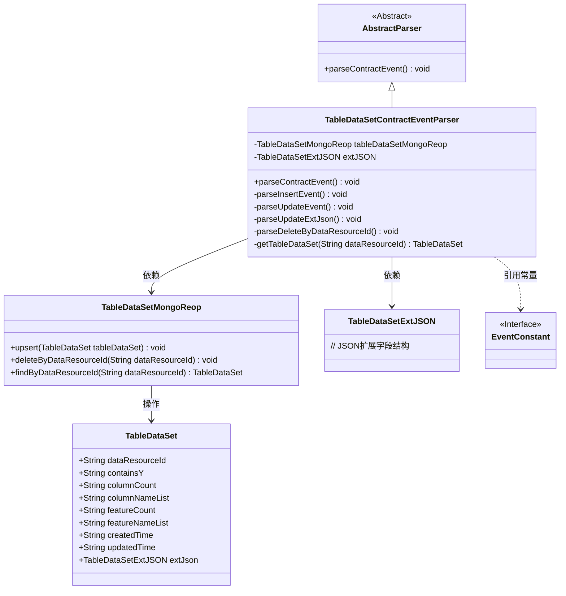
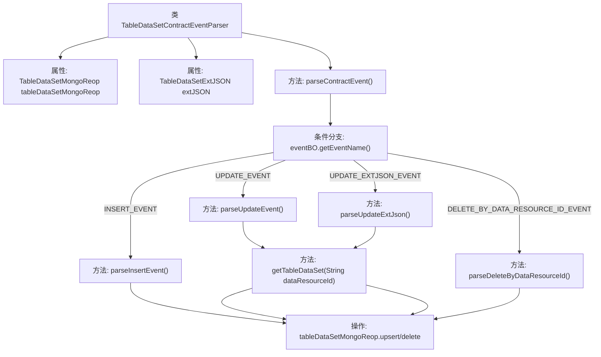
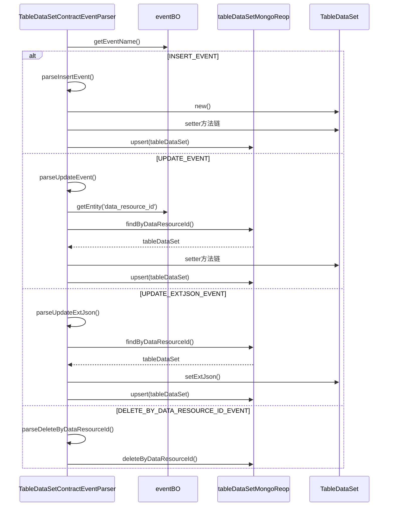

# 基础信息

|      |      |
|------|------|
| 名称 | TableDataSetContractEventParser |
| 编码语言 | .java |
| 代码路径 | WeFe/union/blockchain-data-sync/src/main/java/com/welab/wefe/parser/TableDataSetContractEventParser.java |
| 包名 | com.welab.wefe.parser |
| 依赖项 | ['com.alibaba.fastjson.JSONObject', 'com.welab.wefe.BlockchainDataSyncApp', 'com.welab.wefe.common.data.mongodb.entity.union.TableDataSet', 'com.welab.wefe.common.data.mongodb.entity.union.ext.TableDataSetExtJSON', 'com.welab.wefe.common.data.mongodb.repo.TableDataSetMongoReop', 'com.welab.wefe.common.util.StringUtil', 'com.welab.wefe.constant.EventConstant', 'com.welab.wefe.exception.BusinessException', 'org.apache.commons.lang3.StringUtils'] |
| 概述说明 | TableDataSetContractEventParser类解析合约事件，处理插入、更新、删除操作，操作MongoDB存储表数据，包含数据资源ID、列名、特征等字段。 |

# 说明

TableDataSetContractEventParser是一个继承自AbstractParser的类，用于解析与表数据集相关的合约事件。它包含一个MongoDB仓库实例和一个扩展JSON对象。主要功能包括解析四种事件：插入事件（设置数据集属性并保存）、更新事件（修改现有数据集属性）、更新扩展JSON事件（仅更新扩展JSON）和按数据资源ID删除事件。所有操作都涉及数据资源ID和时间戳的更新，并通过MongoDB仓库进行持久化。若数据不存在或事件名称无效，会抛出业务异常。

# 类列表 Class Summary

| 名称   | 类型  | 说明 |
|-------|------|-------------|
| TableDataSetContractEventParser | class | TableDataSetContractEventParser类解析合约事件，处理插入、更新、删除等操作，操作MongoDB存储表数据集。 |

## 类 TableDataSetContractEventParser

|      |      |
|------|------|
| 访问范围 | public |
| 类型 | class |
| 名称 | TableDataSetContractEventParser |
| 说明 | TableDataSetContractEventParser类解析合约事件，处理插入、更新、删除等操作，操作MongoDB存储表数据集。 |

### UML类图

类图描述：该图展示了TableDataSetContractEventParser继承自AbstractParser，通过TableDataSetMongoReop操作TableDataSet数据，同时处理包含扩展字段TableDataSetExtJSON的解析逻辑。解析器根据事件类型（INSERT/UPDATE/DELETE）调用不同方法，与MongoDB仓库交互完成数据持久化，体现了事件驱动架构中数据处理的核心流程。

### 内部方法调用关系图

该流程图展示了TableDataSetContractEventParser类的事件处理逻辑，核心是通过解析不同事件类型（INSERT/UPDATE/DELETE）来操作MongoDB数据。时序图详细描述了四种事件的处理流程，包括数据校验、实体操作和数据库持久化过程，体现了对区块链合约事件的完整处理链路。所有操作最终都会通过tableDataSetMongoReop完成数据落地或删除。

### 字段列表 Field List

| 名称  | 类型  | 说明 |
|-------|-------|------|
| extJSON | TableDataSetExtJSON | 定义了一个受保护的TableDataSetExtJSON类型变量extJSON。 |
| tableDataSetMongoReop = BlockchainDataSyncApp.CONTEXT.getBean(TableDataSetMongoReop.class) | TableDataSetMongoReop | 获取TableDataSetMongoReop实例，通过BlockchainDataSyncApp的CONTEXT容器注入。 |

### 方法列表

| 名称  | 类型  | 说明 |
|-------|-------|------|
| parseContractEvent | void | 解析合约事件方法，根据事件名称调用对应处理逻辑：插入、更新、更新扩展JSON、按资源ID删除，无效事件抛出异常。 |
| parseInsertEvent | void | 解析插入事件，设置表数据集的各项属性并更新到数据库。 |
| parseUpdateEvent | void | 解析更新事件：获取数据资源ID和更新时间，更新表数据集的包含Y、列数、列名列表、特征数和特征名列表，最后保存更新。 |
| parseUpdateExtJson | void | 解析更新扩展JSON数据，获取资源ID和更新时间，更新数据集并保存到MongoDB。 |
| parseDeleteByDataResourceId | void | 该方法解析并删除指定数据资源ID对应的表数据集，通过调用Mongo仓库的deleteByDataResourceId实现。 |
| getTableDataSet | TableDataSet | 根据数据资源ID获取表数据集，若不存在则抛出业务异常。 |

